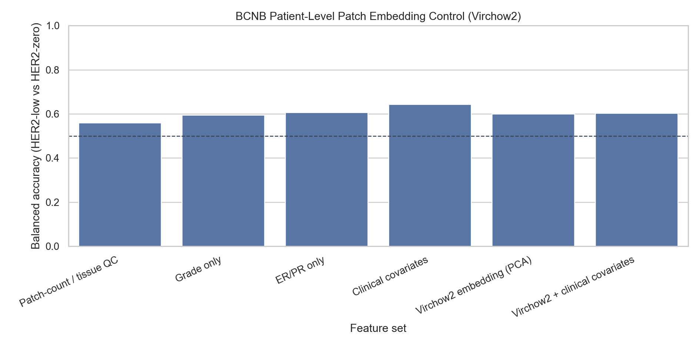

# BCNB Patient-Level Patch Embedding Control (Virchow2)

Status: BCNB external-cohort patch analysis for HER2-low versus HER2-zero.

## Method

- Cohort: 781 BCNB patients with precomputed patch embeddings (654 HER2-low, 127 HER2-zero).
- Embedding input: patient-level mean of capped precomputed 256x256 H&E patches from `paper_patches.zip`.
- Model: `paige-ai/Virchow2`, 2560-d patient embedding.
- Classifier: class-balanced regularized logistic regression with repeated stratified 5-fold CV (5 repeats).
- Embedding dimensionality reduction: PCA fit inside each training fold only (20 components).
- Sanity: 200 shuffled-label permutations for the embedding.

## Results

| Feature set | Features | PCA | Balanced accuracy | AUC | Sensitivity | Specificity |
| --- | --- | --- | --- | --- | --- | --- |
| Patch-count / tissue QC | 4 |  | 0.559 | 0.562 | 0.578 | 0.540 |
| Grade only | 2 |  | 0.595 | 0.604 | 0.517 | 0.673 |
| ER/PR only | 4 |  | 0.606 | 0.570 | 0.354 | 0.858 |
| Clinical covariates | 13 |  | 0.643 | 0.627 | 0.532 | 0.753 |
| Virchow2 embedding (PCA) | 2560 | 20 | 0.600 | 0.643 | 0.545 | 0.654 |
| Virchow2 + clinical covariates | 2577 | 20 | 0.603 | 0.646 | 0.548 | 0.658 |

## Embedding PCA Robustness

| PCA components | Balanced accuracy | AUC |
| --- | --- | --- |
| 5 | 0.560 | 0.577 |
| 10 | 0.620 | 0.657 |
| 20 | 0.600 | 0.643 |
| 30 | 0.588 | 0.638 |
| 50 | 0.583 | 0.618 |

## Shuffled-Label Sanity

| Metric | Observed | Null mean | Null 95% | Empirical p |
| --- | --- | --- | --- | --- |
| Balanced accuracy | 0.600 | 0.497 | 0.538 | 0.0050 |
| AUC | 0.643 | 0.494 | 0.547 | 0.0050 |

## Interpretation

- Virchow2 patch embeddings reach balanced accuracy 0.600 and AUC 0.643 versus 0.643 and AUC 0.627 for clinical covariates.
- Interpret this as external-cohort effect-size evidence, not just a p-value: a statistically non-null but small signal is not a strong image classifier.
- This is patient-level analysis, not patch-level analysis; patch-level splits would leak patient identity and overweight patients with many patches.
- Because these are precomputed tumor-region patches, this does not test whole-slide slide-size or tissue-area confounding. Full WSIs remain the stronger input if the patch signal is interesting.

## Output Files

- `docs/bcnb_patch_embedding_control_virchow2_hash_capped10_low_zero.md`
- `results/bcnb_patch_embedding_control_virchow2_hash_capped10_low_zero/bcnb_patch_embedding_metrics.csv`
- `results/bcnb_patch_embedding_control_virchow2_hash_capped10_low_zero/bcnb_patch_embedding_pca_robustness.csv`
- `results/bcnb_patch_embedding_control_virchow2_hash_capped10_low_zero/bcnb_patch_embedding_permutation.csv`
- `docs/assets/bcnb_patch_embedding_control_virchow2_hash_capped10_low_zero/`
