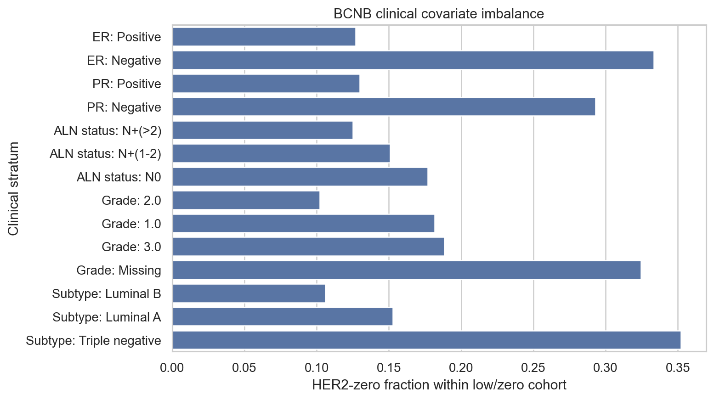
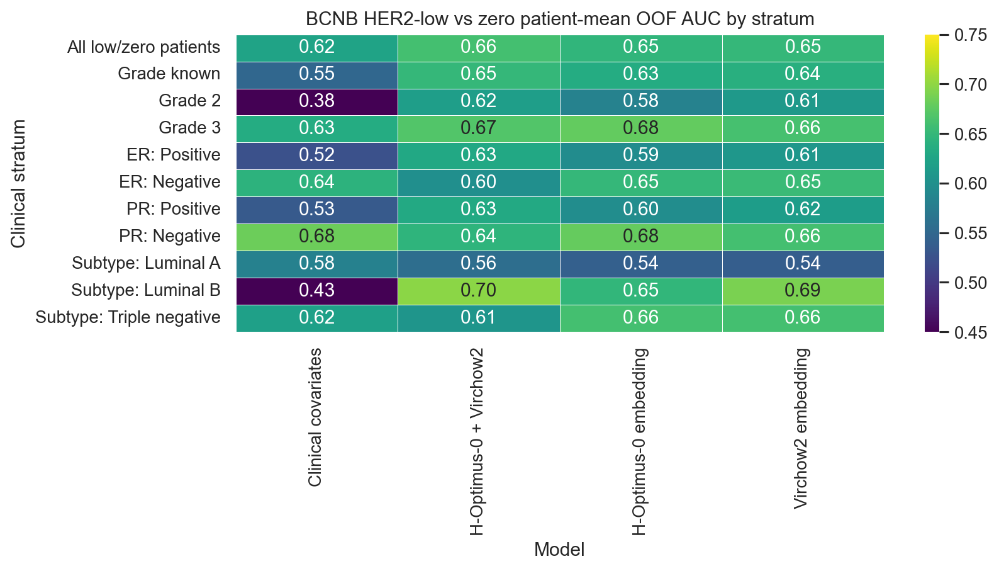

# BCNB Patch Embedding Stratified Performance

Status: clinical-slice robustness check for the BCNB external patch pilots.

## Method

- Cohort: 781 BCNB low/zero patients (654 HER2-low, 127 HER2-zero).
- Inputs: the same hash-capped 10-patch patient embeddings used in the H-Optimus-0 and Virchow2 BCNB pilots.
- Classifiers: class-balanced logistic regression with repeated stratified 5-fold CV (5 repeats); patient-level probabilities are averaged across out-of-fold repeats before slice scoring.
- Embedding PCA: 20 components fit inside each training fold only.
- Strata are reported only when both HER2-low and HER2-zero have at least 15 patients.

## Clinical Imbalance

Grade, ER/PR, subtype, nodal status, and Ki67 all show some low/zero imbalance. This is exactly why pooled image performance is not sufficient evidence of a HER2-specific visual signal.

## Stratified Patient-Mean OOF Performance

| Stratum | Model | Low | Zero | Balanced accuracy | AUC | Mean P0 zero-low |
| --- | --- | --- | --- | --- | --- | --- |
| All low/zero patients | Clinical covariates | 654 | 127 | 0.648 | 0.624 | 0.098 |
| All low/zero patients | H-Optimus-0 embedding | 654 | 127 | 0.593 | 0.646 | 0.092 |
| All low/zero patients | Virchow2 embedding | 654 | 127 | 0.594 | 0.649 | 0.091 |
| All low/zero patients | H-Optimus-0 + Virchow2 | 654 | 127 | 0.613 | 0.660 | 0.123 |
| Grade 2 | Clinical covariates | 369 | 42 | 0.493 | 0.382 | -0.018 |
| Grade 2 | H-Optimus-0 embedding | 369 | 42 | 0.531 | 0.582 | 0.039 |
| Grade 2 | Virchow2 embedding | 369 | 42 | 0.522 | 0.611 | 0.055 |
| Grade 2 | H-Optimus-0 + Virchow2 | 369 | 42 | 0.560 | 0.617 | 0.076 |
| Grade 3 | Clinical covariates | 181 | 42 | 0.683 | 0.635 | 0.104 |
| Grade 3 | H-Optimus-0 embedding | 181 | 42 | 0.620 | 0.679 | 0.116 |
| Grade 3 | Virchow2 embedding | 181 | 42 | 0.620 | 0.661 | 0.099 |
| Grade 3 | H-Optimus-0 + Virchow2 | 181 | 42 | 0.627 | 0.668 | 0.136 |
| ER: Positive | Clinical covariates | 564 | 82 | 0.581 | 0.524 | 0.032 |
| ER: Positive | H-Optimus-0 embedding | 564 | 82 | 0.557 | 0.594 | 0.048 |
| ER: Positive | Virchow2 embedding | 564 | 82 | 0.546 | 0.608 | 0.058 |
| ER: Positive | H-Optimus-0 + Virchow2 | 564 | 82 | 0.580 | 0.630 | 0.090 |
| ER: Negative | Clinical covariates | 90 | 45 | 0.533 | 0.643 | 0.058 |
| ER: Negative | H-Optimus-0 embedding | 90 | 45 | 0.572 | 0.650 | 0.096 |
| ER: Negative | Virchow2 embedding | 90 | 45 | 0.628 | 0.653 | 0.100 |
| ER: Negative | H-Optimus-0 + Virchow2 | 90 | 45 | 0.594 | 0.598 | 0.083 |
| molecular_subtype: Luminal A | Clinical covariates | 244 | 44 | 0.636 | 0.581 | 0.050 |
| molecular_subtype: Luminal A | H-Optimus-0 embedding | 244 | 44 | 0.521 | 0.541 | 0.023 |
| molecular_subtype: Luminal A | Virchow2 embedding | 244 | 44 | 0.495 | 0.539 | 0.021 |
| molecular_subtype: Luminal A | H-Optimus-0 + Virchow2 | 244 | 44 | 0.561 | 0.557 | 0.044 |
| molecular_subtype: Luminal B | Clinical covariates | 329 | 39 | 0.509 | 0.432 | -0.012 |
| molecular_subtype: Luminal B | H-Optimus-0 embedding | 329 | 39 | 0.591 | 0.647 | 0.072 |
| molecular_subtype: Luminal B | Virchow2 embedding | 329 | 39 | 0.605 | 0.690 | 0.099 |
| molecular_subtype: Luminal B | H-Optimus-0 + Virchow2 | 329 | 39 | 0.591 | 0.698 | 0.130 |
| molecular_subtype: Triple negative | Clinical covariates | 81 | 44 | 0.500 | 0.619 | 0.039 |
| molecular_subtype: Triple negative | H-Optimus-0 embedding | 81 | 44 | 0.574 | 0.660 | 0.105 |
| molecular_subtype: Triple negative | Virchow2 embedding | 81 | 44 | 0.634 | 0.661 | 0.107 |
| molecular_subtype: Triple negative | H-Optimus-0 + Virchow2 | 81 | 44 | 0.599 | 0.606 | 0.088 |

## Interpretation

- The pooled dual-model result remains modest, and slice performance is uneven rather than uniformly strong across clinically meaningful subgroups.
- ER-negative and triple-negative slices are particularly important stress tests because they reduce one major receptor-status imbalance. The image models do not become a strong classifier there.
- Grade 2 and grade 3 slices still show some image-readable separation, but the effect is not large enough to support a clinical HER2-low/zero classifier claim.
- Overall, this strengthens the current manuscript framing: BCNB supports a weak, reproducible morphology/covariate-associated signal, not a robust standalone HER2-low versus HER2-zero detector.

## Selected Dual-Model Versus Clinical Rows

| Stratum | Dual-model BA | Dual-model AUC | Clinical BA | Clinical AUC |
| --- | --- | --- | --- | --- |
| All low/zero patients | 0.613 | 0.660 | 0.648 | 0.624 |
| Grade 2 | 0.560 | 0.617 | 0.493 | 0.382 |
| Grade 3 | 0.627 | 0.668 | 0.683 | 0.635 |
| ER: Positive | 0.580 | 0.630 | 0.581 | 0.524 |
| ER: Negative | 0.594 | 0.598 | 0.533 | 0.643 |

## Output Files

- `docs/bcnb_patch_stratified_performance_hoptimus0_virchow2_hash_capped10_low_zero.md`
- `results/bcnb_patch_stratified_performance_hoptimus0_virchow2_hash_capped10_low_zero/bcnb_patch_stratified_patient_metrics.csv`
- `results/bcnb_patch_stratified_performance_hoptimus0_virchow2_hash_capped10_low_zero/bcnb_patch_stratified_patient_predictions.csv`
- `results/bcnb_patch_stratified_performance_hoptimus0_virchow2_hash_capped10_low_zero/bcnb_clinical_stratum_counts.csv`
- `results/bcnb_patch_stratified_performance_hoptimus0_virchow2_hash_capped10_low_zero/bcnb_clinical_associations.csv`
- `docs/assets/bcnb_patch_stratified_performance_hoptimus0_virchow2_hash_capped10_low_zero/`
