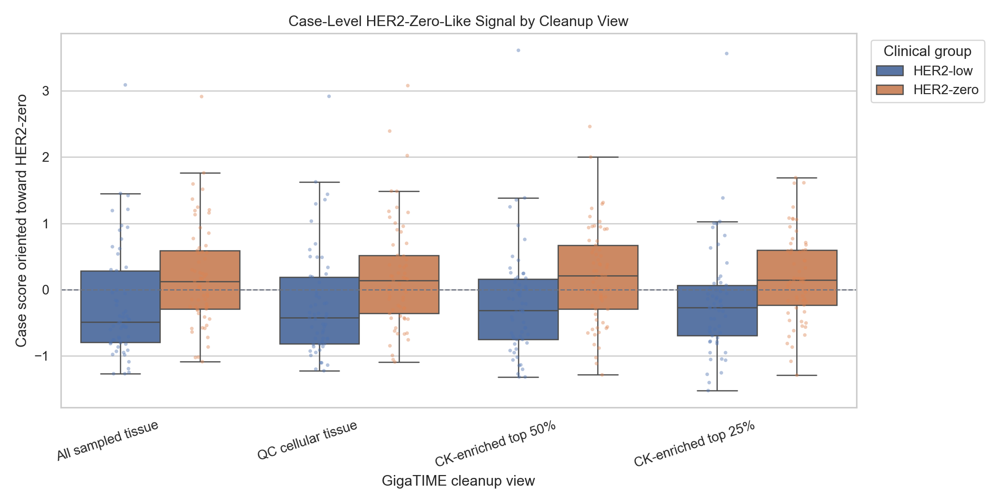
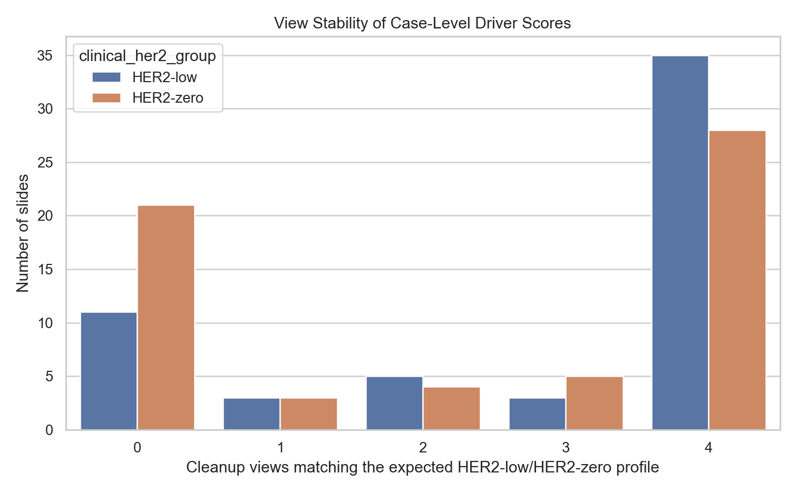
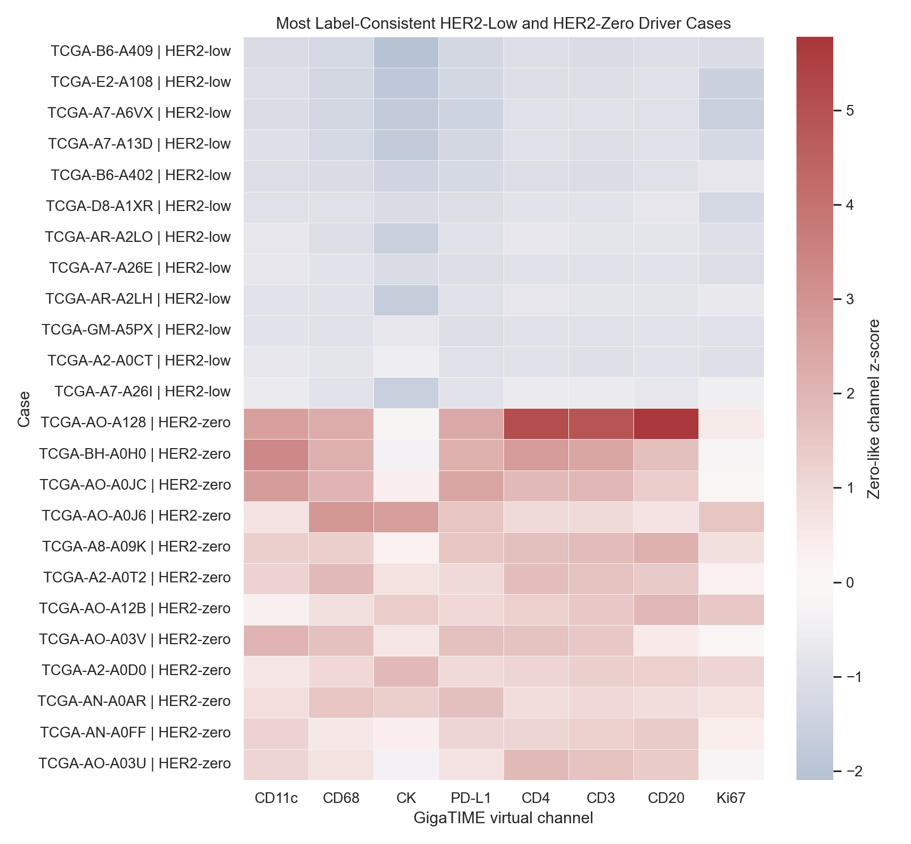
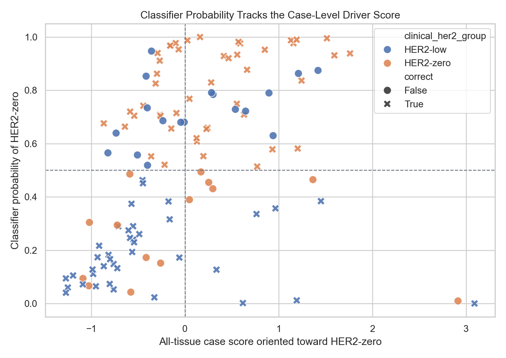

# Strict High-Trust HER2-Low vs HER2-Zero Case Driver Analysis

This analysis asks whether the strongest GigaTIME result is broad and case-level believable, or whether it is driven by a few unusual slides.

The score is built only from GigaTIME virtual channels that significantly separated HER2-low from HER2-zero within each cleanup view. Each channel is standardized and oriented so that higher values are more HER2-zero-like and lower values are more HER2-low-like.

Important: these are virtual H&E-derived GigaTIME features. This analysis creates a review shortlist; it does not validate the virtual channels as real mIF or prove HER2 isoform biology.

## Signal Channels Used

| Cleanup view | N signal channels | Channels |
| --- | --- | --- |
| All sampled tissue | 8 | CD11c, CD68, CK, PD-L1, CD4, CD3, CD20, Ki67 |
| QC cellular tissue | 7 | CD11c, CD3, CD4, CD68, CK, PD-L1, CD20 |
| CK-enriched top 50% | 7 | CD3, CD4, CK, PD-L1, CD68, CD11c, CD20 |
| CK-enriched top 25% | 5 | CD4, CD68, CK, CD3, PD-L1 |

## All-Tissue Case Score

| Clinical group | N | Mean zero-like score | Median zero-like score |
| --- | --- | --- | --- |
| HER2-low | 57 | -0.219 | -0.488 |
| HER2-zero | 61 | 0.205 | 0.123 |

71 of 118 HER2-low/HER2-zero slides matched their expected direction in at least 3 of 4 cleanup views. 47 slides had the opposite profile in at least 2 views and should be prioritized for manual QC/pathology review.

## View Stability

| Clinical group | 0 views | 1 view | 2 views | 3 views | 4 views |
| --- | --- | --- | --- | --- | --- |
| HER2-low | 11 | 3 | 5 | 3 | 35 |
| HER2-zero | 21 | 3 | 4 | 5 | 28 |

## Most Label-Consistent Driver Cases

These are not automatically the most important biological cases; they are the clearest examples of the current GigaTIME pattern.

| Case | Group | HER2 detail | Driver direction | Zero-like score | Expected-profile score | ER | PR | ERBB2 TPM |
| --- | --- | --- | --- | --- | --- | --- | --- | --- |
| TCGA-B6-A409 | HER2-low | HER2-low_IHC1_ISH-negative | low-like | -1.272 | 1.272 | Negative | Negative | 53.40 |
| TCGA-E2-A108 | HER2-low | HER2-low_IHC1_ISH-not-evaluated | low-like | -1.272 | 1.272 | Positive | Positive | 48.31 |
| TCGA-A7-A6VX | HER2-low | HER2-low_IHC1_ISH-not-evaluated | low-like | -1.251 | 1.251 | Positive | Positive |  |
| TCGA-A7-A13D | HER2-low | HER2-low_IHC2_ISH-negative | low-like | -1.195 | 1.195 | Negative | Positive |  |
| TCGA-B6-A402 | HER2-low | HER2-low_IHC1_ISH-not-evaluated | low-like | -1.091 | 1.091 | Negative | Negative |  |
| TCGA-D8-A1XR | HER2-low | HER2-low_IHC1_ISH-not-evaluated | low-like | -0.987 | 0.987 | Positive | Positive |  |
| TCGA-AO-A128 | HER2-zero | HER2-zero_IHC0_ISH-negative | zero-like | 2.913 | 2.913 | Negative | Negative |  |
| TCGA-BH-A0H0 | HER2-zero | HER2-zero_IHC0_ISH-not-evaluated | zero-like | 1.761 | 1.761 | Positive | Positive |  |
| TCGA-AO-A0JC | HER2-zero | HER2-zero_IHC0_ISH-not-evaluated | zero-like | 1.594 | 1.594 | Positive | Positive |  |
| TCGA-AO-A0J6 | HER2-zero | HER2-zero_IHC0_ISH-not-evaluated | zero-like | 1.514 | 1.514 | Negative | Negative |  |
| TCGA-A8-A09K | HER2-zero | HER2-zero_IHC0_ISH-negative | zero-like | 1.365 | 1.365 | Positive | Positive |  |
| TCGA-A2-A0T2 | HER2-zero | HER2-zero_IHC0_ISH-not-evaluated | zero-like | 1.244 | 1.244 | Negative | Negative | 40.53 |

## Classifier Error Review

| Cleanup view | N cases | Correct | Incorrect | Accuracy |
| --- | --- | --- | --- | --- |
| All sampled tissue | 118 | 86 | 32 | 72.9% |
| QC cellular tissue | 118 | 85 | 33 | 72.0% |
| CK-enriched top 50% | 118 | 83 | 35 | 70.3% |
| CK-enriched top 25% | 118 | 84 | 34 | 71.2% |

37 cases were misclassified by the best low-vs-zero classifier in at least 2 cleanup views. These are useful cases to inspect because they may represent label noise, slide artifact, tumor-region sampling problems, or real biological exceptions.

## Highest-Priority Manual Review Cases

| Case | Group | HER2 detail | Wrong classifier views | Opposite-profile views | Score range | All-tissue score | Predictions by view |
| --- | --- | --- | --- | --- | --- | --- | --- |
| TCGA-A2-A0EW | HER2-zero | HER2-zero_IHC0_ISH-negative | 4 | 4 | 0.097 | -1.021 | All sampled tissue: HER2-low; QC cellular tissue: HER2-low; CK-enriched top 50%: HER2-low; CK-enriched top 25%: HER2-low |
| TCGA-A7-A13E | HER2-low | HER2-low_IHC2_ISH-negative | 4 | 4 | 0.674 | 0.940 | All sampled tissue: HER2-zero; QC cellular tissue: HER2-zero; CK-enriched top 50%: HER2-zero; CK-enriched top 25%: HER2-zero |
| TCGA-AO-A03N | HER2-zero | HER2-zero_IHC0_ISH-not-evaluated | 4 | 4 | 0.266 | -1.026 | All sampled tissue: HER2-low; QC cellular tissue: HER2-low; CK-enriched top 50%: HER2-low; CK-enriched top 25%: HER2-low |
| TCGA-AO-A0JG | HER2-low | HER2-low_IHC1_ISH-not-evaluated | 4 | 4 | 0.329 | 0.299 | All sampled tissue: HER2-zero; QC cellular tissue: HER2-zero; CK-enriched top 50%: HER2-zero; CK-enriched top 25%: HER2-zero |
| TCGA-AR-A0U2 | HER2-low | HER2-low_IHC1_ISH-not-evaluated | 4 | 4 | 0.055 | 1.419 | All sampled tissue: HER2-zero; QC cellular tissue: HER2-zero; CK-enriched top 50%: HER2-zero; CK-enriched top 25%: HER2-zero |
| TCGA-BH-A0B9 | HER2-zero | HER2-zero_IHC0_ISH-not-evaluated | 4 | 4 | 0.458 | -0.579 | All sampled tissue: HER2-low; QC cellular tissue: HER2-low; CK-enriched top 50%: HER2-low; CK-enriched top 25%: HER2-low |
| TCGA-BH-A0DH | HER2-zero | HER2-zero_IHC0_ISH-not-evaluated | 4 | 4 | 0.122 | -0.723 | All sampled tissue: HER2-low; QC cellular tissue: HER2-low; CK-enriched top 50%: HER2-low; CK-enriched top 25%: HER2-low |
| TCGA-D8-A27K | HER2-low | HER2-low_IHC1_ISH-not-evaluated | 4 | 4 | 0.457 | 0.896 | All sampled tissue: HER2-zero; QC cellular tissue: HER2-zero; CK-enriched top 50%: HER2-zero; CK-enriched top 25%: HER2-zero |
| TCGA-E2-A1LA | HER2-low | HER2-low_IHC2_ISH-negative | 4 | 4 | 0.350 | 0.537 | All sampled tissue: HER2-zero; QC cellular tissue: HER2-zero; CK-enriched top 50%: HER2-zero; CK-enriched top 25%: HER2-zero |
| TCGA-LL-A8F5 | HER2-low | HER2-low_IHC1_ISH-not-evaluated | 4 | 4 | 0.483 | 0.646 | All sampled tissue: HER2-zero; QC cellular tissue: HER2-zero; CK-enriched top 50%: HER2-zero; CK-enriched top 25%: HER2-zero |
| TCGA-C8-A1HM | HER2-low | HER2-low_IHC1_ISH-not-evaluated | 4 | 3 | 0.600 | 0.283 | All sampled tissue: HER2-zero; QC cellular tissue: HER2-zero; CK-enriched top 50%: HER2-zero; CK-enriched top 25%: HER2-zero |
| TCGA-AO-A0JB | HER2-zero | HER2-zero_IHC0_ISH-not-evaluated | 3 | 4 | 0.220 | -1.089 | All sampled tissue: HER2-low; QC cellular tissue: HER2-low; CK-enriched top 50%: HER2-low; CK-enriched top 25%: HER2-zero |

## Interpretation

A useful paper-facing result is beginning to emerge: the HER2-low versus HER2-zero GigaTIME signal is not just a group-average table. We now have a slide-level score, view-stability check, and classifier-error review list that can guide manual pathology review.

The next highest-value validation step is to open the top label-consistent driver cases and the highest-priority manual-review cases, inspect the sampled H&E regions and virtual mIF-like overlays, and decide whether the signal is tumor-rich, immune/stroma-rich, necrosis/artifact-driven, or plausibly biological.

## Output Files

- `docs/clinical_her2_high_trust_tile128_case_driver_analysis.md`
- `results/gigatime_tcga_brca_clinical_her2_high_trust_tile128/case_driver_analysis/case_driver_scores.csv`
- `results/gigatime_tcga_brca_clinical_her2_high_trust_tile128/case_driver_analysis/view_stability_by_slide.csv`
- `results/gigatime_tcga_brca_clinical_her2_high_trust_tile128/case_driver_analysis/low_zero_classifier_review_cases.csv`
- `docs/assets/clinical_her2_high_trust_tile128_case_drivers/`
