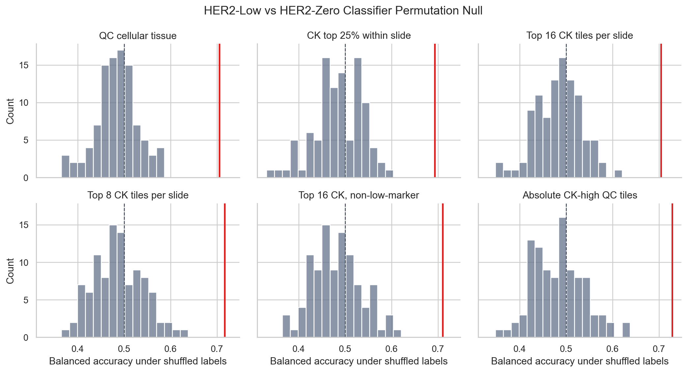
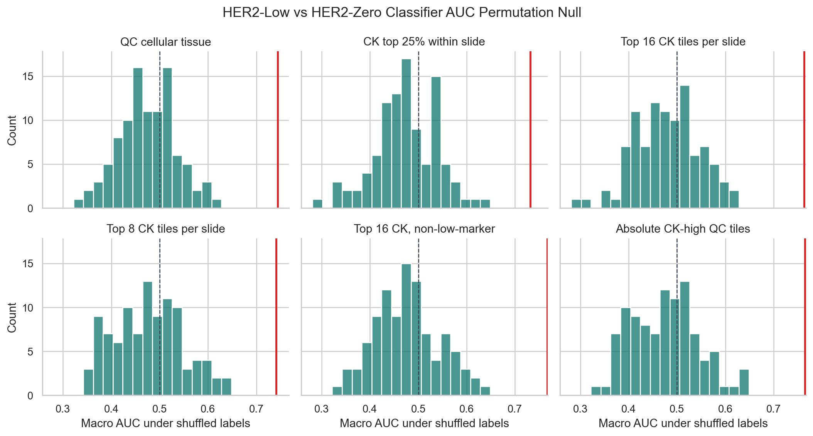

# Classifier Permutation Sanity Check

This analysis asks whether the selected HER2-low versus HER2-zero GigaTIME/H&E classifiers perform better than the same classifiers trained on shuffled labels.

Important caveat: this is a post-hoc sanity check for the selected feature set in each view. It is not a fully nested model-selection permutation test, so it should be used as evidence that the signal is not obviously random, not as final clinical validation.

Method:

- Task: HER2-low versus HER2-zero.
- Model: regularized logistic regression using the same selected GigaTIME/H&E feature set per view.
- Evaluation: repeated stratified 5-fold cross-validation with 3 repeats.
- Null: 100 label shuffles per view using the same folds and feature columns.

## Results

| View | Feature set | N | Features | LOOCV bal acc | Repeated-CV bal acc | Null mean | Null 95% | Empirical p | BH q | Repeated-CV AUC | AUC p |
| --- | --- | --- | --- | --- | --- | --- | --- | --- | --- | --- | --- |
| QC cellular tissue | Mean channels | 118 | 23 | 0.719 | 0.705 | 0.484 | 0.566 | 0.0099 | 0.0099 | 0.744 | 0.0099 |
| CK top 25% within slide | Mean + fraction channels | 117 | 46 | 0.708 | 0.693 | 0.485 | 0.557 | 0.0099 | 0.0099 | 0.731 | 0.0099 |
| Top 16 CK tiles per slide | Mean channels | 118 | 23 | 0.711 | 0.705 | 0.485 | 0.561 | 0.0099 | 0.0099 | 0.763 | 0.0099 |
| Top 8 CK tiles per slide | Mean channels | 118 | 23 | 0.727 | 0.716 | 0.488 | 0.586 | 0.0099 | 0.0099 | 0.741 | 0.0099 |
| Top 16 CK, non-low-marker | Mean channels | 117 | 23 | 0.708 | 0.710 | 0.482 | 0.567 | 0.0099 | 0.0099 | 0.767 | 0.0099 |
| Absolute CK-high QC tiles | Mean channels | 105 | 23 | 0.761 | 0.729 | 0.484 | 0.575 | 0.0099 | 0.0099 | 0.764 | 0.0099 |

## Interpretation

A low empirical p value means the observed repeated-CV classifier result is rarely matched by shuffled HER2-low/HER2-zero labels. This supports the idea that GigaTIME features contain real label-associated structure.

This still does not make the model diagnostic. It does not validate real mIF biology, does not prove tumor-cell HER2 biology, and does not solve the tissue-composition caveat. It is a useful classifier trustworthiness check before discussing the result with an advisor.

## Output Files

- `docs/clinical_her2_high_trust_tile128_classifier_permutation_sanity.md`
- `results/gigatime_tcga_brca_clinical_her2_high_trust_tile128/classifier_permutation_sanity/classifier_permutation_summary.csv`
- `results/gigatime_tcga_brca_clinical_her2_high_trust_tile128/classifier_permutation_sanity/classifier_permutation_null_metrics.csv`
- `docs/assets/clinical_her2_high_trust_tile128_classifier_permutation/`
