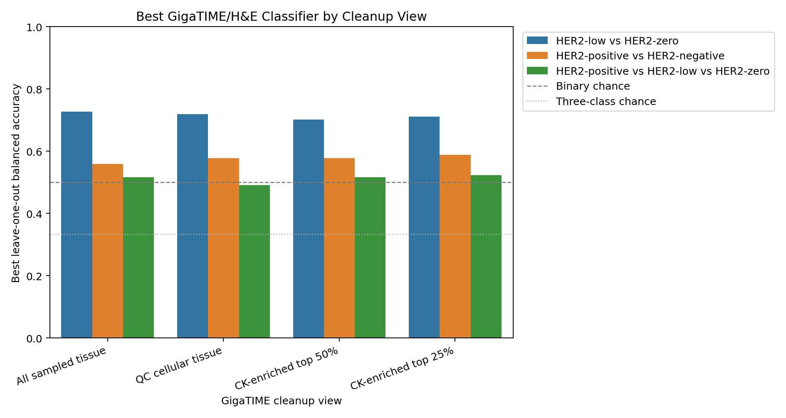
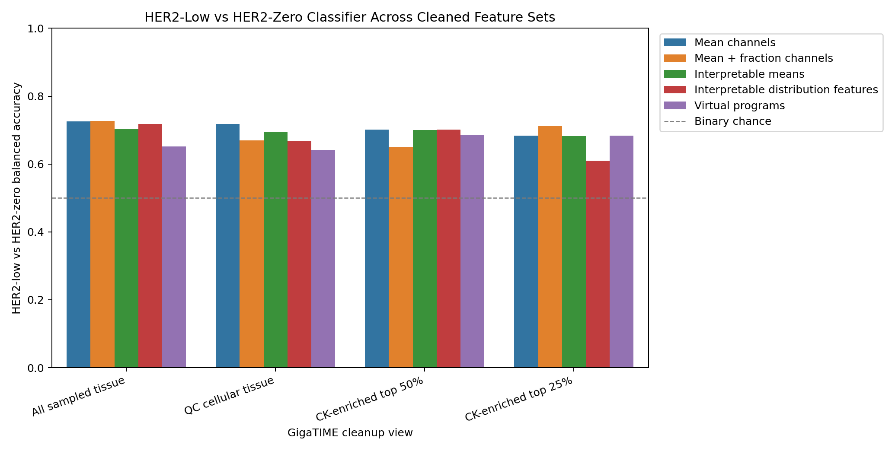
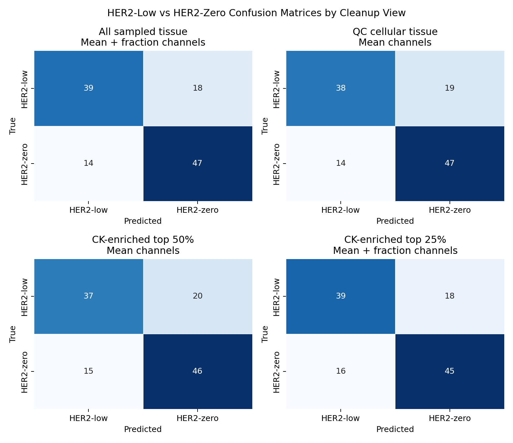

# Cleaned GigaTIME HER2 Classifier Comparison

This analysis reruns the slide-level HER2 classifier after cleaning the GigaTIME tile inputs. It compares all sampled tissue against cellular and virtual CK-enriched feature views.

Every prediction is leave-one-out cross-validated. This remains a small 171-case pilot, not a clinical model.

## Feature Views

- All sampled tissue: the original 256-tile slide aggregation.
- QC cellular tissue: tissue fraction >= 0.70 and virtual DAPI mean >= 0.05.
- CK-enriched top 50%: top half of virtual CK tiles within each slide after QC.
- CK-enriched top 25%: top quarter of virtual CK tiles within each slide after QC.

Virtual CK and DAPI are GigaTIME predictions, not real stains or pathologist tumor annotations.

## Feature Sets

| Feature set | Number of features |
| --- | --- |
| Mean channels | 23 |
| Mean + fraction channels | 46 |
| Interpretable means | 10 |
| Interpretable distribution features | 50 |
| Virtual programs | 8 |
| ERBB2 RNA reference | 1 |

## Best GigaTIME/H&E Result Per View and Task

| Cleanup view | Task | Best feature set | N | Accuracy | Balanced accuracy | Macro AUC | Sensitivity | Specificity |
| --- | --- | --- | --- | --- | --- | --- | --- | --- |
| All sampled tissue | HER2-low vs HER2-zero | Mean + fraction channels | 118 | 0.729 | 0.727 | 0.787 | 0.770 | 0.684 |
| All sampled tissue | HER2-positive vs HER2-negative | Virtual programs | 171 | 0.708 | 0.559 | 0.511 | 0.170 | 0.949 |
| All sampled tissue | HER2-positive vs HER2-low vs HER2-zero | Mean + fraction channels | 171 | 0.526 | 0.516 | 0.683 |  |  |
| QC cellular tissue | HER2-low vs HER2-zero | Mean channels | 118 | 0.720 | 0.719 | 0.741 | 0.770 | 0.667 |
| QC cellular tissue | HER2-positive vs HER2-negative | Interpretable means | 171 | 0.725 | 0.577 | 0.487 | 0.189 | 0.966 |
| QC cellular tissue | HER2-positive vs HER2-low vs HER2-zero | Virtual programs | 171 | 0.503 | 0.491 | 0.623 |  |  |
| CK-enriched top 50% | HER2-low vs HER2-zero | Mean channels | 118 | 0.703 | 0.702 | 0.752 | 0.754 | 0.649 |
| CK-enriched top 50% | HER2-positive vs HER2-negative | Interpretable means | 171 | 0.725 | 0.577 | 0.496 | 0.189 | 0.966 |
| CK-enriched top 50% | HER2-positive vs HER2-low vs HER2-zero | Mean channels | 171 | 0.526 | 0.516 | 0.680 |  |  |
| CK-enriched top 25% | HER2-low vs HER2-zero | Mean + fraction channels | 118 | 0.712 | 0.711 | 0.749 | 0.738 | 0.684 |
| CK-enriched top 25% | HER2-positive vs HER2-negative | Mean + fraction channels | 171 | 0.719 | 0.589 | 0.622 | 0.245 | 0.932 |
| CK-enriched top 25% | HER2-positive vs HER2-low vs HER2-zero | Mean channels | 171 | 0.532 | 0.524 | 0.679 |  |  |

## HER2-Low Versus HER2-Zero Focus

| Cleanup view | Best feature set | Accuracy | Balanced accuracy | Macro AUC | Sensitivity | Specificity |
| --- | --- | --- | --- | --- | --- | --- |
| All sampled tissue | Mean + fraction channels | 0.729 | 0.727 | 0.787 | 0.770 | 0.684 |
| QC cellular tissue | Mean channels | 0.720 | 0.719 | 0.741 | 0.770 | 0.667 |
| CK-enriched top 50% | Mean channels | 0.703 | 0.702 | 0.752 | 0.754 | 0.649 |
| CK-enriched top 25% | Mean + fraction channels | 0.712 | 0.711 | 0.749 | 0.738 | 0.684 |

## Main Result

- All sampled tissue HER2-low versus HER2-zero balanced accuracy: 0.727, macro AUC: 0.787.
- QC cellular tissue preserved the HER2-low versus HER2-zero result: balanced accuracy 0.719, macro AUC 0.741.
- CK-enriched top 50% reduced HER2-low versus HER2-zero performance to balanced accuracy 0.702.
- CK-enriched top 25% HER2-low versus HER2-zero balanced accuracy was 0.711.
- CK-enriched top 25% modestly improved HER2-positive versus HER2-negative balanced accuracy to 0.589, but sensitivity remained low at 0.245.

## ERBB2 RNA Reference

ERBB2 RNA is repeated as a non-H&E reference. It does not depend on the cleanup view and should not be interpreted as image-derived performance.

| Cleanup view | Task | Accuracy | Balanced accuracy | Macro AUC |
| --- | --- | --- | --- | --- |
| All sampled tissue | HER2-low vs HER2-zero | 0.534 | 0.521 | 0.291 |
| All sampled tissue | HER2-positive vs HER2-negative | 0.743 | 0.585 | 0.452 |
| All sampled tissue | HER2-positive vs HER2-low vs HER2-zero | 0.415 | 0.396 | 0.378 |
| QC cellular tissue | HER2-low vs HER2-zero | 0.534 | 0.521 | 0.291 |
| QC cellular tissue | HER2-positive vs HER2-negative | 0.743 | 0.585 | 0.452 |
| QC cellular tissue | HER2-positive vs HER2-low vs HER2-zero | 0.415 | 0.396 | 0.378 |
| CK-enriched top 50% | HER2-low vs HER2-zero | 0.534 | 0.521 | 0.291 |
| CK-enriched top 50% | HER2-positive vs HER2-negative | 0.743 | 0.585 | 0.452 |
| CK-enriched top 50% | HER2-positive vs HER2-low vs HER2-zero | 0.415 | 0.396 | 0.378 |
| CK-enriched top 25% | HER2-low vs HER2-zero | 0.534 | 0.521 | 0.291 |
| CK-enriched top 25% | HER2-positive vs HER2-negative | 0.743 | 0.585 | 0.452 |
| CK-enriched top 25% | HER2-positive vs HER2-low vs HER2-zero | 0.415 | 0.396 | 0.378 |

## Interpretation

The cleaned-view comparison asks whether the classifier signal is stronger in tumor-enriched tile views or in broader tissue context.

In this run, cellular-tissue cleanup preserved the HER2-low versus HER2-zero classifier signal, which argues against the result being only blank/background artifact. However, the signal weakened when restricted to the most CK-enriched tiles. That suggests the current GigaTIME signal may be capturing broader tissue or microenvironment context more than a purely epithelial tumor-cell HER2 phenotype.

The practical next step is not to claim diagnosis. It is to inspect the cases that change classification between all-tissue/QC-cellular and CK-enriched views, because those flips can reveal whether GigaTIME is using tumor regions, stromal context, immune infiltrates, or tile-selection artifacts.

## Outputs

- `results/gigatime_tcga_brca_clinical_her2_high_trust_tile128/cleaned_classifier_comparison/cleaned_classifier_predictions.csv`
- `results/gigatime_tcga_brca_clinical_her2_high_trust_tile128/cleaned_classifier_comparison/cleaned_classifier_metrics.csv`
- `results/gigatime_tcga_brca_clinical_her2_high_trust_tile128/cleaned_classifier_comparison/cleaned_classifier_confusion_matrices.csv`
- `docs/assets/clinical_her2_high_trust_tile128_cleaned_classifier/`
