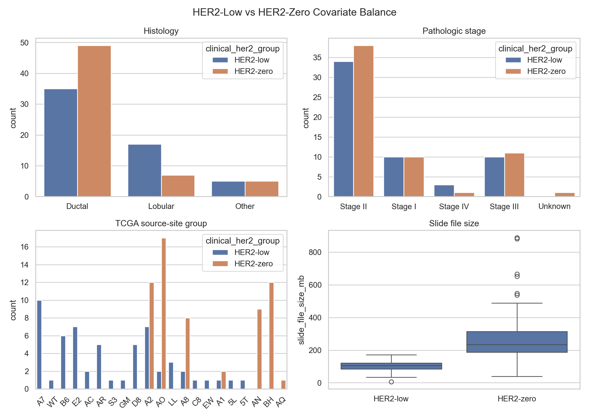
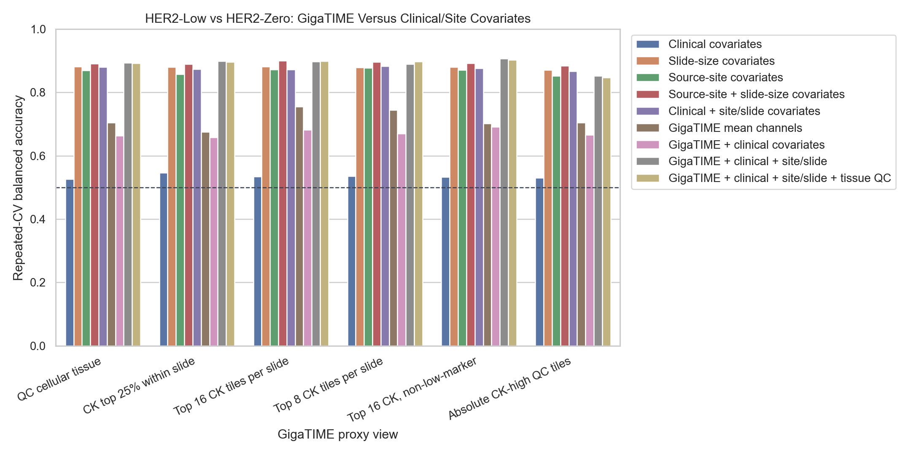
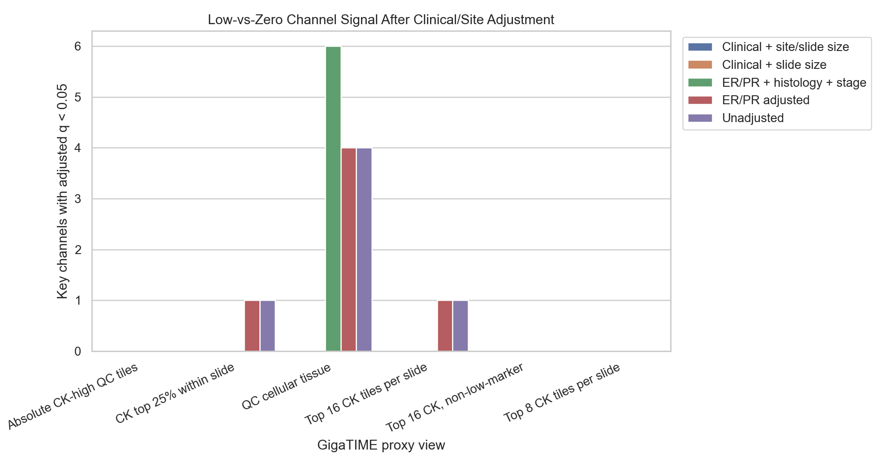

# Clinical/Site Covariate Sensitivity

This analysis asks whether the current HER2-low versus HER2-zero GigaTIME signal could be explained by ordinary clinical, slide, or TCGA source-site covariates.

Important caveat: this still uses retrospective TCGA metadata. It is a confounder sensitivity check, not external validation.

## Covariate Balance

| Numeric covariate | N low | N zero | Mean low | Mean zero | Low-zero delta | p |
| --- | --- | --- | --- | --- | --- | --- |
| Slide file size MB | 57 | 61 | 100.486 | 278.961 | -178.475 | 1.45e-15 |
| Slide width | 57 | 61 | 61509.123 | 102679.066 | -41169.943 | 2.58e-12 |
| Slide height | 57 | 61 | 23300.702 | 31759.115 | -8458.413 | 6.49e-07 |
| Mean tissue fraction | 57 | 61 | 0.922 | 0.906 | 0.017 | 0.0820 |
| Retained tile fraction | 57 | 61 | 0.699 | 0.731 | -0.032 | 0.3459 |
| Mean marker burden | 57 | 61 | 0.056 | 0.076 | -0.019 | 5.79e-04 |
| Mean virtual DAPI | 57 | 61 | 0.306 | 0.384 | -0.078 | 1.63e-04 |
| Mean virtual CK | 57 | 61 | 0.191 | 0.245 | -0.054 | 0.0017 |
| ERBB2 TPM subset | 20 | 20 | 113.146 | 89.649 | 23.497 | 0.2616 |

| Categorical covariate | Level totals | Chi-square p |
| --- | --- | --- |
| ER status | Negative: 30; Positive: 88 | 0.3995 |
| PR status | Negative: 40; Positive: 78 | 0.2721 |
| Histology group | Ductal: 84; Lobular: 24; Other: 10 | 0.0413 |
| Pathologic stage group | Stage I: 20; Stage II: 72; Stage III: 21; Stage IV: 4; Unknown: 1 | 0.7106 |
| TCGA source-site group | 5L: 1; 5T: 1; A1: 3; A2: 19; A7: 10; A8: 10; AC: 2; AN: 9; AO: 19; AQ: 1; AR: 5; B6: 6; BH: 12; C8: 1; D8: 5; E2: 7; EW: 1; GM: 1; LL: 3; S3: 1; WT: 1 | 7.97e-10 |

## Classifier Sensitivity

The classifier comparison asks whether GigaTIME features add signal beyond non-image clinical/site/slide covariates.

### Top 8 CK tiles per slide

| Feature set | Features | Balanced accuracy | AUC | Sensitivity | Specificity |
| --- | --- | --- | --- | --- | --- |
| Clinical covariates | 8 | 0.536 | 0.512 | 0.716 | 0.357 |
| Slide-size covariates | 3 | 0.879 | 0.921 | 0.869 | 0.889 |
| Source-site covariates | 20 | 0.878 | 0.925 | 0.967 | 0.789 |
| Source-site + slide-size covariates | 23 | 0.897 | 0.965 | 0.940 | 0.854 |
| Clinical + site/slide covariates | 31 | 0.884 | 0.949 | 0.902 | 0.865 |
| GigaTIME mean channels | 23 | 0.745 | 0.751 | 0.770 | 0.719 |
| GigaTIME + clinical covariates | 31 | 0.670 | 0.686 | 0.727 | 0.614 |
| GigaTIME + clinical + site/slide | 54 | 0.890 | 0.952 | 0.896 | 0.883 |
| GigaTIME + clinical + site/slide + tissue QC | 57 | 0.898 | 0.955 | 0.907 | 0.889 |

### Absolute CK-high QC tiles

| Feature set | Features | Balanced accuracy | AUC | Sensitivity | Specificity |
| --- | --- | --- | --- | --- | --- |
| Clinical covariates | 8 | 0.531 | 0.540 | 0.678 | 0.383 |
| Slide-size covariates | 3 | 0.871 | 0.914 | 0.862 | 0.879 |
| Source-site covariates | 20 | 0.853 | 0.898 | 0.954 | 0.752 |
| Source-site + slide-size covariates | 23 | 0.884 | 0.931 | 0.931 | 0.837 |
| Clinical + site/slide covariates | 31 | 0.867 | 0.922 | 0.891 | 0.844 |
| GigaTIME mean channels | 23 | 0.704 | 0.742 | 0.799 | 0.610 |
| GigaTIME + clinical covariates | 31 | 0.666 | 0.706 | 0.701 | 0.631 |
| GigaTIME + clinical + site/slide | 54 | 0.853 | 0.920 | 0.897 | 0.809 |
| GigaTIME + clinical + site/slide + tissue QC | 57 | 0.847 | 0.924 | 0.885 | 0.809 |

## Adjusted Channel Tests

These models test the HER2-low minus HER2-zero coefficient for each key GigaTIME channel after adding covariates.

### Top 8 CK tiles per slide

| Adjustment model | q<0.05 channels | Channels | Best q |
| --- | --- | --- | --- |
| Unadjusted | 0 | none | 0.0543 |
| ER/PR adjusted | 0 | none | 0.0678 |
| ER/PR + histology + stage | 0 | none | 0.1238 |
| Clinical + slide size | 0 | none | 0.7788 |
| Clinical + site/slide size | 0 | none | 0.6262 |

### Absolute CK-high QC tiles

| Adjustment model | q<0.05 channels | Channels | Best q |
| --- | --- | --- | --- |
| Unadjusted | 0 | none | 0.2071 |
| ER/PR adjusted | 0 | none | 0.2505 |
| ER/PR + histology + stage | 0 | none | 0.1976 |
| Clinical + slide size | 0 | none | 0.9815 |
| Clinical + site/slide size | 0 | none | 0.3553 |

## Interpretation

- HER2-low and HER2-zero are not perfectly balanced for histology, stage, source site, or slide size.
- The source-site and slide-size imbalance is especially important because it can reflect TCGA batch/collection differences rather than tumor biology.
- If source-site or slide-size covariates alone classify well, the image result may be partly confounded by cohort construction or acquisition differences.
- If GigaTIME plus covariates does not clearly improve beyond site/slide covariates alone, the image-derived classifier should not be presented as a strong independent biological model.
- Any result that remains after this adjustment still needs pathologist-reviewed tumor-rich regions and external validation before biological claims.

Follow-up status: a matched HER2-low/HER2-zero sensitivity analysis has now been run. It keeps modest GigaTIME classifier signal in matched subsets, but source-site/slide-size baselines remain competitive or stronger in the larger matched subsets, and paired channel tests do not reach BH q < 0.05. See `docs/clinical_her2_high_trust_tile128_matched_low_zero_sensitivity.md`.

A leave-source-site-out classifier check has also been run. In the top 8 CK proxy view, GigaTIME mean channels drop from balanced accuracy 0.745 under repeated stratified CV to 0.669 under leave-source-site-out validation, while slide-size covariates remain at 0.882. See `docs/clinical_her2_high_trust_tile128_source_site_generalization.md`.

## Output Files

- `docs/clinical_her2_high_trust_tile128_clinical_covariate_sensitivity.md`
- `results/gigatime_tcga_brca_clinical_her2_high_trust_tile128/clinical_covariate_sensitivity/covariate_balance_numeric.csv`
- `results/gigatime_tcga_brca_clinical_her2_high_trust_tile128/clinical_covariate_sensitivity/covariate_balance_categorical.csv`
- `results/gigatime_tcga_brca_clinical_her2_high_trust_tile128/clinical_covariate_sensitivity/covariate_classifier_metrics.csv`
- `results/gigatime_tcga_brca_clinical_her2_high_trust_tile128/clinical_covariate_sensitivity/covariate_adjusted_channel_tests.csv`
- `docs/assets/clinical_her2_high_trust_tile128_clinical_covariates/`
