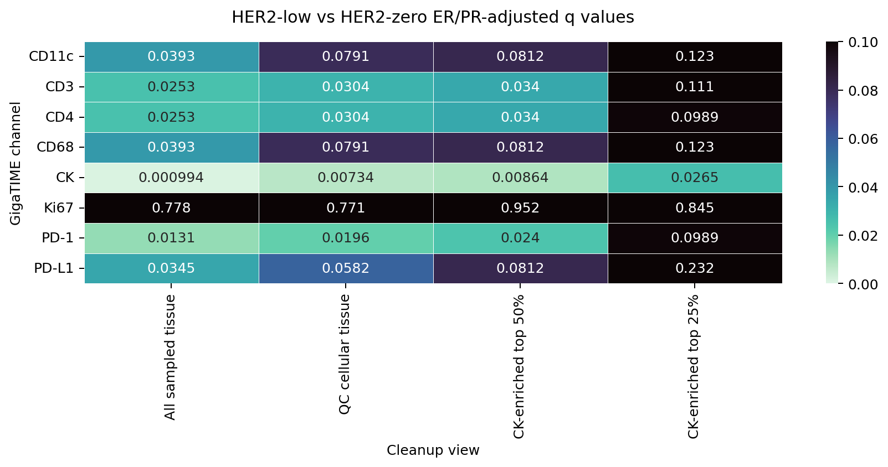
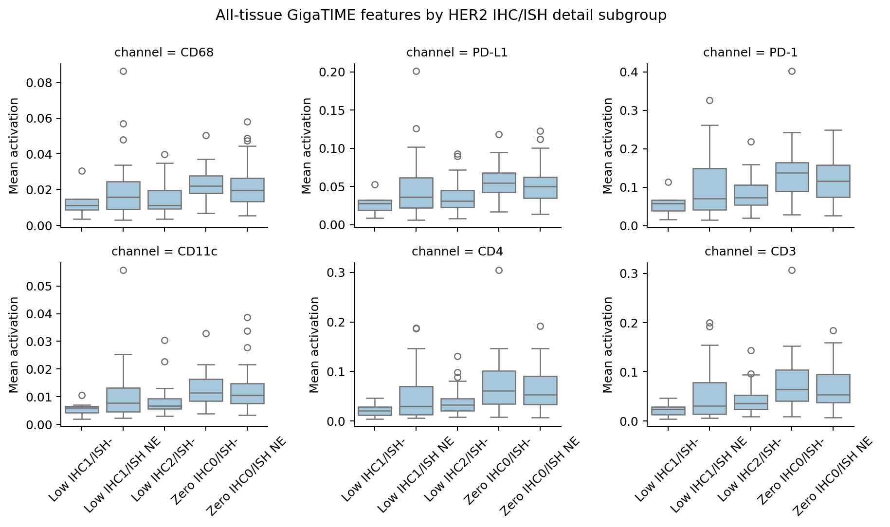

# High-Trust HER2 ER/PR and Subgroup Sensitivity

Status: Sensitivity analysis for the current strict high-trust 171-slide GigaTIME analysis set.

## Why This Matters

The main high-trust finding is HER2-low versus HER2-zero separation in GigaTIME virtual immune/myeloid/checkpoint and tissue-context channels. This analysis asks whether that signal is obviously explained by hormone receptor imbalance or by one HER2 IHC/ISH subgroup.

This is still exploratory. ER/PR adjustment is a statistical sensitivity check, not causal proof.

## Input Counts

| Group | Slides | ER positive | ER negative | PR positive | PR negative |
| --- | --- | --- | --- | --- | --- |
| HER2-positive | 53 | 43 | 10 | 30 | 23 |
| HER2-low | 57 | 45 | 12 | 41 | 16 |
| HER2-zero | 61 | 43 | 18 | 37 | 24 |

## ER/PR-Adjusted Result

| Cleanup view | Unadjusted q<0.05 channels | ER/PR adjusted q<0.05 channels | ER/PR+ERBB2 adjusted q<0.05 channels |
| --- | --- | --- | --- |
| All sampled tissue | 8 | 7 | 4 |
| QC cellular tissue | 7 | 4 | 3 |
| CK-enriched top 50% | 7 | 4 | 3 |
| CK-enriched top 25% | 7 | 1 | 2 |

All-sampled-tissue channels ranked by ER/PR-adjusted q value:

| Channel | Unadjusted low-zero delta | Unadjusted q | ER/PR beta | ER/PR q | ER/PR+ERBB2 q | RNA n |
| --- | --- | --- | --- | --- | --- | --- |
| CK | -0.06377 | 5.94e-04 | -0.06170 | 9.94e-04 | 0.039 | 40 |
| PD-1 | -0.03948 | 5.94e-04 | -0.03772 | 0.013 | 0.027 | 40 |
| CD4 | -0.02379 | 8.19e-04 | -0.02269 | 0.025 | 0.019 | 40 |
| CD3 | -0.02433 | 8.89e-04 | -0.02311 | 0.025 | 0.019 | 40 |
| PD-L1 | -0.01301 | 5.94e-04 | -0.01273 | 0.034 | 0.252 | 40 |
| CD68 | -0.00537 | 5.94e-04 | -0.00521 | 0.039 | 0.238 | 40 |
| CD11c | -0.00325 | 5.94e-04 | -0.00326 | 0.039 | 0.073 | 40 |
| Ki67 | -5.34e-04 | 0.019 | -3.30e-04 | 0.778 | 0.274 | 40 |

Interpretation: if the ER/PR-adjusted q values remain small and the beta stays negative, the HER2-low lower-than-zero signal is not explained only by ER/PR imbalance.

The ER/PR+ERBB2 adjustment uses only cases with available ERBB2 RNA, so it is a smaller secondary sensitivity check.

## ER/PR-Stratified Result

| Stratum | HER2-low n | HER2-zero n | Best channel | Low-zero delta | BH q |
| --- | --- | --- | --- | --- | --- |
| ER-positive only | 45 | 43 | PD-L1 | -0.00906 | 0.044 |
| ER-negative only | 12 | 18 | PD-1 | -0.08258 | 0.009 |
| PR-positive only | 41 | 37 | CD11c | -0.00365 | 0.009 |
| PR-negative only | 16 | 24 | CD68 | -0.00784 | 0.049 |

Interpretation: these strata are smaller, especially ER-negative and PR-negative subsets. Consistent negative deltas across strata are more important than any single p value.

## HER2 Detail Subgroup Result

All-sampled-tissue subgroup means:

| Channel | Low IHC1/ISH- | Low IHC1/ISH NE | Low IHC2/ISH- | Zero IHC0/ISH- | Zero IHC0/ISH NE | Subgroup q |
| --- | --- | --- | --- | --- | --- | --- |
| CD68 | 0.01280 | 0.02043 | 0.01522 | 0.02348 | 0.02240 | 0.007 |
| PD-L1 | 0.02727 | 0.04864 | 0.03826 | 0.05755 | 0.05342 | 0.006 |
| PD-1 | 0.05673 | 0.10417 | 0.08611 | 0.14408 | 0.12414 | 0.006 |
| CD11c | 0.00576 | 0.01106 | 0.00894 | 0.01306 | 0.01263 | 0.006 |
| CD4 | 0.02148 | 0.05151 | 0.04251 | 0.07782 | 0.06334 | 0.007 |
| CD3 | 0.02339 | 0.05606 | 0.04650 | 0.08243 | 0.06780 | 0.007 |
| CK | 0.13331 | 0.16646 | 0.18085 | 0.23355 | 0.23011 | 0.006 |

Best all-sampled-tissue subgroup contrasts:

| Contrast | Best channel | A n | B n | A-B delta | BH q |
| --- | --- | --- | --- | --- | --- |
| low_IHC1_any_ISH_vs_zero_all | CK | 35 | 61 | -0.07224 | 0.001 |
| low_IHC2_ISH_negative_vs_zero_all | CD68 | 22 | 61 | -0.00750 | 0.010 |
| low_all_vs_zero_ISH_negative | CD68 | 57 | 18 | -0.00613 | 0.008 |
| low_all_vs_zero_ISH_not_evaluated | CD68 | 57 | 43 | -0.00505 | 0.005 |

Interpretation: if both HER2-low IHC1 and HER2-low IHC2/ISH-negative remain lower than HER2-zero, the result is less likely to be an artifact of only one HER2-low subgroup.

## Machine-Readable Outputs

- [assets/clinical_her2_high_trust_tile128_erpr_subgroup_sensitivity/low_zero_erpr_adjusted_tests.csv](assets/clinical_her2_high_trust_tile128_erpr_subgroup_sensitivity/low_zero_erpr_adjusted_tests.csv)
- [assets/clinical_her2_high_trust_tile128_erpr_subgroup_sensitivity/low_zero_erpr_stratified_tests.csv](assets/clinical_her2_high_trust_tile128_erpr_subgroup_sensitivity/low_zero_erpr_stratified_tests.csv)
- [assets/clinical_her2_high_trust_tile128_erpr_subgroup_sensitivity/her2_detail_subgroup_tests.csv](assets/clinical_her2_high_trust_tile128_erpr_subgroup_sensitivity/her2_detail_subgroup_tests.csv)
- [assets/clinical_her2_high_trust_tile128_erpr_subgroup_sensitivity/her2_detail_subgroup_contrasts.csv](assets/clinical_her2_high_trust_tile128_erpr_subgroup_sensitivity/her2_detail_subgroup_contrasts.csv)
- [assets/clinical_her2_high_trust_tile128_erpr_subgroup_sensitivity/sensitivity_summary.json](assets/clinical_her2_high_trust_tile128_erpr_subgroup_sensitivity/sensitivity_summary.json)

## Cautious Claim This Supports

> The main all-sampled-tissue HER2-low versus HER2-zero GigaTIME signal persists after ER/PR adjustment and remains visible across major HER2 IHC/ISH detail subgroups, supporting a tissue-context association rather than an obvious hormone-receptor or single-subgroup artifact.

What this does not prove:

- It does not prove clinical HER2 diagnosis from H&E.
- It does not prove that GigaTIME measures real immune proteins in these TCGA slides.
- It does not replace pathologist tumor-region review or external validation.
