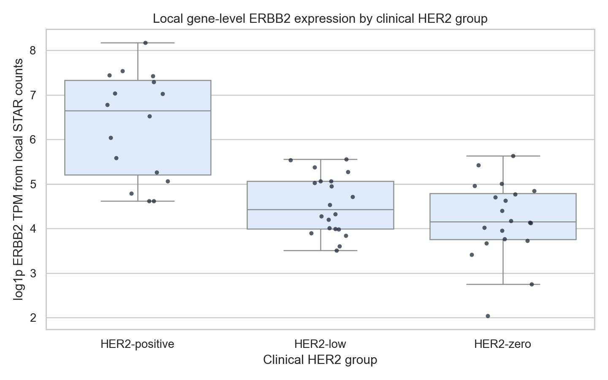
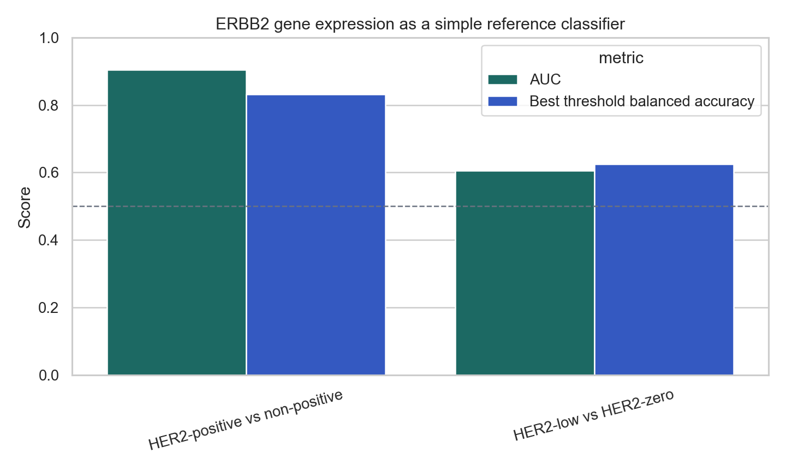
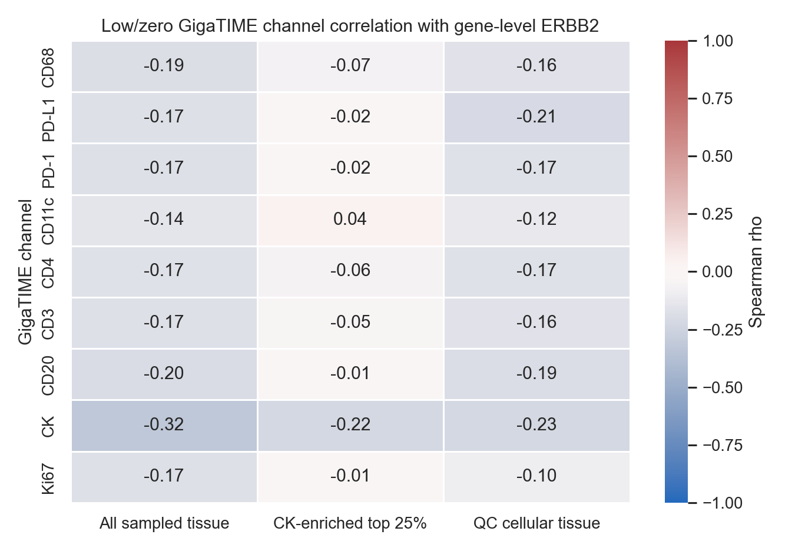
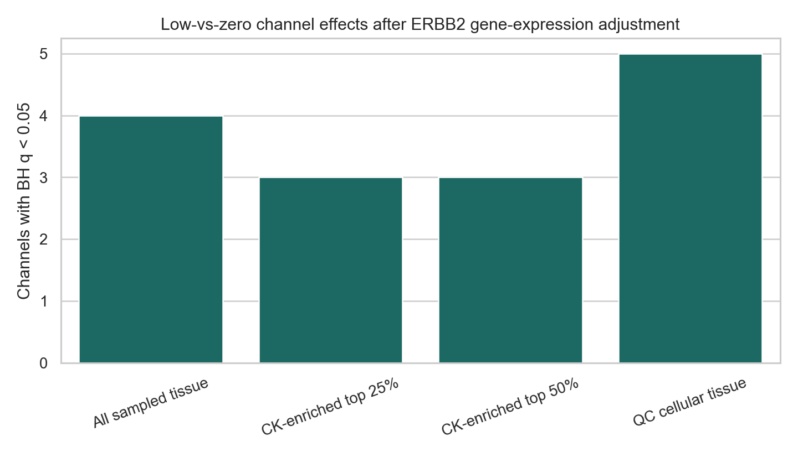

# Local ERBB2 Gene-Level Validation

Status: expanded gene-level ERBB2 validation using all local GDC STAR augmented gene-count files currently downloaded in this workspace.

## Bottom Line

The local STAR files add gene-level ERBB2 context for 110 TCGA-BRCA cases, including 56 strict high-trust GigaTIME/HER2 cases and 40 HER2-low/HER2-zero high-trust cases.

This is a useful sanity check, but it is not HER2 isoform validation. These files contain gene-level ERBB2 TPM from STAR counts, not transcript-level isoform proportions, PSI, junction evidence, or antibody-binding-domain information.

Main interpretation:

- ERBB2 gene expression strongly supports the HER2-positive label as a broad molecular sanity check: the simple ERBB2-only reference classifier has AUC 0.905 for HER2-positive versus non-positive.
- ERBB2 gene expression is much weaker for HER2-low versus HER2-zero: low/zero ERBB2-only AUC is 0.605, and the pairwise low-vs-zero Mann-Whitney p/q are 0.262/0.262.
- Therefore, the current GigaTIME HER2-low versus HER2-zero signal is not simply a strong gene-level ERBB2 expression separation.
- In the low/zero subset, GigaTIME channel correlations with gene-level ERBB2 are limited and should be treated as context, not validation.
- After adjusting low-vs-zero channel tests for log ERBB2 TPM in the small local RNA-overlap subset, 15 tested channel/view effects remain BH q < 0.05.

## Local ERBB2 Coverage

| Item | Count |
|---|---:|
| Local STAR ERBB2 cases | 110 |
| Strict high-trust slides/cases | 171 |
| Strict high-trust cases with local ERBB2 | 56 |
| HER2-low/HER2-zero high-trust cases with local ERBB2 | 40 |

## ERBB2 Expression By Clinical HER2 Group

| Clinical HER2 group | N | Median TPM | Q25 TPM | Q75 TPM |
| --- | --- | --- | --- | --- |
| HER2-positive | 16 | 779 | 183 | 1.52e+03 |
| HER2-low | 20 | 83.4 | 53.2 | 157 |
| HER2-zero | 20 | 62.7 | 41.8 | 119 |

## Pairwise ERBB2 Gene-Level Tests

| Comparison | N A | N B | Median A | Median B | AUC | p | BH q |
| --- | --- | --- | --- | --- | --- | --- | --- |
| HER2-positive vs HER2-low | 16 | 20 | 779 | 83.4 | 0.891 | 7.38e-05 | 1.11e-04 |
| HER2-positive vs HER2-zero | 16 | 20 | 779 | 62.7 | 0.919 | 2.14e-05 | 6.41e-05 |
| HER2-low vs HER2-zero | 20 | 20 | 83.4 | 62.7 | 0.605 | 0.262 | 0.262 |

## ERBB2-Only Reference Classifier

This is not an image model. It is a sanity-check reference using only gene-level ERBB2 TPM.

| Task | N cases | AUC | Best-threshold balanced accuracy |
| --- | --- | --- | --- |
| HER2-positive vs non-positive | 56 | 0.905 | 0.831 |
| HER2-low vs HER2-zero | 40 | 0.605 | 0.625 |

## GigaTIME Correlation With Gene-Level ERBB2

Top absolute low/zero correlations between GigaTIME mean channels and log ERBB2 TPM:

| Feature view | Channel | N | Spearman rho | p | BH q |
| --- | --- | --- | --- | --- | --- |
| All sampled tissue | CK | 40 | -0.321 | 0.0433 | 0.693 |
| CK-enriched top 50% | CK | 40 | -0.236 | 0.142 | 0.693 |
| QC cellular tissue | CK | 40 | -0.226 | 0.16 | 0.693 |
| CK-enriched top 25% | CK | 40 | -0.221 | 0.17 | 0.693 |
| QC cellular tissue | PD-L1 | 40 | -0.206 | 0.201 | 0.693 |
| All sampled tissue | CD20 | 40 | -0.197 | 0.224 | 0.693 |
| QC cellular tissue | CD20 | 40 | -0.191 | 0.237 | 0.693 |
| All sampled tissue | CD68 | 40 | -0.186 | 0.25 | 0.693 |
| All sampled tissue | Ki67 | 40 | -0.175 | 0.281 | 0.693 |
| All sampled tissue | CD3 | 40 | -0.174 | 0.283 | 0.693 |

## Low-Vs-Zero Channel Tests Adjusted For ERBB2

These models test whether the low-vs-zero GigaTIME channel difference remains after adding log ERBB2 TPM as a covariate. This is limited by the small RNA-overlap subset and should not be overinterpreted.

| Feature view | Channel | N | Beta zero-vs-low adjusted | p | BH q |
| --- | --- | --- | --- | --- | --- |
| CK-enriched top 50% | CD3 | 40 | 0.0326 | 0.00342 | 0.0208 |
| CK-enriched top 50% | PD-1 | 40 | 0.0499 | 0.00578 | 0.0208 |
| QC cellular tissue | PD-1 | 40 | 0.0588 | 0.00383 | 0.0208 |
| All sampled tissue | CD4 | 40 | 0.0339 | 0.00408 | 0.0208 |
| All sampled tissue | CD3 | 40 | 0.0338 | 0.00547 | 0.0208 |
| CK-enriched top 25% | CD3 | 40 | 0.0267 | 0.00527 | 0.0208 |
| CK-enriched top 25% | CD4 | 40 | 0.0262 | 0.00484 | 0.0208 |
| CK-enriched top 50% | CD4 | 40 | 0.0324 | 0.00316 | 0.0208 |
| QC cellular tissue | CD4 | 40 | 0.0418 | 0.00361 | 0.0208 |
| QC cellular tissue | CD3 | 40 | 0.042 | 0.00453 | 0.0208 |
| All sampled tissue | PD-1 | 40 | 0.0472 | 0.00713 | 0.0233 |
| CK-enriched top 25% | PD-1 | 40 | 0.0434 | 0.0114 | 0.0325 |

## What This Means For The Paper

This result helps us say something careful:

- The clinical HER2-positive labels look molecularly plausible because ERBB2 RNA is high in many HER2-positive cases.
- HER2-low versus HER2-zero is not strongly resolved by gene-level ERBB2 RNA alone in the local overlap subset.
- That makes the GigaTIME low/zero image signal more interesting, but not automatically biological. It could reflect tissue context, source-site/slide-size effects, stromal composition, immune context, or real biology.
- This analysis does not test the Guardia et al. HER2 isoform hypothesis directly. For that, we still need transcript-level isoform labels or RNA-seq reads/junction evidence.

## Output Files

- `docs/clinical_her2_high_trust_tile128_local_erbb2_validation.md`
- `results/gigatime_tcga_brca_clinical_her2_high_trust_tile128/local_erbb2_expression_validation/local_erbb2_expression.csv`
- `results/gigatime_tcga_brca_clinical_her2_high_trust_tile128/local_erbb2_expression_validation/high_trust_local_erbb2_joined.csv`
- `results/gigatime_tcga_brca_clinical_her2_high_trust_tile128/local_erbb2_expression_validation/local_erbb2_group_summary.csv`
- `results/gigatime_tcga_brca_clinical_her2_high_trust_tile128/local_erbb2_expression_validation/local_erbb2_pairwise_tests.csv`
- `results/gigatime_tcga_brca_clinical_her2_high_trust_tile128/local_erbb2_expression_validation/local_erbb2_reference_classifier_metrics.csv`
- `results/gigatime_tcga_brca_clinical_her2_high_trust_tile128/local_erbb2_expression_validation/local_erbb2_gigatime_correlations.csv`
- `results/gigatime_tcga_brca_clinical_her2_high_trust_tile128/local_erbb2_expression_validation/local_erbb2_adjusted_low_zero_channel_tests.csv`
- `results/gigatime_tcga_brca_clinical_her2_high_trust_tile128/local_erbb2_expression_validation/local_erbb2_validation_summary.json`
