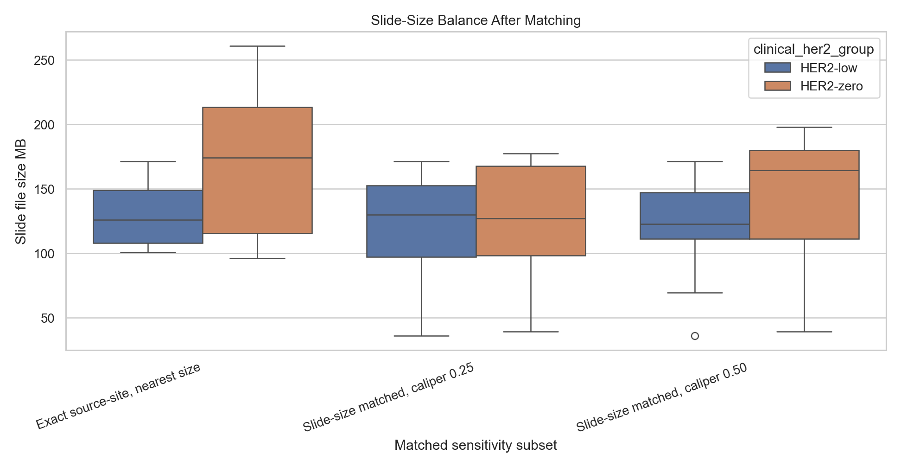
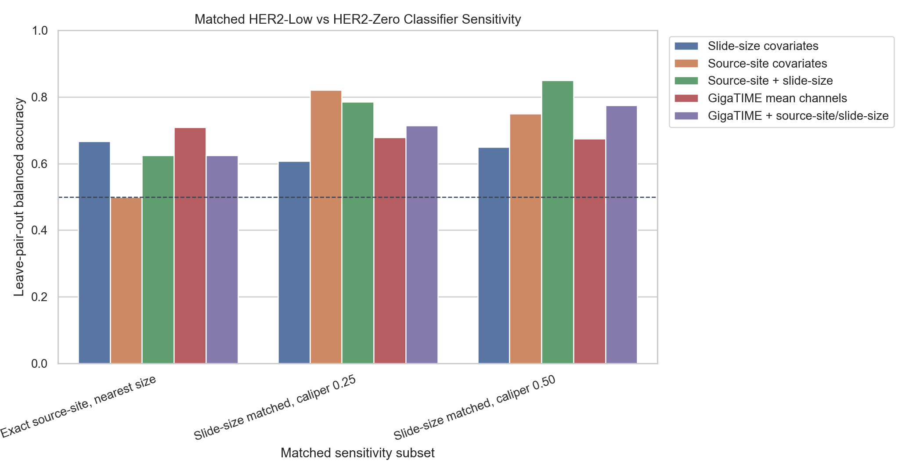
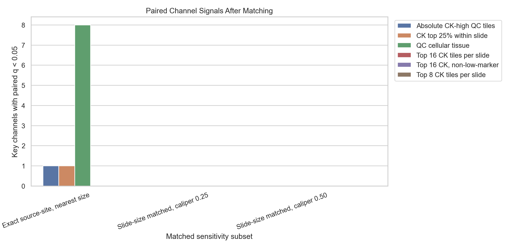

# Matched HER2-Low Versus HER2-Zero Sensitivity

This analysis responds to the clinical/source-site confounder finding. It builds matched HER2-low/HER2-zero subsets and reruns the key GigaTIME checks with leave-one-pair-out classifier evaluation and paired channel tests.

Important caveat: exact source-site matching leaves only a small sample. These matched analyses are sensitivity checks, not final validation.

## Matched Subsets

| Matched subset | Pairs | Same-source-site pairs | Median abs log-size diff | Median abs MB diff |
| --- | --- | --- | --- | --- |
| Exact source-site, nearest size | 12 | 12 | 0.150 | 17.4 |
| Slide-size matched, caliper 0.25 | 14 | 2 | 0.017 | 2.0 |
| Slide-size matched, caliper 0.50 | 20 | 2 | 0.031 | 3.1 |

## Leave-Pair-Out Classifier Sensitivity

### Exact source-site, nearest size

| Feature set | Pairs | Features | Balanced accuracy | AUC |
| --- | --- | --- | --- | --- |
| Slide-size covariates | 12 | 3 | 0.667 | 0.729 |
| Source-site covariates | 12 | 3 | 0.500 | 0.500 |
| Source-site + slide-size | 12 | 6 | 0.625 | 0.771 |
| GigaTIME mean channels | 12 | 23 | 0.708 | 0.750 |
| GigaTIME + source-site/slide-size | 12 | 29 | 0.625 | 0.757 |

### Slide-size matched, caliper 0.25

| Feature set | Pairs | Features | Balanced accuracy | AUC |
| --- | --- | --- | --- | --- |
| Slide-size covariates | 14 | 3 | 0.607 | 0.689 |
| Source-site covariates | 14 | 12 | 0.821 | 0.768 |
| Source-site + slide-size | 14 | 15 | 0.786 | 0.893 |
| GigaTIME mean channels | 14 | 23 | 0.679 | 0.694 |
| GigaTIME + source-site/slide-size | 14 | 38 | 0.714 | 0.791 |

### Slide-size matched, caliper 0.50

| Feature set | Pairs | Features | Balanced accuracy | AUC |
| --- | --- | --- | --- | --- |
| Slide-size covariates | 20 | 3 | 0.650 | 0.685 |
| Source-site covariates | 20 | 14 | 0.750 | 0.797 |
| Source-site + slide-size | 20 | 17 | 0.850 | 0.873 |
| GigaTIME mean channels | 20 | 23 | 0.675 | 0.623 |
| GigaTIME + source-site/slide-size | 20 | 40 | 0.775 | 0.838 |

## Paired Channel Tests

The table below shows the top paired low-minus-zero channel differences in the top 8 CK proxy view for each matched subset.

### Exact source-site, nearest size

| Channel | Pairs | Mean low-zero | Wilcoxon p | BH q |
| --- | --- | --- | --- | --- |
| CD20 | 12 | -0.0201 | 0.0522 | 0.3472 |
| CK | 12 | -0.0886 | 0.0771 | 0.3472 |
| Ki67 | 12 | -0.0035 | 0.1514 | 0.4541 |
| PD-L1 | 12 | -0.0077 | 0.2036 | 0.4581 |
| PD-1 | 12 | -0.0132 | 0.3394 | 0.4768 |
| CD11c | 12 | -0.0016 | 0.4238 | 0.4768 |
| CD4 | 12 | -0.0087 | 0.3394 | 0.4768 |
| CD3 | 12 | -0.0086 | 0.3804 | 0.4768 |

### Slide-size matched, caliper 0.25

| Channel | Pairs | Mean low-zero | Wilcoxon p | BH q |
| --- | --- | --- | --- | --- |
| CK | 14 | -0.0561 | 0.0785 | 0.7064 |
| CD68 | 14 | -0.0022 | 0.4631 | 0.7524 |
| CD11c | 14 | -8.57e-04 | 0.4263 | 0.7524 |
| CD4 | 14 | -2.60e-05 | 0.4631 | 0.7524 |
| CD20 | 14 | 0.0237 | 0.5016 | 0.7524 |
| Ki67 | 14 | 0.0060 | 0.1937 | 0.7524 |
| PD-L1 | 14 | 0.0127 | 0.8077 | 1.0000 |
| PD-1 | 14 | 0.0175 | 0.9515 | 1.0000 |

### Slide-size matched, caliper 0.50

| Channel | Pairs | Mean low-zero | Wilcoxon p | BH q |
| --- | --- | --- | --- | --- |
| CK | 20 | -0.0696 | 0.0153 | 0.1378 |
| PD-L1 | 20 | 0.0122 | 0.4091 | 0.7124 |
| PD-1 | 20 | 0.0265 | 0.3488 | 0.7124 |
| CD3 | 20 | 0.0148 | 0.4524 | 0.7124 |
| CD20 | 20 | 0.0200 | 0.3300 | 0.7124 |
| Ki67 | 20 | 0.0033 | 0.4749 | 0.7124 |
| CD68 | 20 | 0.0013 | 0.7562 | 0.8821 |
| CD4 | 20 | 0.0095 | 0.7841 | 0.8821 |

## Interpretation

- GigaTIME mean channels remain modestly above chance in the matched subsets: balanced accuracy 0.708 in exact source-site pairs, 0.679 in strict slide-size pairs, and 0.675 in wider slide-size pairs.
- The confounder concern is not solved. In the larger slide-size matched subsets, source-site or source-site plus slide-size baselines remain competitive or stronger than GigaTIME.
- Paired channel tests do not reach BH q < 0.05 in the top 8 CK proxy view.
- The safest conclusion is that the HER2-low/HER2-zero GigaTIME signal remains worth studying, but TCGA alone is not clean enough to support an independent HER2-biology or diagnostic claim.
- Because exact source-site matching leaves only 12 pairs, any surviving image signal should be treated as hypothesis-generating and should motivate external/site-balanced validation plus pathologist-reviewed tumor-rich tile analysis.

## Output Files

- `docs/clinical_her2_high_trust_tile128_matched_low_zero_sensitivity.md`
- `results/gigatime_tcga_brca_clinical_her2_high_trust_tile128/matched_low_zero_sensitivity/matched_pairs.csv`
- `results/gigatime_tcga_brca_clinical_her2_high_trust_tile128/matched_low_zero_sensitivity/matched_slide_features.csv`
- `results/gigatime_tcga_brca_clinical_her2_high_trust_tile128/matched_low_zero_sensitivity/matched_classifier_metrics.csv`
- `results/gigatime_tcga_brca_clinical_her2_high_trust_tile128/matched_low_zero_sensitivity/matched_channel_tests.csv`
- `docs/assets/clinical_her2_high_trust_tile128_matched_low_zero/`
