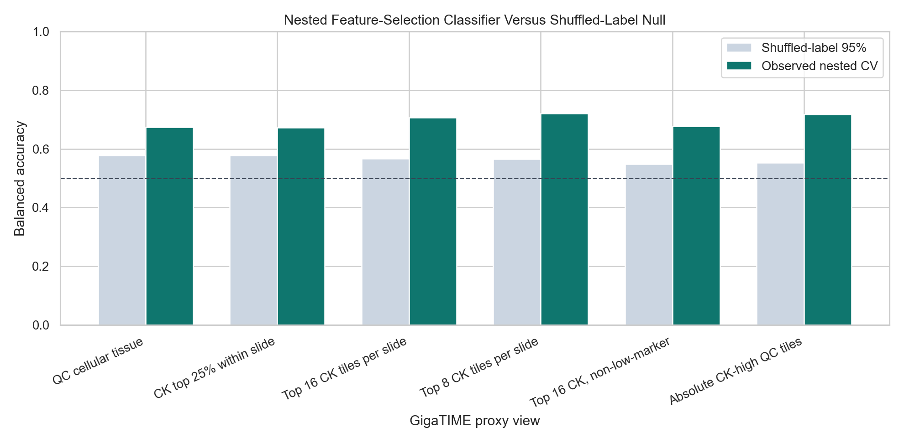
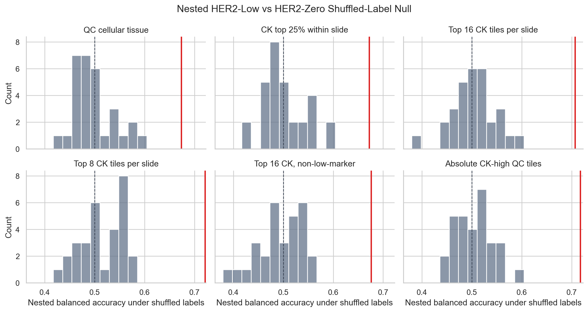
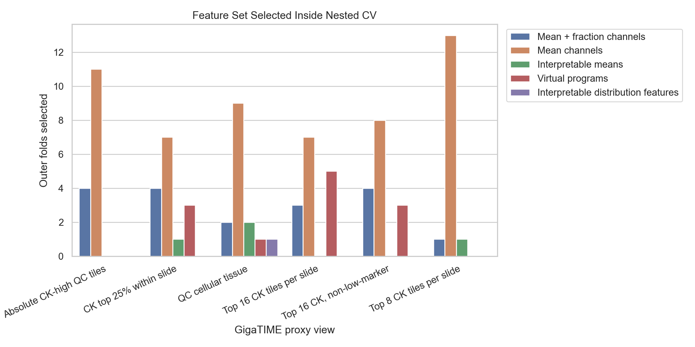

# Nested Classifier Model-Selection Check

This analysis is a stricter follow-up to the post-hoc classifier permutation check. Instead of fixing the previously selected feature set, it chooses the best GigaTIME/H&E feature set inside each training fold and only then evaluates the held-out fold.

Method:

- Task: HER2-low versus HER2-zero.
- Model: regularized logistic regression.
- Outer evaluation: repeated stratified 5-fold cross-validation with 3 repeats.
- Inner model selection: stratified 4-fold cross-validation on the outer-training set only.
- Candidate feature sets: GigaTIME mean channels, mean+fraction channels, interpretable marker means, interpretable distribution features, and virtual programs when available.
- Null: 30 shuffled-label runs per view, with feature-set selection repeated inside each shuffled run.

Important caveat: this is still not external clinical validation. It is a stronger internal sanity check that reduces feature-set selection bias.

## Results

| View | N | Most selected feature set | Selected folds | Nested bal acc | Nested AUC | Null mean | Null 95% | Empirical p | BH q |
| --- | --- | --- | --- | --- | --- | --- | --- | --- | --- |
| QC cellular tissue | 118 | Mean channels | 9 | 0.674 | 0.717 | 0.498 | 0.577 | 0.0323 | 0.0323 |
| CK top 25% within slide | 117 | Mean channels | 7 | 0.672 | 0.706 | 0.500 | 0.578 | 0.0323 | 0.0323 |
| Top 16 CK tiles per slide | 118 | Mean channels | 7 | 0.706 | 0.731 | 0.506 | 0.566 | 0.0323 | 0.0323 |
| Top 8 CK tiles per slide | 118 | Mean channels | 13 | 0.721 | 0.739 | 0.514 | 0.565 | 0.0323 | 0.0323 |
| Top 16 CK, non-low-marker | 117 | Mean channels | 8 | 0.676 | 0.717 | 0.492 | 0.548 | 0.0323 | 0.0323 |
| Absolute CK-high QC tiles | 105 | Mean channels | 11 | 0.717 | 0.766 | 0.505 | 0.553 | 0.0323 | 0.0323 |

## Interpretation

If the nested result remains above the shuffled-label null, the low-versus-zero classifier signal is less likely to be a simple artifact of choosing the best feature set after looking at the whole data set.

This still does not prove clinical diagnosis, real mIF validity, HER2 isoform biology, or treatment-response biology. It is classifier-methodology evidence that the next validation step should focus on tumor-rich/pathologist-approved regions and external molecular/protein validation.

## Output Files

- `docs/clinical_her2_high_trust_tile128_nested_classifier_model_selection.md`
- `results/gigatime_tcga_brca_clinical_her2_high_trust_tile128/nested_classifier_model_selection/nested_classifier_summary.csv`
- `results/gigatime_tcga_brca_clinical_her2_high_trust_tile128/nested_classifier_model_selection/nested_classifier_predictions.csv`
- `results/gigatime_tcga_brca_clinical_her2_high_trust_tile128/nested_classifier_model_selection/nested_classifier_feature_selection.csv`
- `results/gigatime_tcga_brca_clinical_her2_high_trust_tile128/nested_classifier_model_selection/nested_classifier_null_metrics.csv`
- `docs/assets/clinical_her2_high_trust_tile128_nested_classifier/`
