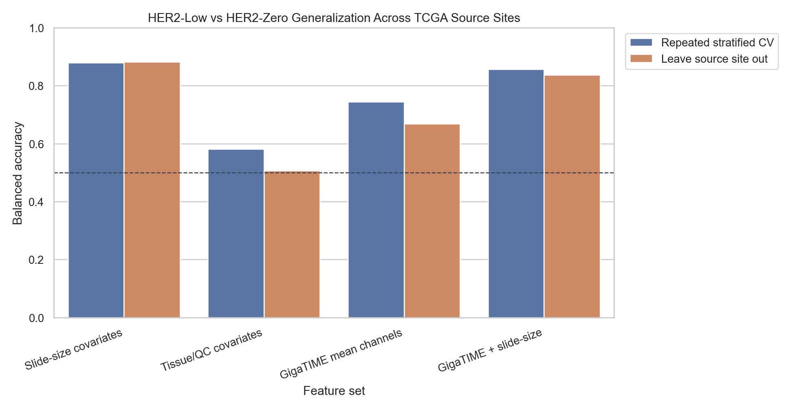
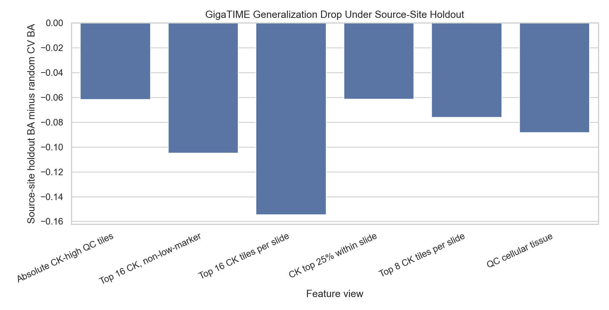

# Source-Site Held-Out Generalization

This analysis asks whether the HER2-low versus HER2-zero classifier travels across TCGA source sites. It compares ordinary repeated stratified cross-validation with a harsher leave-one-source-site-out validation.

Important caveat: many TCGA source sites have only HER2-low or only HER2-zero cases. Leave-source-site-out validation is therefore conservative and can be unstable, but it directly tests the acquisition/source-site confounding concern.

## Source-Site Balance

| TSS | N HER2-low | N HER2-zero | N cases | Both classes |
| --- | --- | --- | --- | --- |
| AO | 2 | 17 | 19 | yes |
| A2 | 7 | 12 | 19 | yes |
| BH | 0 | 12 | 12 | no |
| A8 | 2 | 8 | 10 | yes |
| A7 | 10 | 0 | 10 | no |
| AN | 0 | 9 | 9 | no |
| E2 | 7 | 0 | 7 | no |
| B6 | 6 | 0 | 6 | no |
| AR | 5 | 0 | 5 | no |
| D8 | 5 | 0 | 5 | no |
| A1 | 1 | 2 | 3 | yes |
| LL | 3 | 0 | 3 | no |

## Top 8 CK Proxy View

| Feature set | Validation | Features | Balanced accuracy | AUC | Sensitivity | Specificity |
| --- | --- | --- | --- | --- | --- | --- |
| Slide-size covariates | Repeated stratified CV | 3 | 0.879 | 0.921 | 0.869 | 0.889 |
| Slide-size covariates | Leave source site out | 3 | 0.882 | 0.915 | 0.869 | 0.895 |
| Tissue/QC covariates | Repeated stratified CV | 4 | 0.581 | 0.623 | 0.683 | 0.480 |
| Tissue/QC covariates | Leave source site out | 4 | 0.507 | 0.478 | 0.541 | 0.474 |
| GigaTIME mean channels | Repeated stratified CV | 23 | 0.745 | 0.751 | 0.770 | 0.719 |
| GigaTIME mean channels | Leave source site out | 23 | 0.669 | 0.679 | 0.689 | 0.649 |
| GigaTIME + slide-size | Repeated stratified CV | 26 | 0.857 | 0.915 | 0.902 | 0.813 |
| GigaTIME + slide-size | Leave source site out | 26 | 0.837 | 0.894 | 0.885 | 0.789 |
| GigaTIME + tissue/QC | Repeated stratified CV | 27 | 0.734 | 0.750 | 0.760 | 0.708 |
| GigaTIME + tissue/QC | Leave source site out | 27 | 0.668 | 0.683 | 0.705 | 0.632 |

GigaTIME mean channels drop from balanced accuracy 0.745 under repeated stratified CV to 0.669 under leave-source-site-out validation in the top 8 CK proxy view.

## Interpretation

- GigaTIME mean channels lose performance under source-site holdout across every tested feature view.
- Slide-size covariates remain very strong even when entire source sites are held out, meaning the low-versus-zero cohort still carries a portable technical/size imbalance.
- Adding slide-size covariates to GigaTIME largely preserves the slide-size signal, but that does not make the image model more biologically trustworthy.
- The safest conclusion is that the low-versus-zero GigaTIME classifier remains hypothesis-generating and internally interesting, but it is not yet robust evidence of source-independent HER2 biology.
- The next validation step should be external/site-balanced data or pathologist-approved tumor-rich regions with stronger acquisition controls.

## Output Files

- `docs/clinical_her2_high_trust_tile128_source_site_generalization.md`
- `results/gigatime_tcga_brca_clinical_her2_high_trust_tile128/source_site_generalization/source_site_generalization_metrics.csv`
- `results/gigatime_tcga_brca_clinical_her2_high_trust_tile128/source_site_generalization/source_site_generalization_predictions.csv`
- `results/gigatime_tcga_brca_clinical_her2_high_trust_tile128/source_site_generalization/source_site_balance.csv`
- `docs/assets/clinical_her2_high_trust_tile128_source_site_generalization/`
