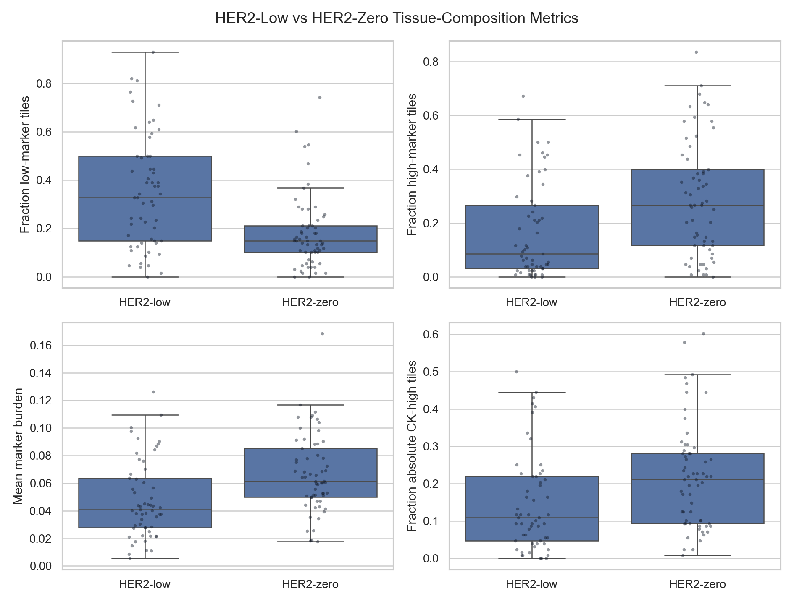
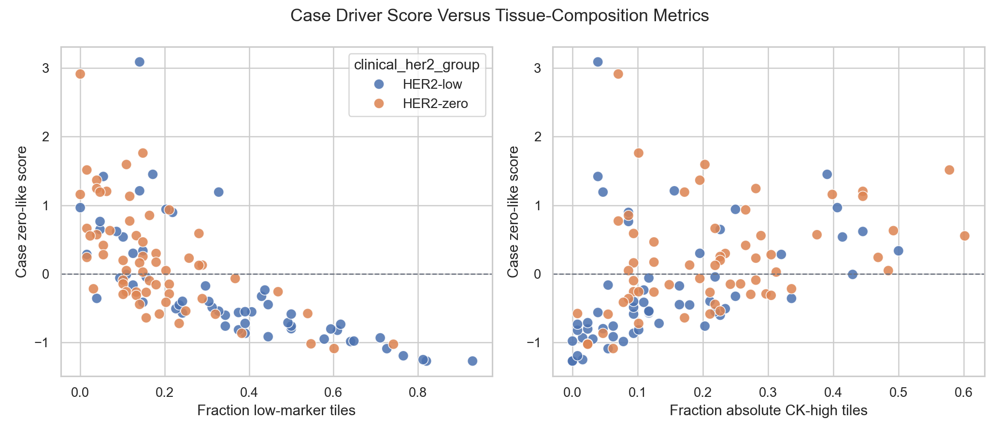
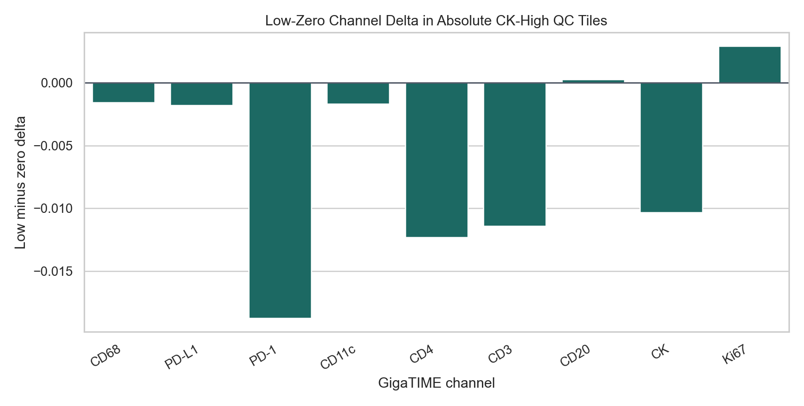
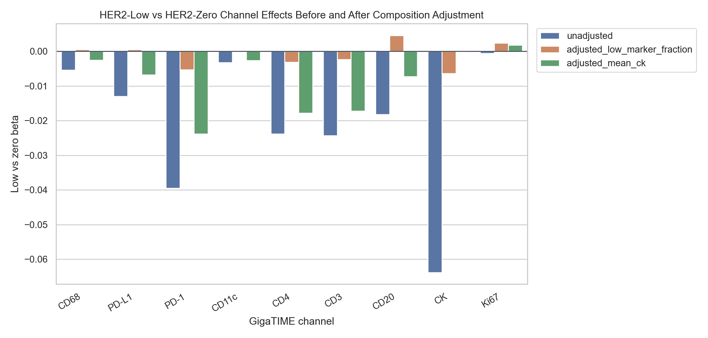

# Tissue-Composition Sensitivity for HER2-Low vs HER2-Zero

This analysis quantifies the caveat raised by the case-driver visual QC: the HER2-low versus HER2-zero signal may partly reflect tissue composition, especially low-marker/stromal-like tiles.

Definitions:

- Marker burden = mean of virtual `CK, CD68, PD-L1, CD11c, CD3, CD4, CD20, Ki67` per tile.
- Low-marker tile = marker burden <= bottom quartile threshold `0.0173`.
- Very-low-marker tile = marker burden <= bottom decile threshold `0.0043`.
- Absolute CK-high tile = QC-cellular tile with virtual CK >= QC-tile top quartile threshold `0.3285`.

## Main Tissue-Composition Result

| Metric | N low | N zero | Mean low | Mean zero | Low-zero delta | p | BH q | Cliff |
| --- | --- | --- | --- | --- | --- | --- | --- | --- |
| Fraction low-marker tiles | 57 | 61 | 0.3492 | 0.1805 | 0.1688 | 3.44e-05 | 2.65e-04 | 0.443 |
| Fraction very-low-marker tiles | 57 | 61 | 0.1498 | 0.0605 | 0.0894 | 5.99e-05 | 2.65e-04 | 0.428 |
| Mean DAPI | 57 | 61 | 0.2615 | 0.3459 | -0.0844 | 8.83e-05 | 2.65e-04 | -0.419 |
| Mean marker burden | 57 | 61 | 0.0479 | 0.0669 | -0.0190 | 1.60e-04 | 2.88e-04 | -0.404 |
| Mean CK | 57 | 61 | 0.1674 | 0.2311 | -0.0638 | 1.29e-04 | 2.88e-04 | -0.409 |
| Fraction high-marker tiles | 57 | 61 | 0.1675 | 0.2865 | -0.1190 | 9.30e-04 | 0.0014 | -0.354 |
| Fraction high-CK QC tiles | 57 | 61 | 0.1450 | 0.2179 | -0.0728 | 0.0015 | 0.0019 | -0.339 |
| Fraction low-CK QC tiles | 57 | 61 | 0.2111 | 0.1364 | 0.0747 | 0.0039 | 0.0044 | 0.308 |
| Mean tissue fraction | 57 | 61 | 0.8553 | 0.8329 | 0.0224 | 0.1444 | 0.1444 | 0.156 |

Interpretation: if HER2-low has more low-marker tiles and fewer high-marker or CK-high tiles than HER2-zero, then the GigaTIME HER2-low versus HER2-zero signal is at least partly a tissue-composition signal.

## Case-Driver Score Correlation

| Metric | N | Spearman rho | p | BH q |
| --- | --- | --- | --- | --- |
| mean_marker_burden | 118 | 0.980 | 8.52e-83 | 7.67e-82 |
| fraction_high_marker_q75 | 118 | 0.947 | 2.94e-59 | 1.32e-58 |
| mean_DAPI | 118 | 0.913 | 6.57e-47 | 1.97e-46 |
| fraction_low_marker_q25 | 118 | -0.782 | 1.40e-25 | 3.15e-25 |
| fraction_very_low_marker_q10 | 118 | -0.722 | 2.72e-20 | 4.90e-20 |
| mean_CK | 118 | 0.601 | 6.34e-13 | 9.51e-13 |
| fraction_high_ck_q75 | 118 | 0.535 | 4.17e-10 | 5.36e-10 |
| fraction_low_ck_q25 | 118 | -0.405 | 5.50e-06 | 6.19e-06 |
| mean_tissue_fraction | 118 | -0.167 | 0.0712 | 0.0712 |

Interpretation: these correlations test whether the slide-level HER2-zero-like case-driver score is tracking tissue composition. A strong positive correlation with high-marker or CK-high fraction, and a negative correlation with low-marker fraction, supports the tissue-composition caveat.

## Absolute CK-High Tile Restriction

This view keeps only QC-cellular tiles with CK above the global QC-tile 75th percentile and requires at least 4 retained tiles per slide.

| Channel | N low | N zero | Mean low | Mean zero | Low-zero delta | p | BH q |
| --- | --- | --- | --- | --- | --- | --- | --- |
| CD11c | 47 | 58 | 0.0084 | 0.0101 | -0.0017 | 0.0088 | 0.0337 |
| CD4 | 47 | 58 | 0.0449 | 0.0572 | -0.0123 | 0.0055 | 0.0337 |
| CD3 | 47 | 58 | 0.0542 | 0.0656 | -0.0114 | 0.0112 | 0.0337 |
| PD-1 | 47 | 58 | 0.1366 | 0.1554 | -0.0188 | 0.0155 | 0.0349 |
| CD68 | 47 | 58 | 0.0267 | 0.0283 | -0.0016 | 0.0490 | 0.0882 |
| PD-L1 | 47 | 58 | 0.0646 | 0.0664 | -0.0018 | 0.0836 | 0.1254 |
| CK | 47 | 58 | 0.4307 | 0.4411 | -0.0103 | 0.1307 | 0.1681 |
| CD20 | 47 | 58 | 0.0732 | 0.0729 | 2.77e-04 | 0.5685 | 0.5861 |
| Ki67 | 47 | 58 | 0.0249 | 0.0219 | 0.0029 | 0.5861 | 0.5861 |

Interpretation: this is a stricter virtual tumor/epithelial-enriched proxy than the per-slide CK top-25% view. If the low-zero signal weakens here, the current finding should be framed as broader tissue context rather than tumor-cell intrinsic HER2 biology.

## Composition-Adjusted Channel Effects

Low-vs-zero beta is from a simple OLS model where HER2-low is compared against HER2-zero. These are exploratory covariate checks, not a final causal model.

Unadjusted:

| Channel | N | Low-vs-zero beta | p | BH q |
| --- | --- | --- | --- | --- |
| CD68 | 118 | -0.0054 | 0.0262 | 0.0392 |
| PD-L1 | 118 | -0.0130 | 0.0175 | 0.0315 |
| PD-1 | 118 | -0.0395 | 0.0020 | 0.0091 |
| CD11c | 118 | -0.0033 | 0.0318 | 0.0408 |
| CD4 | 118 | -0.0238 | 0.0076 | 0.0185 |
| CD3 | 118 | -0.0243 | 0.0082 | 0.0185 |
| CD20 | 118 | -0.0182 | 0.0469 | 0.0527 |
| CK | 118 | -0.0638 | 6.47e-05 | 5.82e-04 |
| Ki67 | 118 | -5.34e-04 | 0.6471 | 0.6471 |

Adjusted for low-marker tile fraction:

| Channel | N | Low-vs-zero beta | p | BH q |
| --- | --- | --- | --- | --- |
| CD68 | 118 | 5.27e-04 | 0.8125 | 0.9103 |
| PD-L1 | 118 | 5.62e-04 | 0.9103 | 0.9103 |
| PD-1 | 118 | -0.0053 | 0.6329 | 0.9103 |
| CD11c | 118 | -1.72e-04 | 0.9069 | 0.9103 |
| CD4 | 118 | -0.0031 | 0.7062 | 0.9103 |
| CD3 | 118 | -0.0023 | 0.7869 | 0.9103 |
| CD20 | 118 | 0.0046 | 0.5841 | 0.9103 |
| CK | 118 | -0.0064 | 0.5303 | 0.9103 |
| Ki67 | 118 | 0.0024 | 0.0299 | 0.2691 |

Adjusted for mean CK:

| Channel | N | Low-vs-zero beta | p | BH q |
| --- | --- | --- | --- | --- |
| CD68 | 118 | -0.0025 | 0.3056 | 0.3929 |
| PD-L1 | 118 | -0.0068 | 0.2270 | 0.3406 |
| PD-1 | 118 | -0.0238 | 0.0656 | 0.1933 |
| CD11c | 118 | -0.0026 | 0.1074 | 0.1933 |
| CD4 | 118 | -0.0178 | 0.0582 | 0.1933 |
| CD3 | 118 | -0.0172 | 0.0741 | 0.1933 |
| CD20 | 118 | -0.0072 | 0.4401 | 0.4951 |
| CK | 118 | 9.20e-18 | 0.6646 | 0.6646 |
| Ki67 | 118 | 0.0018 | 0.0943 | 0.1933 |

## Bottom Line

- The HER2-low versus HER2-zero GigaTIME signal remains interesting.
- The new tissue-composition analysis makes the caveat stronger, not weaker.
- A presentable claim should emphasize tissue-context association.
- The next scientific step is tumor-rich/pathologist-approved tile restriction before claiming HER2 biology.

## Output Files

- `docs/clinical_her2_high_trust_tile128_tissue_composition_sensitivity.md`
- `results/gigatime_tcga_brca_clinical_her2_high_trust_tile128/tissue_composition_sensitivity/slide_tissue_composition_metrics.csv`
- `results/gigatime_tcga_brca_clinical_her2_high_trust_tile128/tissue_composition_sensitivity/low_zero_composition_tests.csv`
- `results/gigatime_tcga_brca_clinical_her2_high_trust_tile128/tissue_composition_sensitivity/composition_adjusted_channel_tests.csv`
- `docs/assets/clinical_her2_high_trust_tile128_tissue_composition/`
