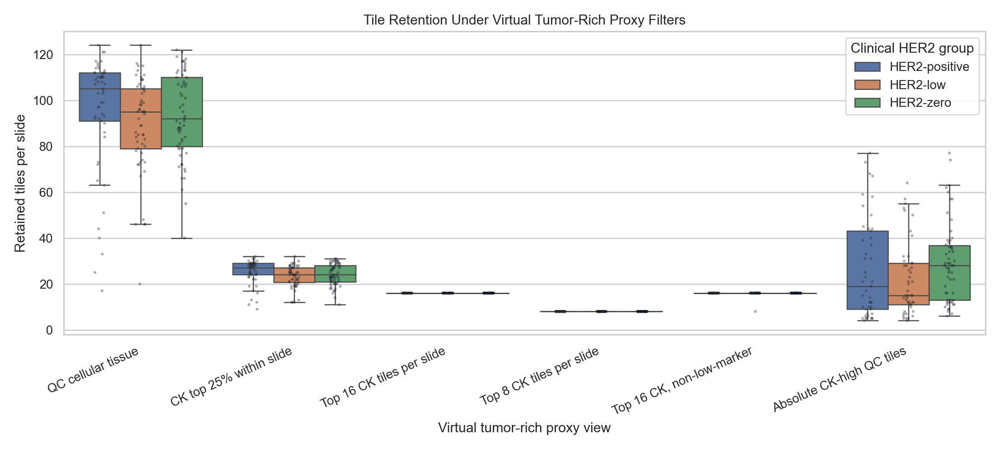
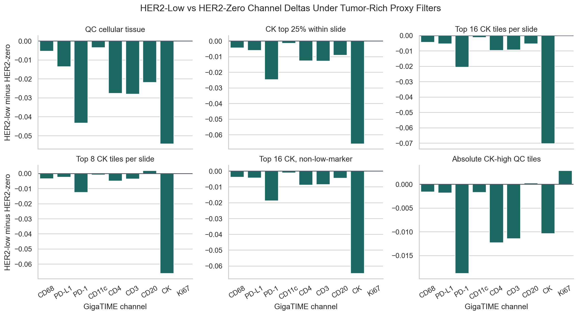
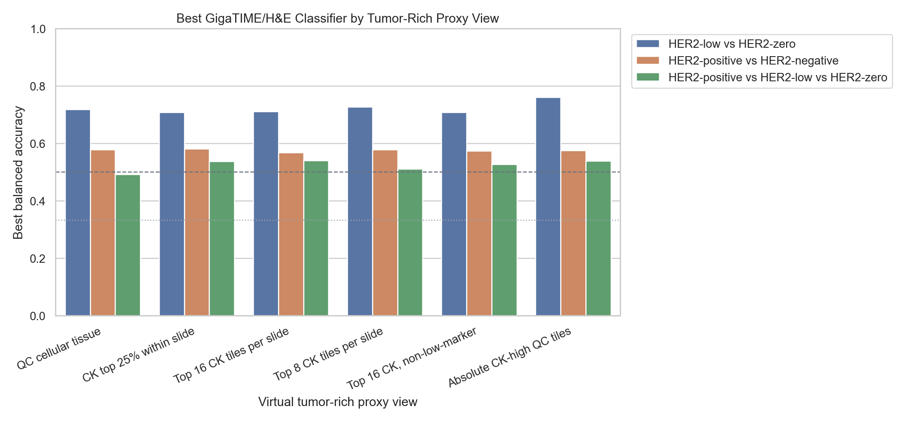
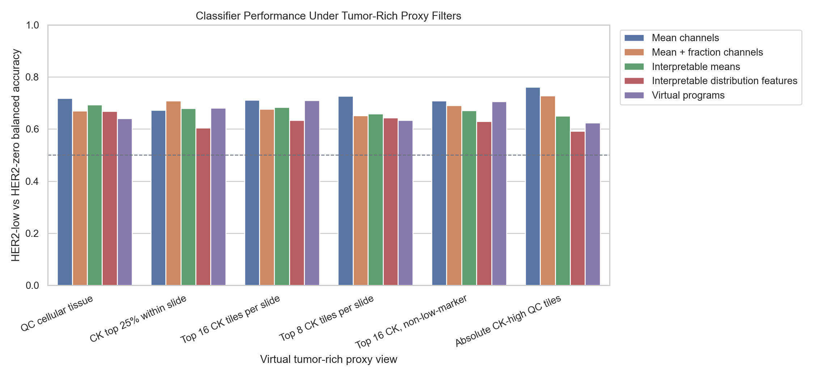

# Tumor-Rich Proxy Sensitivity for High-Trust HER2 Analysis

This analysis asks whether the HER2-low versus HER2-zero GigaTIME signal survives stricter virtual tumor-rich proxy tile filters.

Important: these are not pathologist tumor annotations. They are GigaTIME-derived proxies using virtual DAPI, CK, marker burden, and existing cellular-tissue cleanup. A true tumor-rich analysis still requires pathologist review or a validated tumor segmentation model.

## Proxy Definitions

- Marker burden = mean of virtual `CK, CD68, PD-L1, CD11c, CD3, CD4, CD20, Ki67` per tile.
- Low-marker threshold = bottom quartile of marker burden across all tiles: `0.0173`.
- Absolute CK-high threshold = top quartile of virtual CK among QC-cellular tiles: `0.3285`.
- QC cellular tissue = existing tissue_fraction and virtual DAPI cleanup.
- CK top 25% within slide = existing within-slide CK-enriched top-quarter view.
- Top 16/top 8 CK tiles = fixed-count strongest virtual CK tiles within each slide after QC.
- Top 16 CK, non-low-marker = fixed-count virtual CK tiles after removing low-marker tiles.

## Retention

| Proxy view | Clinical group | Slides passing min tiles | Median retained tiles | Median retained fraction |
| --- | --- | --- | --- | --- |
| QC cellular tissue | HER2-positive | 53 | 105.0 | 0.820 |
| QC cellular tissue | HER2-low | 57 | 95.0 | 0.742 |
| QC cellular tissue | HER2-zero | 61 | 92.0 | 0.719 |
| CK top 25% within slide | HER2-positive | 51 | 27.0 | 0.211 |
| CK top 25% within slide | HER2-low | 56 | 24.0 | 0.188 |
| CK top 25% within slide | HER2-zero | 61 | 24.0 | 0.188 |
| Top 16 CK tiles per slide | HER2-positive | 53 | 16.0 | 0.125 |
| Top 16 CK tiles per slide | HER2-low | 57 | 16.0 | 0.125 |
| Top 16 CK tiles per slide | HER2-zero | 61 | 16.0 | 0.125 |
| Top 8 CK tiles per slide | HER2-positive | 53 | 8.0 | 0.062 |
| Top 8 CK tiles per slide | HER2-low | 57 | 8.0 | 0.062 |
| Top 8 CK tiles per slide | HER2-zero | 61 | 8.0 | 0.062 |
| Top 16 CK, non-low-marker | HER2-positive | 52 | 16.0 | 0.125 |
| Top 16 CK, non-low-marker | HER2-low | 56 | 16.0 | 0.125 |
| Top 16 CK, non-low-marker | HER2-zero | 61 | 16.0 | 0.125 |
| Absolute CK-high QC tiles | HER2-positive | 45 | 19.0 | 0.148 |
| Absolute CK-high QC tiles | HER2-low | 47 | 15.0 | 0.117 |
| Absolute CK-high QC tiles | HER2-zero | 58 | 28.0 | 0.219 |

## HER2-Low Versus HER2-Zero Channel Tests

| Proxy view | Channel | N low | N zero | Mean low | Mean zero | Low-zero delta | BH q |
| --- | --- | --- | --- | --- | --- | --- | --- |
| QC cellular tissue | CD68 | 57 | 61 | 0.0203 | 0.0256 | -0.0053 | 0.0024 |
| QC cellular tissue | PD-L1 | 57 | 61 | 0.0500 | 0.0636 | -0.0135 | 0.0023 |
| QC cellular tissue | PD-1 | 57 | 61 | 0.1110 | 0.1543 | -0.0433 | 0.0023 |
| QC cellular tissue | CD11c | 57 | 61 | 0.0108 | 0.0143 | -0.0034 | 0.0024 |
| QC cellular tissue | CD4 | 57 | 61 | 0.0530 | 0.0806 | -0.0276 | 0.0024 |
| QC cellular tissue | CD3 | 57 | 61 | 0.0578 | 0.0859 | -0.0280 | 0.0024 |
| QC cellular tissue | CK | 57 | 61 | 0.1909 | 0.2452 | -0.0543 | 0.0024 |
| CK top 25% within slide | CD68 | 56 | 61 | 0.0232 | 0.0275 | -0.0043 | 0.0217 |
| CK top 25% within slide | PD-L1 | 56 | 61 | 0.0583 | 0.0642 | -0.0059 | 0.0291 |
| CK top 25% within slide | PD-1 | 56 | 61 | 0.1239 | 0.1486 | -0.0247 | 0.0217 |
| CK top 25% within slide | CD11c | 56 | 61 | 0.0083 | 0.0098 | -0.0015 | 0.0578 |
| CK top 25% within slide | CD4 | 56 | 61 | 0.0425 | 0.0551 | -0.0126 | 0.0217 |
| CK top 25% within slide | CD3 | 56 | 61 | 0.0502 | 0.0629 | -0.0127 | 0.0291 |
| CK top 25% within slide | CK | 56 | 61 | 0.3726 | 0.4384 | -0.0659 | 0.0217 |
| Top 16 CK tiles per slide | CD68 | 57 | 61 | 0.0230 | 0.0273 | -0.0043 | 0.0482 |
| Top 16 CK tiles per slide | PD-L1 | 57 | 61 | 0.0573 | 0.0627 | -0.0054 | 0.0666 |
| Top 16 CK tiles per slide | PD-1 | 57 | 61 | 0.1208 | 0.1414 | -0.0206 | 0.0482 |
| Top 16 CK tiles per slide | CD11c | 57 | 61 | 0.0077 | 0.0089 | -0.0012 | 0.1538 |
| Top 16 CK tiles per slide | CD4 | 57 | 61 | 0.0389 | 0.0484 | -0.0095 | 0.0782 |
| Top 16 CK tiles per slide | CD3 | 57 | 61 | 0.0466 | 0.0558 | -0.0092 | 0.1056 |
| Top 16 CK tiles per slide | CK | 57 | 61 | 0.4002 | 0.4705 | -0.0703 | 0.0395 |
| Top 8 CK tiles per slide | CD68 | 57 | 61 | 0.0237 | 0.0270 | -0.0034 | 0.1641 |
| Top 8 CK tiles per slide | PD-L1 | 57 | 61 | 0.0577 | 0.0600 | -0.0023 | 0.1674 |
| Top 8 CK tiles per slide | PD-1 | 57 | 61 | 0.1193 | 0.1318 | -0.0124 | 0.1641 |
| Top 8 CK tiles per slide | CD11c | 57 | 61 | 0.0069 | 0.0078 | -8.86e-04 | 0.1674 |
| Top 8 CK tiles per slide | CD4 | 57 | 61 | 0.0351 | 0.0399 | -0.0049 | 0.1641 |
| Top 8 CK tiles per slide | CD3 | 57 | 61 | 0.0428 | 0.0463 | -0.0035 | 0.1674 |
| Top 8 CK tiles per slide | CK | 57 | 61 | 0.4566 | 0.5229 | -0.0663 | 0.0551 |
| Top 16 CK, non-low-marker | CD68 | 56 | 61 | 0.0235 | 0.0273 | -0.0038 | 0.0808 |
| Top 16 CK, non-low-marker | PD-L1 | 56 | 61 | 0.0583 | 0.0627 | -0.0044 | 0.1093 |
| Top 16 CK, non-low-marker | PD-1 | 56 | 61 | 0.1226 | 0.1414 | -0.0188 | 0.0808 |
| Top 16 CK, non-low-marker | CD11c | 56 | 61 | 0.0078 | 0.0089 | -0.0011 | 0.2656 |
| Top 16 CK, non-low-marker | CD4 | 56 | 61 | 0.0396 | 0.0484 | -0.0088 | 0.1284 |
| Top 16 CK, non-low-marker | CD3 | 56 | 61 | 0.0474 | 0.0558 | -0.0084 | 0.1568 |
| Top 16 CK, non-low-marker | CK | 56 | 61 | 0.4057 | 0.4705 | -0.0648 | 0.0588 |
| Absolute CK-high QC tiles | CD68 | 47 | 58 | 0.0267 | 0.0283 | -0.0016 | 0.0882 |
| Absolute CK-high QC tiles | PD-L1 | 47 | 58 | 0.0646 | 0.0664 | -0.0018 | 0.1254 |
| Absolute CK-high QC tiles | PD-1 | 47 | 58 | 0.1366 | 0.1554 | -0.0188 | 0.0349 |
| Absolute CK-high QC tiles | CD11c | 47 | 58 | 0.0084 | 0.0101 | -0.0017 | 0.0337 |
| Absolute CK-high QC tiles | CD4 | 47 | 58 | 0.0449 | 0.0572 | -0.0123 | 0.0337 |
| Absolute CK-high QC tiles | CD3 | 47 | 58 | 0.0542 | 0.0656 | -0.0114 | 0.0337 |
| Absolute CK-high QC tiles | CK | 47 | 58 | 0.4307 | 0.4411 | -0.0103 | 0.1681 |

## Classifier Sensitivity

Every classifier result below is leave-one-out cross-validated. The H&E/GigaTIME models exclude the ERBB2 RNA reference.

| Proxy view | Task | Best H&E/GigaTIME feature set | N | Accuracy | Balanced accuracy | Macro AUC | Sensitivity | Specificity |
| --- | --- | --- | --- | --- | --- | --- | --- | --- |
| QC cellular tissue | HER2-low vs HER2-zero | Mean channels | 118 | 0.720 | 0.719 | 0.741 | 0.770 | 0.667 |
| QC cellular tissue | HER2-positive vs HER2-negative | Interpretable means | 171 | 0.725 | 0.577 | 0.487 | 0.189 | 0.966 |
| QC cellular tissue | HER2-positive vs HER2-low vs HER2-zero | Virtual programs | 171 | 0.503 | 0.491 | 0.623 |  |  |
| CK top 25% within slide | HER2-low vs HER2-zero | Mean + fraction channels | 117 | 0.709 | 0.708 | 0.744 | 0.738 | 0.679 |
| CK top 25% within slide | HER2-positive vs HER2-negative | Interpretable means | 168 | 0.732 | 0.581 | 0.510 | 0.196 | 0.966 |
| CK top 25% within slide | HER2-positive vs HER2-low vs HER2-zero | Mean + fraction channels | 168 | 0.548 | 0.537 | 0.693 |  |  |
| Top 16 CK tiles per slide | HER2-low vs HER2-zero | Mean channels | 118 | 0.712 | 0.711 | 0.766 | 0.738 | 0.684 |
| Top 16 CK tiles per slide | HER2-positive vs HER2-negative | Interpretable means | 171 | 0.719 | 0.568 | 0.445 | 0.170 | 0.966 |
| Top 16 CK tiles per slide | HER2-positive vs HER2-low vs HER2-zero | Mean + fraction channels | 171 | 0.550 | 0.540 | 0.683 |  |  |
| Top 8 CK tiles per slide | HER2-low vs HER2-zero | Mean channels | 118 | 0.729 | 0.727 | 0.755 | 0.770 | 0.684 |
| Top 8 CK tiles per slide | HER2-positive vs HER2-negative | Interpretable means | 171 | 0.725 | 0.577 | 0.463 | 0.189 | 0.966 |
| Top 8 CK tiles per slide | HER2-positive vs HER2-low vs HER2-zero | Mean channels | 171 | 0.520 | 0.510 | 0.673 |  |  |
| Top 16 CK, non-low-marker | HER2-low vs HER2-zero | Mean channels | 117 | 0.709 | 0.708 | 0.761 | 0.738 | 0.679 |
| Top 16 CK, non-low-marker | HER2-positive vs HER2-negative | Interpretable means | 169 | 0.728 | 0.574 | 0.461 | 0.173 | 0.974 |
| Top 16 CK, non-low-marker | HER2-positive vs HER2-low vs HER2-zero | Mean channels | 169 | 0.538 | 0.527 | 0.687 |  |  |
| Absolute CK-high QC tiles | HER2-low vs HER2-zero | Mean channels | 105 | 0.771 | 0.761 | 0.782 | 0.862 | 0.660 |
| Absolute CK-high QC tiles | HER2-positive vs HER2-negative | Mean channels | 150 | 0.707 | 0.575 | 0.637 | 0.244 | 0.905 |
| Absolute CK-high QC tiles | HER2-positive vs HER2-low vs HER2-zero | Mean + fraction channels | 150 | 0.553 | 0.538 | 0.715 |  |  |

## Low-Zero Summary

- QC cellular tissue: best low-vs-zero balanced accuracy 0.719, macro AUC 0.741; q<0.05 channels: CD68, PD-L1, PD-1, CD11c, CD4, CD3, CD20, CK.
- CK top 25% within slide: best low-vs-zero balanced accuracy 0.708, macro AUC 0.744; q<0.05 channels: CD68, PD-L1, PD-1, CD4, CD3, CK.
- Top 16 CK tiles per slide: best low-vs-zero balanced accuracy 0.711, macro AUC 0.766; q<0.05 channels: CD68, PD-1, CK.
- Top 8 CK tiles per slide: best low-vs-zero balanced accuracy 0.727, macro AUC 0.755; q<0.05 channels: none.
- Top 16 CK, non-low-marker: best low-vs-zero balanced accuracy 0.708, macro AUC 0.761; q<0.05 channels: none.
- Absolute CK-high QC tiles: best low-vs-zero balanced accuracy 0.761, macro AUC 0.782; q<0.05 channels: PD-1, CD11c, CD4, CD3.

## ERBB2 RNA Reference

ERBB2 RNA is shown only as a non-H&E reference. It is not affected biologically by these tile filters and should not be used as image-derived evidence.

| Proxy view | Task | N | Balanced accuracy | Macro AUC |
| --- | --- | --- | --- | --- |
| QC cellular tissue | HER2-low vs HER2-zero | 118 | 0.521 | 0.291 |
| QC cellular tissue | HER2-positive vs HER2-negative | 171 | 0.585 | 0.452 |
| QC cellular tissue | HER2-positive vs HER2-low vs HER2-zero | 171 | 0.396 | 0.378 |
| CK top 25% within slide | HER2-low vs HER2-zero | 117 | 0.522 | 0.292 |
| CK top 25% within slide | HER2-positive vs HER2-negative | 168 | 0.578 | 0.446 |
| CK top 25% within slide | HER2-positive vs HER2-low vs HER2-zero | 168 | 0.392 | 0.374 |
| Top 16 CK tiles per slide | HER2-low vs HER2-zero | 118 | 0.521 | 0.291 |
| Top 16 CK tiles per slide | HER2-positive vs HER2-negative | 171 | 0.585 | 0.452 |
| Top 16 CK tiles per slide | HER2-positive vs HER2-low vs HER2-zero | 171 | 0.396 | 0.378 |
| Top 8 CK tiles per slide | HER2-low vs HER2-zero | 118 | 0.521 | 0.291 |
| Top 8 CK tiles per slide | HER2-positive vs HER2-negative | 171 | 0.585 | 0.452 |
| Top 8 CK tiles per slide | HER2-positive vs HER2-low vs HER2-zero | 171 | 0.396 | 0.378 |
| Top 16 CK, non-low-marker | HER2-low vs HER2-zero | 117 | 0.522 | 0.292 |
| Top 16 CK, non-low-marker | HER2-positive vs HER2-negative | 169 | 0.587 | 0.456 |
| Top 16 CK, non-low-marker | HER2-positive vs HER2-low vs HER2-zero | 169 | 0.397 | 0.382 |
| Absolute CK-high QC tiles | HER2-low vs HER2-zero | 105 | 0.559 | 0.316 |
| Absolute CK-high QC tiles | HER2-positive vs HER2-negative | 150 | 0.589 | 0.441 |
| Absolute CK-high QC tiles | HER2-positive vs HER2-low vs HER2-zero | 150 | 0.393 | 0.371 |

## Interpretation

If HER2-low versus HER2-zero separation remains strong in fixed-count CK-high/non-low-marker views, that supports the idea that GigaTIME is capturing something closer to tumor-rich epithelial context. If it weakens, the current result should remain framed as a broader tissue-context association.

This still does not validate real mIF channels, diagnose HER2 status, or detect HER2 isoforms. It is a stricter failure-mode analysis that tells us where the signal lives.

## Output Files

- `docs/clinical_her2_high_trust_tile128_tumor_proxy_sensitivity.md`
- `results/gigatime_tcga_brca_clinical_her2_high_trust_tile128/tumor_proxy_sensitivity/tumor_proxy_slide_features.csv`
- `results/gigatime_tcga_brca_clinical_her2_high_trust_tile128/tumor_proxy_sensitivity/tumor_proxy_low_zero_pairwise_tests.csv`
- `results/gigatime_tcga_brca_clinical_her2_high_trust_tile128/tumor_proxy_sensitivity/tumor_proxy_classifier_metrics.csv`
- `docs/assets/clinical_her2_high_trust_tile128_tumor_proxy_sensitivity/`
