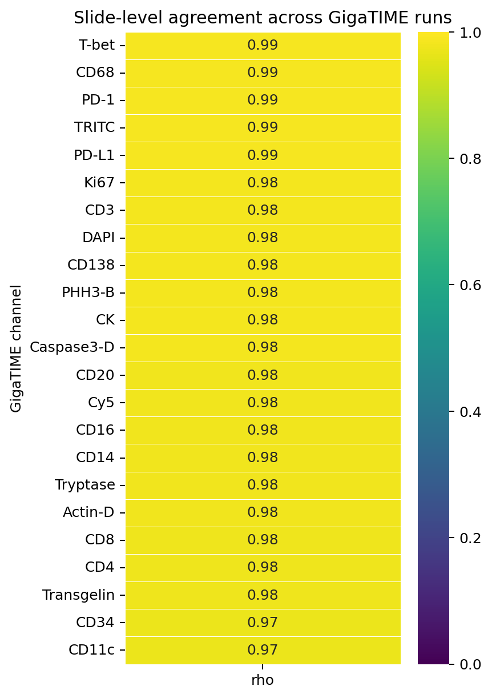
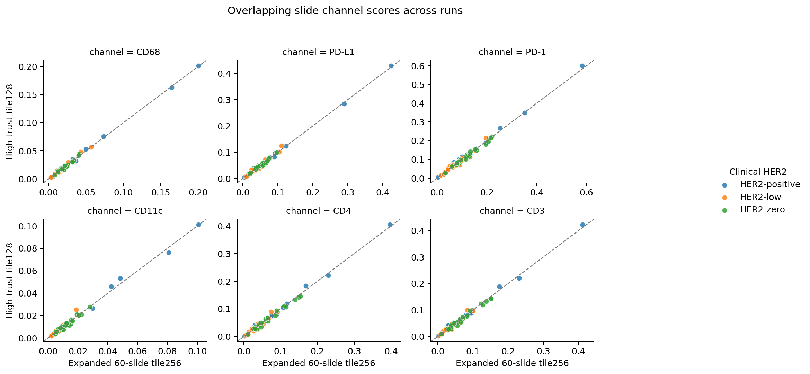
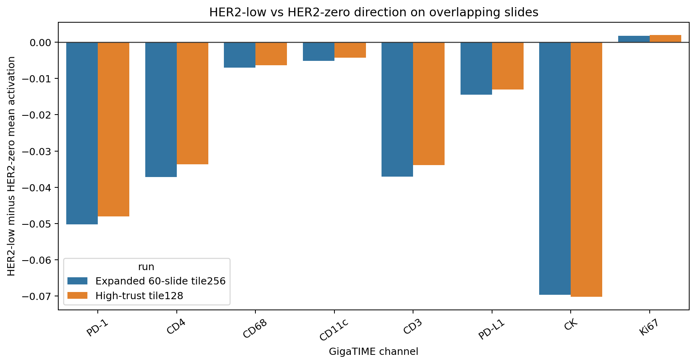

# GigaTIME Run Agreement: Tile128 High-Trust vs Tile256 Expanded

Status: Parameter/settings robustness check comparing overlapping slides across two completed GigaTIME runs.

## Why This Matters

The current primary result uses `High-trust tile128`. Earlier, the project used `Expanded 60-slide tile256`. This analysis asks whether the same slide-level GigaTIME channels agree across those settings, and whether the HER2-low versus HER2-zero direction remains the same on overlapping slides.

This is not a perfect tile-count experiment because the cohorts and random tile samples are not identical. It is still useful because it compares the same slide IDs where both runs exist.

## Overlap

| Quantity | Count |
| --- | --- |
| Reference run slides | 60 |
| Comparison run slides | 171 |
| Overlapping slide IDs | 56 |
| Overlapping HER2-low slides | 20 |
| Overlapping HER2-zero slides | 20 |
| Overlapping HER2-positive slides | 16 |

The overlap preserves all 20 HER2-low and all 20 HER2-zero slides from the expanded 60-slide cohort. Two HER2-positive expanded-run cases are absent from the high-trust list because they were review/excluded cases.

## Channel Agreement

| Channel | Spearman rho | Pearson r | Median absolute difference | Mean comparison-reference |
| --- | --- | --- | --- | --- |
| CD68 | 0.987 | 0.998 | 0.00105 | 3.64e-04 |
| PD-1 | 0.986 | 0.996 | 0.00491 | 3.95e-05 |
| PD-L1 | 0.985 | 0.998 | 0.00236 | 1.93e-04 |
| CD3 | 0.984 | 0.995 | 0.00374 | -1.90e-05 |
| Ki67 | 0.984 | 0.998 | 5.61e-04 | -3.15e-05 |
| CK | 0.982 | 0.987 | 0.01043 | -0.00145 |
| CD4 | 0.975 | 0.996 | 0.00367 | 8.90e-05 |
| CD11c | 0.970 | 0.995 | 8.68e-04 | 1.91e-04 |

## HER2-Low Versus HER2-Zero Direction

| Channel | Reference low-zero delta | Comparison low-zero delta | Same direction | Both low lower than zero |
| --- | --- | --- | --- | --- |
| PD-1 | -0.05030 | -0.04810 | yes | yes |
| CD4 | -0.03719 | -0.03365 | yes | yes |
| CD68 | -0.00699 | -0.00632 | yes | yes |
| CD11c | -0.00508 | -0.00427 | yes | yes |
| CD3 | -0.03711 | -0.03387 | yes | yes |
| PD-L1 | -0.01447 | -0.01303 | yes | yes |
| CK | -0.06973 | -0.07023 | yes | yes |
| Ki67 | 0.00181 | 0.00198 | yes | no |

## Interpretation

- Overlap is strong enough for this check: 56 matched slides, including all HER2-low and HER2-zero slides from the 60-slide run.
- Key-channel direction agreement: 8 of 8 tested key channels have the same HER2-low versus HER2-zero direction across runs.
- Key channels with HER2-low lower than HER2-zero in both runs: 7 of 8.
- This supports that the main HER2-low versus HER2-zero direction is not simply an artifact of using 128 tiles instead of 256 tiles.
- Some absolute channel scores shift across runs, which is expected because tile samples, cohort filtering, and run settings differ. The direction and relative agreement matter more than exact equality.

## Machine-Readable Outputs

- [assets/clinical_her2_high_trust_tile128_vs_expanded20_tile256/run_channel_agreement.csv](assets/clinical_her2_high_trust_tile128_vs_expanded20_tile256/run_channel_agreement.csv)
- [assets/clinical_her2_high_trust_tile128_vs_expanded20_tile256/low_zero_direction_comparison.csv](assets/clinical_her2_high_trust_tile128_vs_expanded20_tile256/low_zero_direction_comparison.csv)
- [assets/clinical_her2_high_trust_tile128_vs_expanded20_tile256/overlap_slide_scores.csv](assets/clinical_her2_high_trust_tile128_vs_expanded20_tile256/overlap_slide_scores.csv)
- [assets/clinical_her2_high_trust_tile128_vs_expanded20_tile256/run_agreement_summary.json](assets/clinical_her2_high_trust_tile128_vs_expanded20_tile256/run_agreement_summary.json)

## Cautious Claim This Supports

> The HER2-low versus HER2-zero GigaTIME signal is directionally robust across an earlier 60-slide 256-tile run and the larger high-trust 128-tile run on overlapping slides, supporting a reproducible image-derived tissue-context association rather than a single-run sampling artifact.
