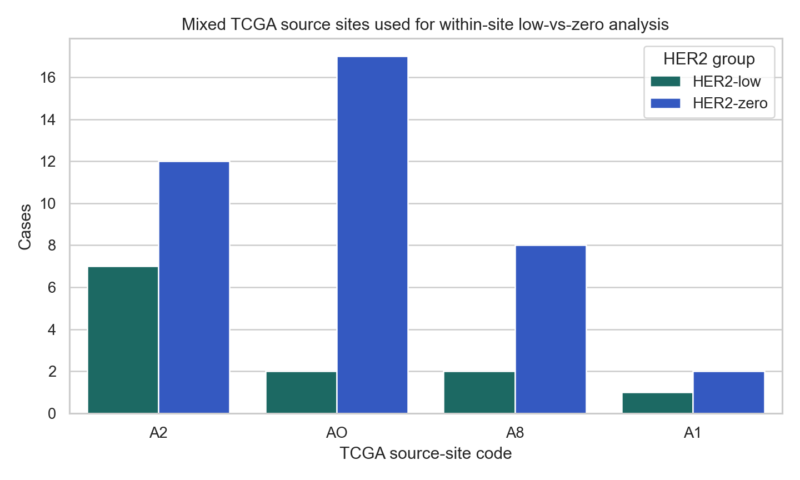
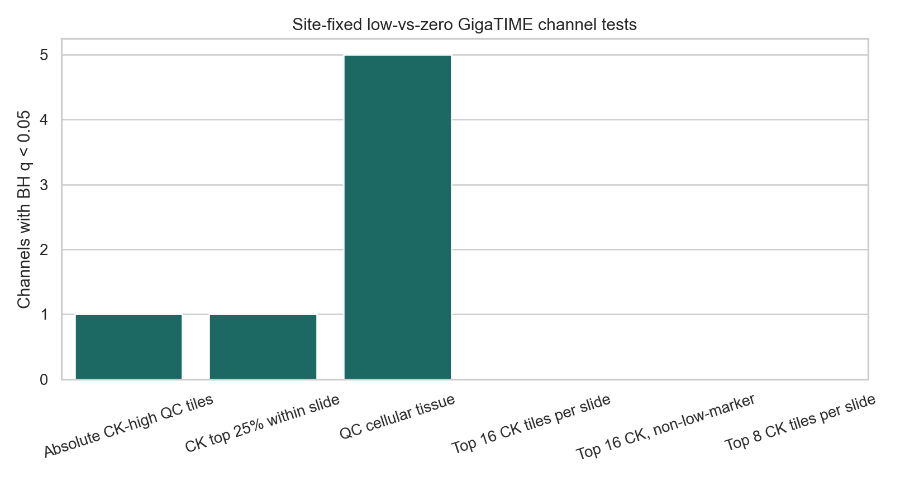
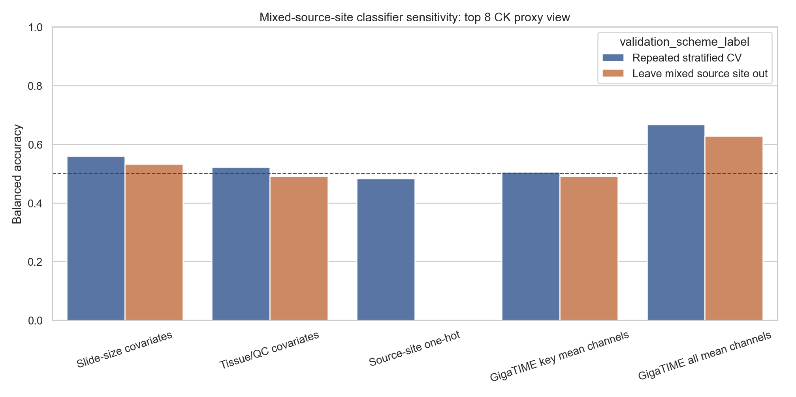

# Within-Source-Site HER2-Low Versus HER2-Zero Sensitivity

Status: sensitivity check asking whether the GigaTIME HER2-low versus HER2-zero signal remains when analysis is restricted to TCGA source sites that contain both groups.

## Bottom Line

Only 4 TCGA source sites contain both HER2-low and HER2-zero strict high-trust cases. That mixed-site subset contains 51 cases: 12 HER2-low and 39 HER2-zero.

This is a useful but very small sensitivity check. It cannot prove biology, but it helps separate two possibilities:

- If the signal persists within mixed source sites, it is less likely to be only a between-site artifact.
- If the signal collapses within mixed source sites, then the TCGA source-site confounding concern becomes even stronger.

## Mixed Source Sites

| TSS | HER2-low | HER2-zero | Cases |
| --- | --- | --- | --- |
| A2 | 7 | 12 | 19 |
| AO | 2 | 17 | 19 |
| A8 | 2 | 8 | 10 |
| A1 | 1 | 2 | 3 |

## Site-Fixed Channel Tests

These models test each GigaTIME channel with a source-site fixed effect: channel score ~ HER2-low/zero group + TCGA source site. Positive beta means HER2-zero is higher than HER2-low after accounting for source site.

| Feature view | Channels tested | Channels q<0.05 | Best BH q |
| --- | --- | --- | --- |
| Absolute CK-high QC tiles | 23 | 1 | 0.0167 |
| Top 16 CK, non-low-marker | 23 | 0 | 0.0921 |
| Top 16 CK tiles per slide | 23 | 0 | 0.0962 |
| CK top 25% within slide | 23 | 1 | 0.0446 |
| Top 8 CK tiles per slide | 23 | 0 | 0.1128 |
| QC cellular tissue | 23 | 5 | 0.0284 |

Top site-fixed channel tests in the top 8 CK proxy view:

| Feature view | Channel | N low | N zero | Beta zero-vs-low | p | BH q |
| --- | --- | --- | --- | --- | --- | --- |
| Top 8 CK tiles per slide | DAPI | 12 | 39 | 0.0925 | 0.0049 | 0.1128 |
| Top 8 CK tiles per slide | CK | 12 | 39 | 0.0794 | 0.0309 | 0.1616 |
| Top 8 CK tiles per slide | Transgelin | 12 | 39 | -0.0026 | 0.0391 | 0.1616 |
| Top 8 CK tiles per slide | Caspase3-D | 12 | 39 | 0.0658 | 0.0405 | 0.1616 |
| Top 8 CK tiles per slide | CD8 | 12 | 39 | 0.0313 | 0.0415 | 0.1616 |
| Top 8 CK tiles per slide | CD138 | 12 | 39 | 0.0846 | 0.0422 | 0.1616 |
| Top 8 CK tiles per slide | CD20 | 12 | 39 | 0.0152 | 0.1666 | 0.4976 |
| Top 8 CK tiles per slide | Ki67 | 12 | 39 | 0.0034 | 0.1731 | 0.4976 |
| Top 8 CK tiles per slide | Actin-D | 12 | 39 | -0.0017 | 0.2590 | 0.6618 |
| Top 8 CK tiles per slide | CD34 | 12 | 39 | 0.0011 | 0.4945 | 0.9722 |
| Top 8 CK tiles per slide | CD4 | 12 | 39 | 0.0038 | 0.6200 | 0.9722 |
| Top 8 CK tiles per slide | CD3 | 12 | 39 | 0.0039 | 0.6449 | 0.9722 |

## Mixed-Site Classifier Sensitivity

This classifier is run only inside the mixed-source-site subset. Repeated stratified CV is still random internal validation. Leave-mixed-source-site-out is harder: one mixed source site is held out at a time.

| Feature set | Validation | N | Features | Balanced accuracy | AUC | Sensitivity | Specificity |
| --- | --- | --- | --- | --- | --- | --- | --- |
| Slide-size covariates | Leave mixed source site out | 51 | 3 | 0.532 | 0.729 | 0.897 | 0.167 |
| Tissue/QC covariates | Leave mixed source site out | 51 | 4 | 0.490 | 0.526 | 0.897 | 0.083 |
| GigaTIME key mean channels | Leave mixed source site out | 51 | 9 | 0.490 | 0.517 | 0.897 | 0.083 |
| GigaTIME all mean channels | Leave mixed source site out | 51 | 23 | 0.628 | 0.737 | 0.923 | 0.333 |
| Slide-size covariates | Repeated stratified CV | 51 | 3 | 0.560 | 0.834 | 0.897 | 0.222 |
| Tissue/QC covariates | Repeated stratified CV | 51 | 4 | 0.521 | 0.687 | 0.932 | 0.111 |
| Source-site one-hot | Repeated stratified CV | 51 | 3 | 0.483 | 0.536 | 0.966 | 0.000 |
| GigaTIME key mean channels | Repeated stratified CV | 51 | 9 | 0.505 | 0.588 | 0.872 | 0.139 |
| GigaTIME all mean channels | Repeated stratified CV | 51 | 23 | 0.667 | 0.759 | 0.889 | 0.444 |

## Interpretation

This analysis should be presented as a stress test, not as a main result. The sample is small and imbalanced because most TCGA source sites contain only HER2-low or only HER2-zero cases. A persistent signal here would support continued investigation, while a weak signal here reinforces the need for external/site-balanced validation.

The strongest conclusion remains cautious: TCGA-BRCA can generate a hypothesis about HER2-low versus HER2-zero tissue context, but it is not clean enough by itself to prove source-independent HER2 biology or clinical diagnostic performance.

## Output Files

- `docs/clinical_her2_high_trust_tile128_within_source_site_low_zero.md`
- `results/gigatime_tcga_brca_clinical_her2_high_trust_tile128/within_source_site_low_zero/within_source_site_summary.json`
- `results/gigatime_tcga_brca_clinical_her2_high_trust_tile128/within_source_site_low_zero/mixed_source_site_balance.csv`
- `results/gigatime_tcga_brca_clinical_her2_high_trust_tile128/within_source_site_low_zero/within_source_site_channel_tests.csv`
- `results/gigatime_tcga_brca_clinical_her2_high_trust_tile128/within_source_site_low_zero/within_source_site_per_site_channel_deltas.csv`
- `results/gigatime_tcga_brca_clinical_her2_high_trust_tile128/within_source_site_low_zero/within_source_site_classifier_metrics.csv`
- `results/gigatime_tcga_brca_clinical_her2_high_trust_tile128/within_source_site_low_zero/within_source_site_classifier_predictions.csv`
