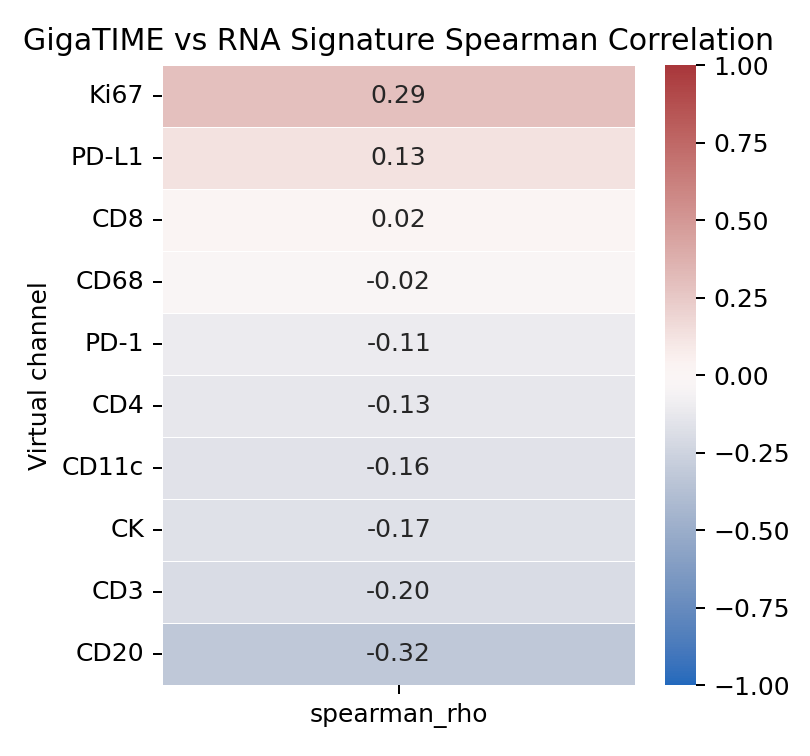
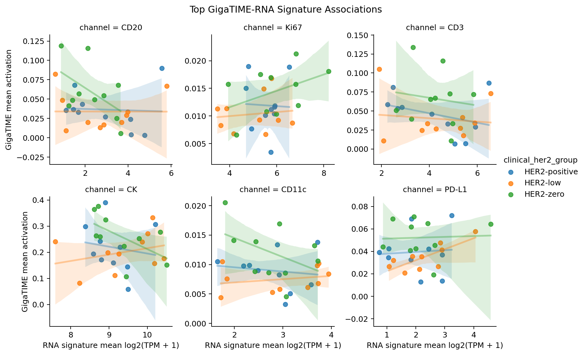

# Clinical HER2 RNA Validation

This document records the first indirect validation check for the 30-slide clinical HER2 GigaTIME pilot.

## Why This Was Done

The current GigaTIME result suggested that HER2-zero tumors had higher predicted immune/checkpoint virtual channels than HER2-low tumors, especially `CD68`, `PD-L1`, and `CD11c`.

Because this project does not currently have real multiplex immunofluorescence matched to the TCGA slides, the next best local validation layer is RNA-seq. The idea is simple:

- If GigaTIME predicts high `CD8`, do the same cases also have higher RNA expression of `CD8A` and `CD8B`?
- If GigaTIME predicts high `PD-L1`, do the same cases also have higher RNA expression of `CD274`, the gene for PD-L1?
- If GigaTIME predicts high `Ki67`, do the same cases also have higher `MKI67` and `TOP2A` expression?

This is not a perfect validation. Bulk RNA-seq measures mixed tissue from the specimen, while GigaTIME measures selected H&E image tiles. Still, it is a useful trustworthiness check.

## Command

```bash
conda run -n gigatime-tcga python scripts/validate_gigatime_with_rna_signatures.py
```

Inputs:

- `results/gigatime_tcga_brca_clinical_her2/clinical_summary/joined_slide_clinical_her2_gigatime.csv`
- `data/tcga_brca/expression_files/`

Local outputs:

- `results/gigatime_tcga_brca_clinical_her2/rna_validation/case_rna_signatures.csv`
- `results/gigatime_tcga_brca_clinical_her2/rna_validation/case_gene_expression_long.csv`
- `results/gigatime_tcga_brca_clinical_her2/rna_validation/joined_gigatime_rna_signatures.csv`
- `results/gigatime_tcga_brca_clinical_her2/rna_validation/gigatime_rna_signature_correlations.csv`
- `results/gigatime_tcga_brca_clinical_her2/rna_validation/gigatime_rna_group_summary.csv`
- `results/gigatime_tcga_brca_clinical_her2/rna_validation/rna_validation_summary.md`

Tracked figure copies:





## RNA Signatures Used

| GigaTIME channel | RNA marker genes |
|---|---|
| CD3 | CD3D, CD3E, CD3G, TRAC |
| CD8 | CD8A, CD8B |
| CD4 | CD4 |
| CD20 | MS4A1, CD79A, CD79B |
| CD68 | CD68, CD163, MRC1 |
| CD11c | ITGAX, IRF8, BATF3 |
| PD-1 | PDCD1 |
| PD-L1 | CD274 |
| CK | EPCAM, KRT8, KRT18, KRT19 |
| Ki67 | MKI67, TOP2A |

For multi-gene signatures, the script uses the mean of `log2(TPM + 1)` across the marker genes found in each case.

## Results

The analysis included all 30 clinical HER2 pilot cases.

| Channel | Spearman rho | p | BH q | Interpretation |
|---|---:|---:|---:|---|
| Ki67 | 0.294 | 0.114 | 0.572 | Weak positive relationship with proliferation RNA markers. |
| PD-L1 | 0.127 | 0.502 | 0.722 | Very weak positive relationship with `CD274`. |
| CD8 | 0.019 | 0.919 | 0.928 | No meaningful relationship in this pilot. |
| CD68 | -0.017 | 0.928 | 0.928 | No meaningful relationship in this pilot. |
| PD-1 | -0.105 | 0.580 | 0.725 | Weak negative relationship. |
| CD4 | -0.127 | 0.505 | 0.722 | Weak negative relationship. |
| CD11c | -0.157 | 0.408 | 0.722 | Weak negative relationship. |
| CK | -0.168 | 0.374 | 0.722 | Weak negative relationship. |
| CD3 | -0.198 | 0.294 | 0.722 | Weak negative relationship. |
| CD20 | -0.325 | 0.080 | 0.572 | Moderate negative trend, not significant. |

No GigaTIME channel had a statistically significant RNA-signature correlation after Benjamini-Hochberg correction.

## What This Means

The RNA validation check does not strongly confirm the GigaTIME virtual immune-channel findings.

The most important caution is that the top clinical HER2 pilot signals, `CD68`, `PD-L1`, and `CD11c`, did not show strong positive correlations with their matching RNA signatures across the 30 cases. This means we should not present the HER2-zero immune/checkpoint signal as validated yet.

However, this does not automatically mean the GigaTIME outputs are wrong. Bulk RNA-seq and virtual mIF from selected H&E tiles can disagree for several reasons:

- Bulk RNA-seq averages tumor, stroma, immune cells, and normal tissue together.
- The H&E slide analyzed by GigaTIME may not be the same physical tissue section used for RNA-seq.
- The 64 sampled tiles may not represent the whole slide.
- GigaTIME was trained to predict image-local marker patterns, while RNA-seq measures specimen-level transcript abundance.
- TCGA slide staining, tissue quality, tumor purity, and sampling can vary.

## Proposal Language

A careful way to describe this result:

> As an indirect validation layer, we compared GigaTIME virtual marker activations with matched TCGA RNA-seq marker signatures. In the 30-case pilot, correlations were weak and did not survive multiple-testing correction. Therefore, the HER2-zero versus HER2-low virtual immune signal should be treated as hypothesis-generating and requires additional validation.

## Next Step

The next robustness step should be visual and spatial QC:

- Select representative HER2-zero, HER2-low, and HER2-positive cases.
- For each, show source H&E tiles beside virtual mIF composites.
- Prioritize cases driving high `CD68`, `PD-L1`, and `CD11c` predictions.
- Ask whether high virtual signal appears in plausible tissue regions or in artifacts, folds, necrosis, background, or low-quality tiles.

After that, rerun GigaTIME with more tiles per slide to check whether the RNA-discordant result is partly due to sparse tile sampling.
