# HEST-1k Breast RNA-Validation Results — TENX14

Status: within-slide validation of GigaTIME virtual channels against HEST-1k spatial RNA (Visium). Independent replication of the Xenium Rep1/Rep2 audit on a different breast sample to test generalization.

- Sample: `TENX14` (Visium, HEST-1k); nan; `nan`. Dataset: Human Breast Cancer (Block A Section 2).
- Clinical (from HEST metadata): IDC; AJCC/UICC Stage Group IIA, ER positive, PR negative, Her2 positive.

## Method

- H&E full resolution: 24240 x 24240 px (0.3663 um/px); 3737 tiles used at 256 px (stride 256).
- Visium: 4,015 spots (73,976,393 total UMI), binned onto the tile grid via `pxl_col/row_in_fullres`. Analysis restricted to the **3737** tiles containing >=1 spot (spots are ~100 um apart, sparser than 256 px tiles).
- Channels with a panel gene (16/16): CD3, CD8, CD4, CD20, CD68, CD14, CD11c, CD16, PD-1, PD-L1, CK, Ki67, CD138, CD34, T-bet, Tryptase. Not in this panel: none.
- Statistics are computed by the same audited core as the Xenium Rep1/Rep2 run (`scripts/validate_gigatime_xenium_rna.py`, imported unchanged): within-slide Spearman, channel x gene-set specificity matrix, cellularity-controlled partial correlation, spatial block-bootstrap 95% CIs.

## Alignment Sanity (model-free)

Spearman(tile tissue fraction, total transcript density) = **0.450** (p=4.3e-186, 95% CI [0.381, 0.510]). A strongly positive value confirms the transcript-to-H&E mapping before interpreting channels.

## Channel Correlations (virtual channel vs RNA)

| Channel | Gene(s) | Spearman r | 95% CI | p | Counts on grid |
|---|---|---:|---|---:|---:|
| CK | KRT8, KRT18, KRT19, KRT7, EPCAM | 0.309 | [0.239, 0.380] | 1.5e-83 | 1,119,347 |
| CD68 | CD68 | 0.083 | [0.025, 0.138] | 3.6e-07 | 6,456 |
| Tryptase | TPSAB1, TPSB2 | 0.071 | [0.028, 0.114] | 1.6e-05 | 3,036 |
| CD4 | CD4 | 0.062 | [0.017, 0.104] | 1.5e-04 | 2,378 |
| CD3 | CD3D, CD3E, CD3G | 0.062 | [0.016, 0.112] | 1.6e-04 | 3,788 |
| CD14 | CD14 | 0.061 | [0.001, 0.123] | 1.8e-04 | 5,959 |
| CD11c | ITGAX | 0.044 | [0.002, 0.089] | 7.6e-03 | 1,776 |
| CD20 | MS4A1 | 0.036 | [-0.015, 0.079] | 2.9e-02 | 722 |
| CD34 | CD34 | 0.028 | [-0.009, 0.063] | 8.5e-02 | 1,344 |
| CD138 | SDC1 | 0.028 | [-0.032, 0.095] | 8.5e-02 | 18,707 |
| CD16 | FCGR3A | 0.028 | [-0.024, 0.076] | 9.0e-02 | 4,085 |
| Ki67 | MKI67 | 0.023 | [-0.022, 0.067] | 1.5e-01 | 2,561 |
| PD-L1 | CD274 | 0.019 | [-0.019, 0.055] | 2.4e-01 | 417 |
| T-bet | TBX21 | 0.011 | [-0.026, 0.046] | 4.9e-01 | 164 |
| PD-1 | PDCD1 | 0.011 | [-0.027, 0.047] | 4.9e-01 | 348 |
| CD8 | CD8A, CD8B | -0.001 | [-0.045, 0.042] | 9.5e-01 | 1,341 |

### Scatter plots

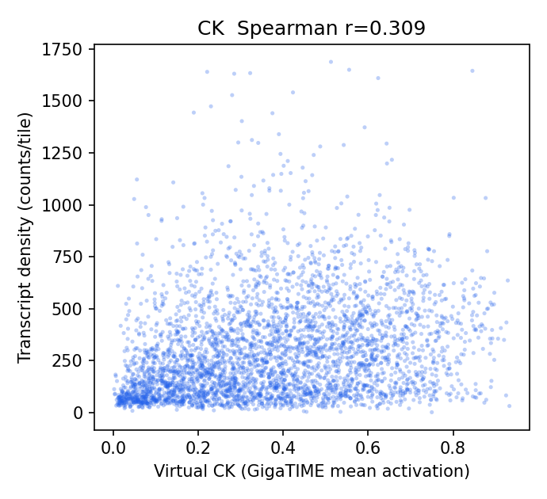
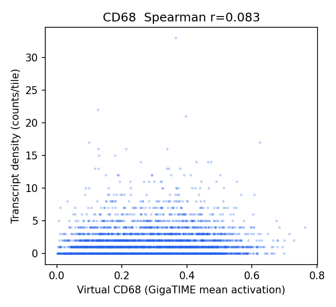
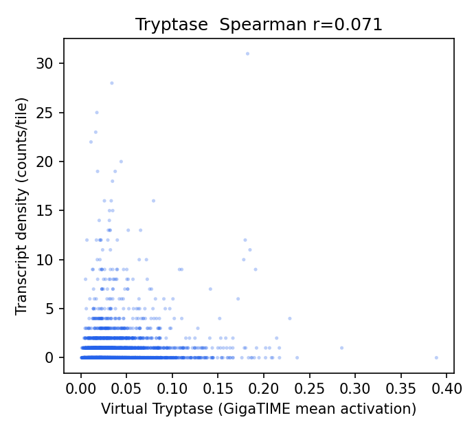
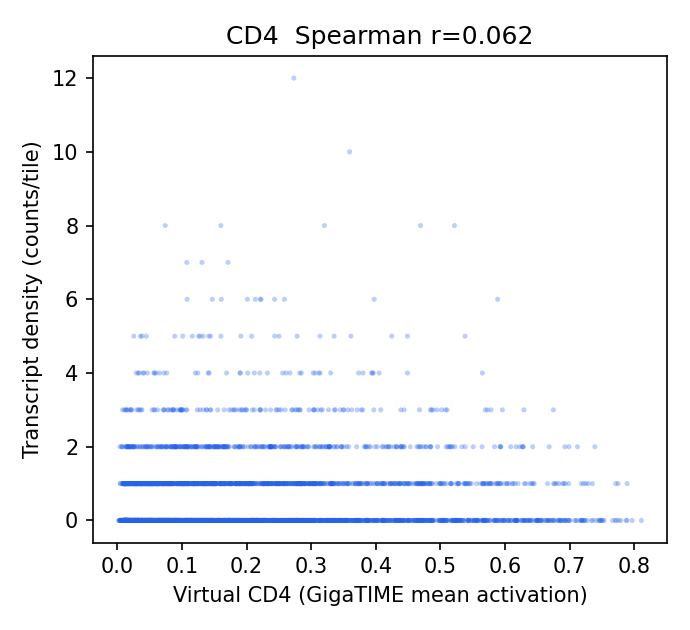
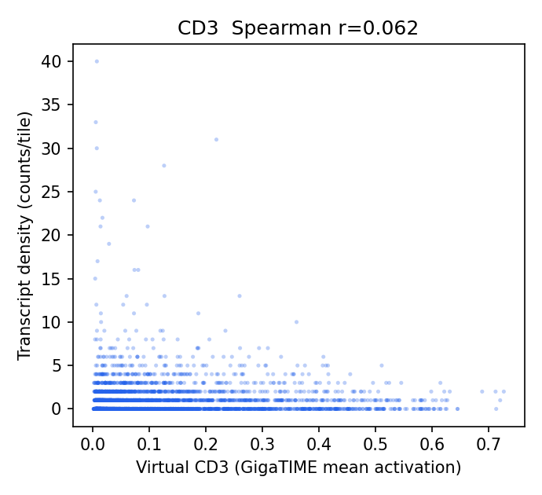
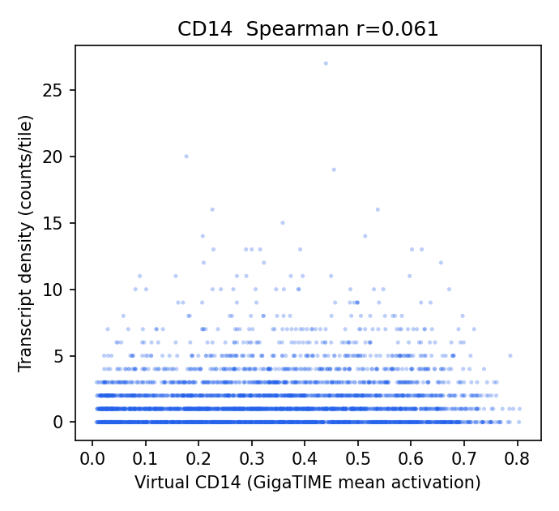
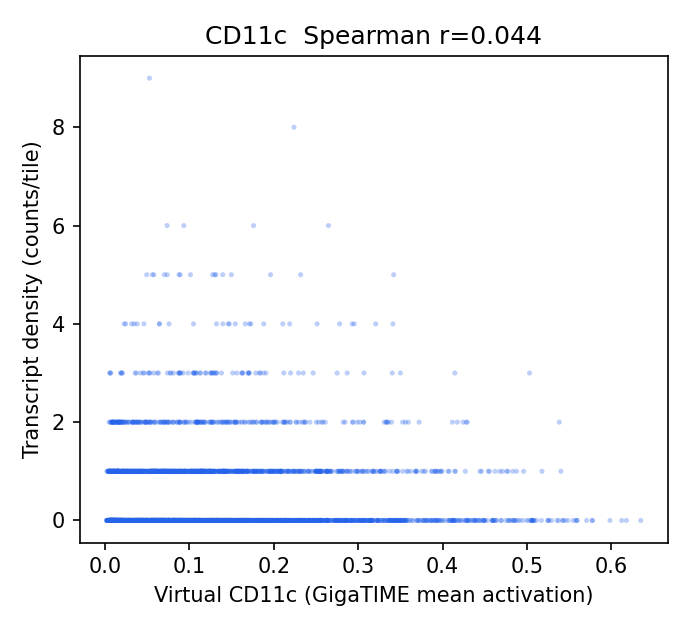
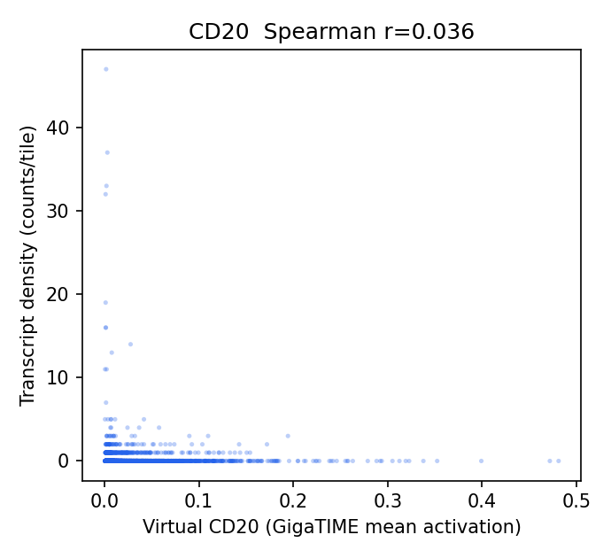
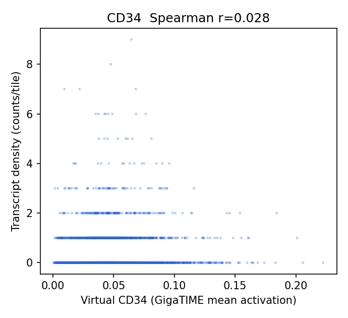
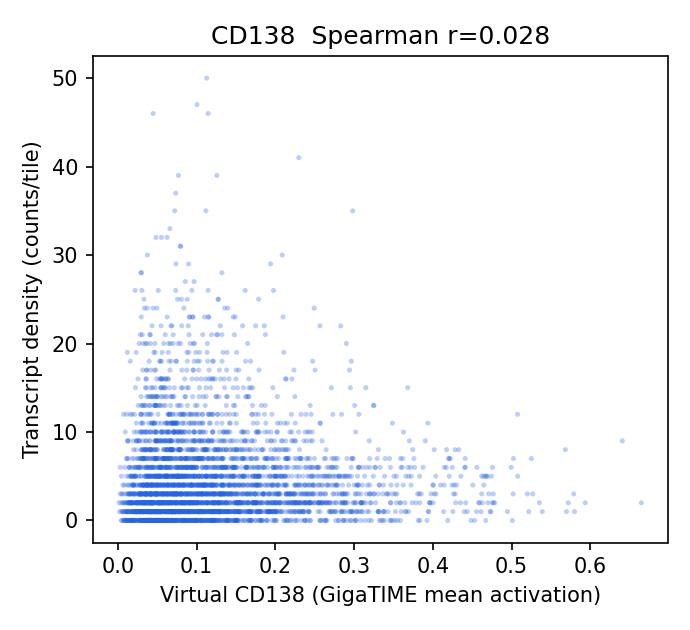
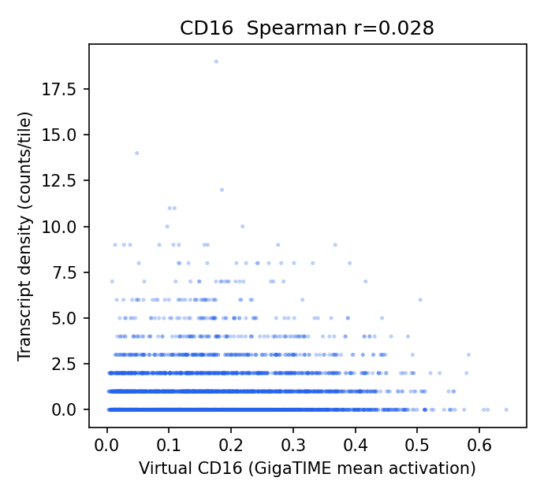
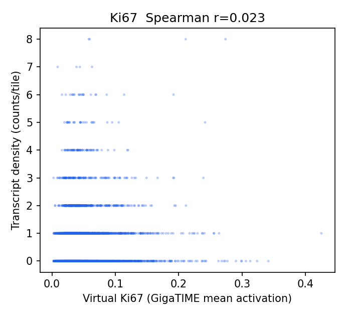
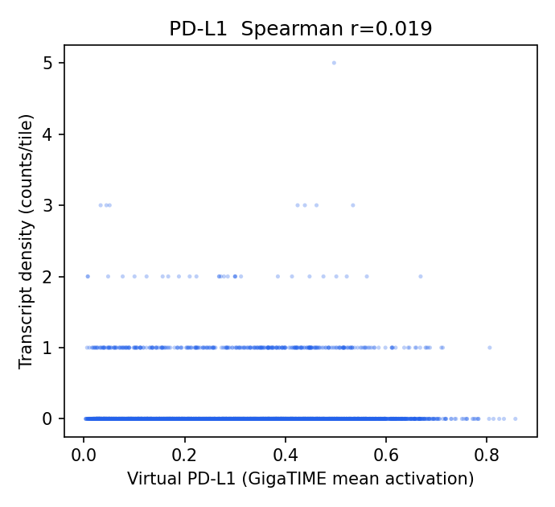
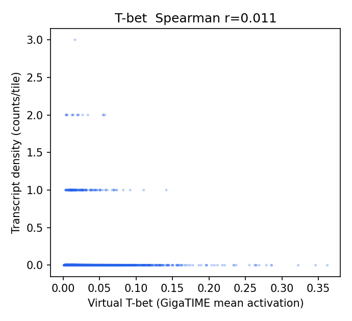
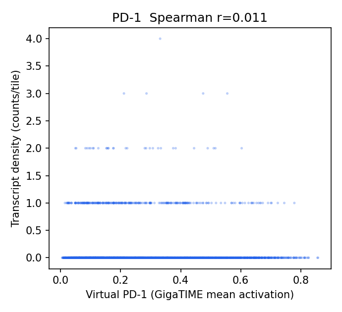
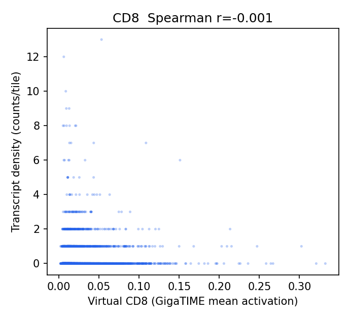

## Channel Specificity (is the signal channel-specific, not just cellularity?)

(1) Row-max: own-gene is the most-correlated gene-set for **2/16** channels. (2) Partial correlation controlling for total per-tile transcript density stays positive (95% CI > 0) for **9/16** channels.

| Channel | Own-gene r | Partial r (control total tx) | Partial 95% CI | Own-gene row-max? | Closest other channel |
|---|---:|---:|---|:--:|---|
| CD3 | 0.062 | 0.161 | [0.120, 0.200] | no | Tryptase (0.083) |
| CD4 | 0.062 | 0.143 | [0.105, 0.180] | no | Tryptase (0.092) |
| CD11c | 0.044 | 0.115 | [0.077, 0.151] | no | Tryptase (0.082) |
| Tryptase | 0.071 | 0.108 | [0.070, 0.146] | yes | CD68 (0.043) |
| CD14 | 0.061 | 0.106 | [0.055, 0.155] | no | CD68 (0.114) |
| CD16 | 0.028 | 0.086 | [0.043, 0.125] | no | CD3 (0.090) |
| CD8 | -0.001 | 0.072 | [0.037, 0.105] | no | CD3 (0.071) |
| CD20 | 0.036 | 0.063 | [0.014, 0.102] | no | Tryptase (0.084) |
| T-bet | 0.011 | 0.039 | [0.004, 0.072] | no | Tryptase (0.077) |
| PD-L1 | 0.019 | 0.027 | [-0.006, 0.062] | no | CD3 (0.116) |
| CD34 | 0.028 | 0.025 | [-0.015, 0.064] | no | CD68 (0.125) |
| CK | 0.309 | 0.025 | [-0.064, 0.111] | yes | CD138 (0.193) |
| CD68 | 0.083 | 0.024 | [-0.026, 0.070] | no | CK (0.109) |
| PD-1 | 0.011 | 0.009 | [-0.029, 0.043] | no | Tryptase (0.089) |
| Ki67 | 0.023 | -0.004 | [-0.040, 0.033] | no | Tryptase (0.051) |
| CD138 | 0.028 | -0.016 | [-0.061, 0.027] | no | CD3 (0.079) |

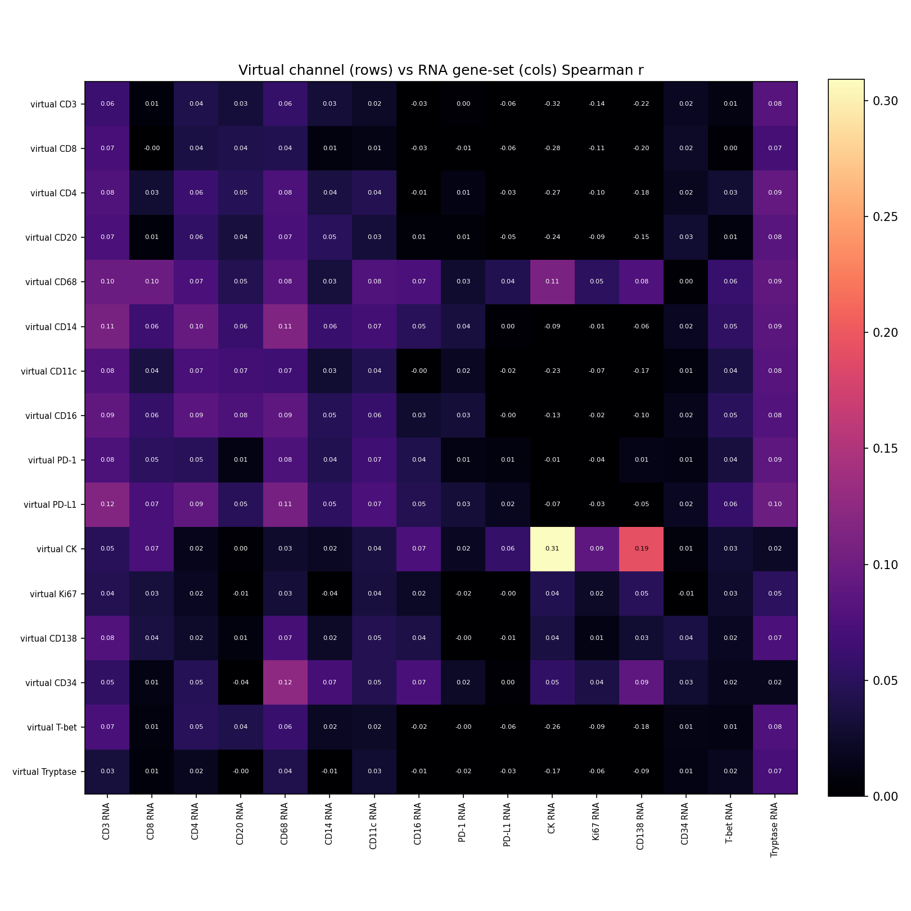

## Interpretation

- Own-gene is the most-correlated gene-set for **2/16** channels; after partialling out total per-tile transcript density (cellularity), channel-specific signal stays positive (95% CI > 0) for **9/16** channels: CD3 0.16, CD4 0.14, CD11c 0.11, Tryptase 0.11, CD14 0.11, CD16 0.09, CD8 0.07, CD20 0.06.
- Headline-channel check vs the Xenium Rep1/Rep2 finding: CK partial r = 0.03 (not positive); T-cell CD3 0.16, CD8 0.07, CD4 0.14; CD68 = 0.02 (not negative here).

## Output Files

- `results/gigatime_hest_rna_validation/TENX14/hest_rna_validation_report.json`
- `docs/assets/gigatime_hest_rna_validation_TENX14/`
