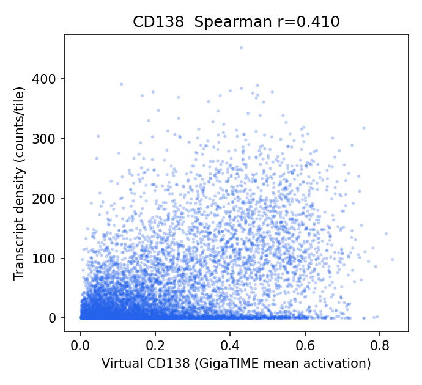
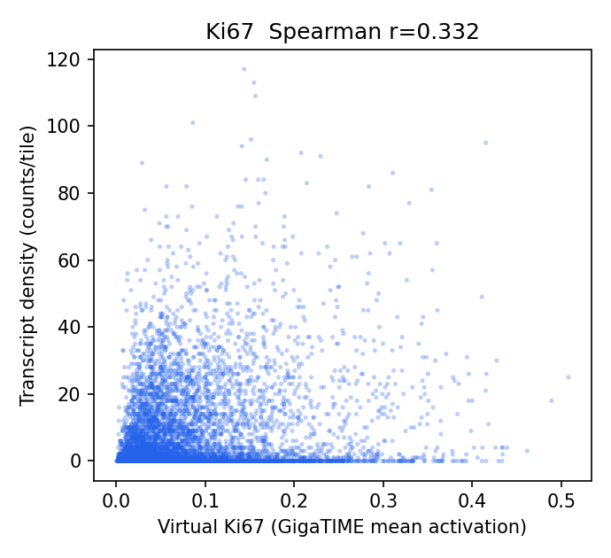
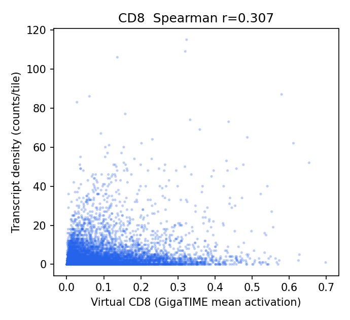
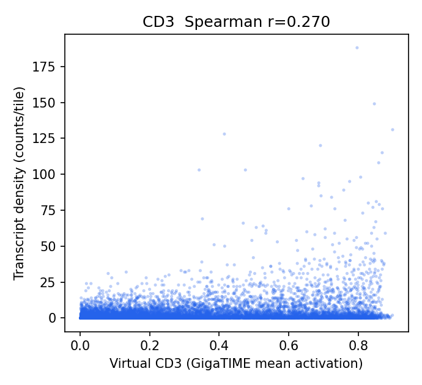
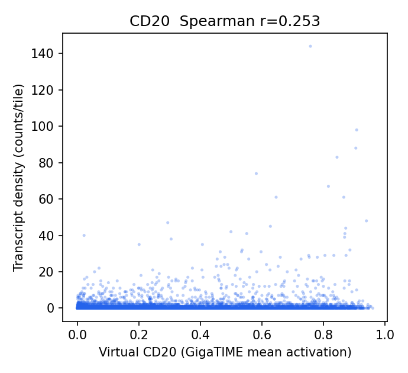
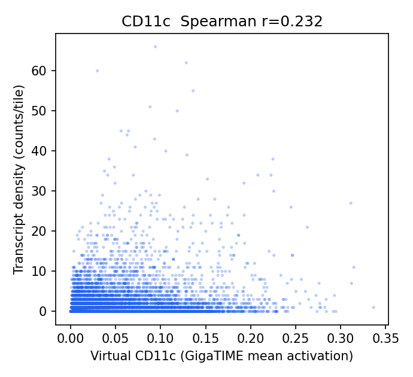
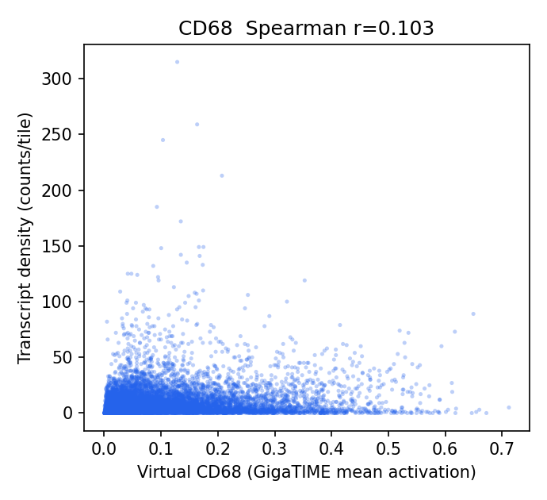
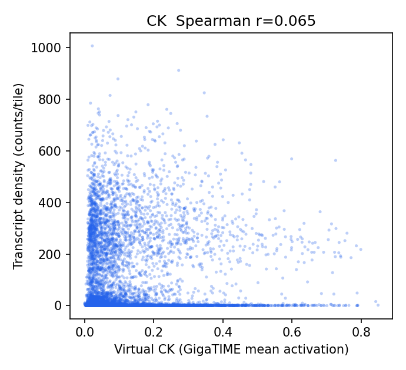
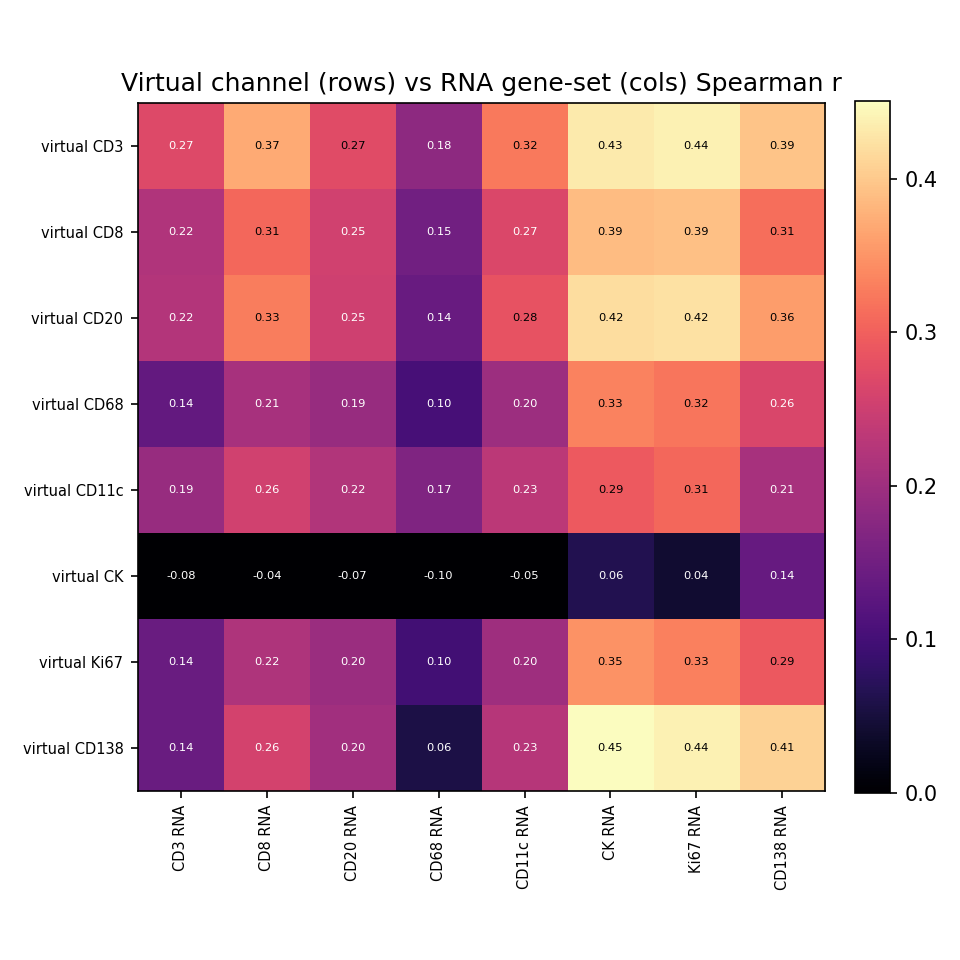

# HEST-1k Breast RNA-Validation Results — TENX191

Status: within-slide validation of GigaTIME virtual channels against HEST-1k spatial RNA. Independent replication of the Xenium Rep1/Rep2 audit on a different breast sample to test generalization.

- Sample: `TENX191` (Xenium, HEST-1k); Patient 1; `Section 1, top`. Dataset: Xenium v1 Human Breast FFPE with Biomarkers & Housekeeping Genes Custom Panel.
- Clinical (from HEST metadata): IDC; IDC, T3 N0 M0, G3, HER2-Neg.

## Method

- H&E full resolution: 43995 x 20515 px (0.2740 um/px); 9837 tissue tiles at 256 px (stride 256).
- Transcripts: 64,433,598 gene transcripts (of 64,581,006 incl. controls), binned onto the tile grid directly via the HEST-provided H&E pixel coordinates (`he_x`/`he_y`) — no alignment affine.
- Channels with a panel gene (8/16): CD3, CD8, CD20, CD68, CD11c, CK, Ki67, CD138. Not in this panel: CD4, CD14, CD16, PD-1, PD-L1, CD34, T-bet, Tryptase.
- Statistics are computed by the same audited core as the Xenium Rep1/Rep2 run (`scripts/validate_gigatime_xenium_rna.py`, imported unchanged): within-slide Spearman, channel x gene-set specificity matrix, cellularity-controlled partial correlation, spatial block-bootstrap 95% CIs.

## Alignment Sanity (model-free)

Spearman(tile tissue fraction, total transcript density) = **0.104** (p=4.9e-25, 95% CI [0.060, 0.147]). A strongly positive value confirms the transcript-to-H&E mapping before interpreting channels.

## Channel Correlations (virtual channel vs RNA)

| Channel | Gene(s) | Spearman r | 95% CI | p | Transcripts on grid |
|---|---|---:|---|---:|---:|
| CD138 | SDC1 | 0.410 | [0.362, 0.459] | 0.0e+00 | 443,996 |
| Ki67 | MKI67 | 0.332 | [0.294, 0.367] | 3.4e-251 | 58,626 |
| CD8 | CD8A | 0.307 | [0.273, 0.341] | 9.6e-214 | 35,366 |
| CD3 | CD3E | 0.270 | [0.230, 0.311] | 1.9e-163 | 36,095 |
| CD20 | MS4A1 | 0.253 | [0.222, 0.282] | 4.7e-143 | 7,611 |
| CD11c | ITGAX | 0.232 | [0.197, 0.266] | 6.8e-120 | 18,091 |
| CD68 | CD68 | 0.103 | [0.062, 0.143] | 1.3e-24 | 96,807 |
| CK | KRT19, EPCAM | 0.065 | [0.016, 0.112] | 1.3e-10 | 758,493 |

### Scatter plots

## Channel Specificity (is the signal channel-specific, not just cellularity?)

(1) Row-max: own-gene is the most-correlated gene-set for **0/8** channels. (2) Partial correlation controlling for total per-tile transcript density stays positive (95% CI > 0) for **5/8** channels.

| Channel | Own-gene r | Partial r (control total tx) | Partial 95% CI | Own-gene row-max? | Closest other channel |
|---|---:|---:|---|:--:|---|
| CD20 | 0.253 | 0.110 | [0.084, 0.138] | no | Ki67 (0.424) |
| CD8 | 0.307 | 0.083 | [0.052, 0.113] | no | Ki67 (0.391) |
| CD3 | 0.270 | 0.071 | [0.034, 0.109] | no | Ki67 (0.440) |
| CD11c | 0.232 | 0.069 | [0.041, 0.098] | no | Ki67 (0.307) |
| Ki67 | 0.332 | 0.036 | [0.007, 0.065] | no | CK (0.347) |
| CD68 | 0.103 | 0.024 | [-0.015, 0.064] | no | CK (0.333) |
| CK | 0.065 | 0.005 | [-0.030, 0.040] | no | CD138 (0.137) |
| CD138 | 0.410 | -0.036 | [-0.079, 0.006] | no | CK (0.451) |

## Interpretation

- Own-gene is the most-correlated gene-set for **0/8** channels; after partialling out total per-tile transcript density (cellularity), channel-specific signal stays positive (95% CI > 0) for **5/8** channels: CD20 0.11, CD8 0.08, CD3 0.07, CD11c 0.07, Ki67 0.04.
- Headline-channel check vs the Xenium Rep1/Rep2 finding: CK partial r = 0.00 (not positive); T-cell CD3 0.07, CD8 0.08; CD68 = 0.02 (NOT negative here).

## Output Files

- `results/gigatime_hest_rna_validation/TENX191/hest_rna_validation_report.json`
- `docs/assets/gigatime_hest_rna_validation_TENX191/`
