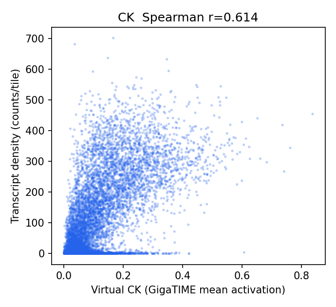
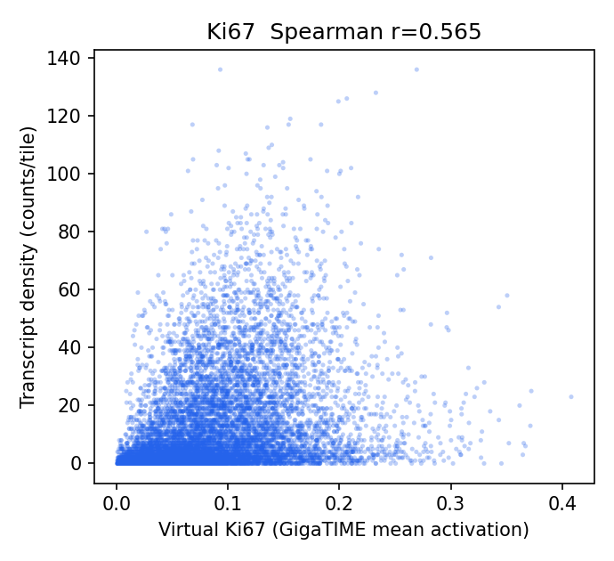
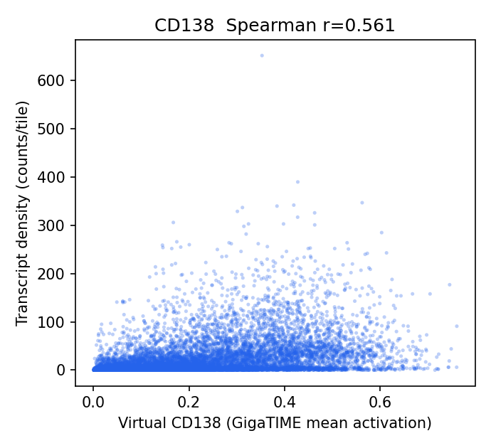
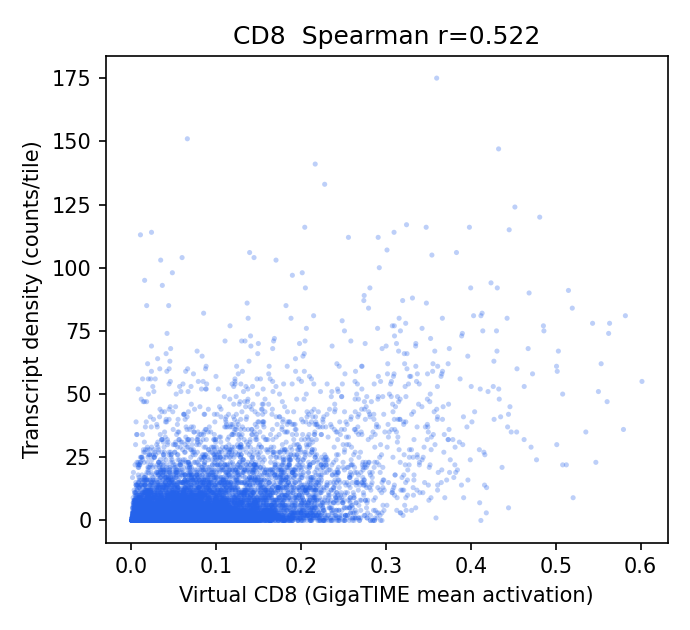
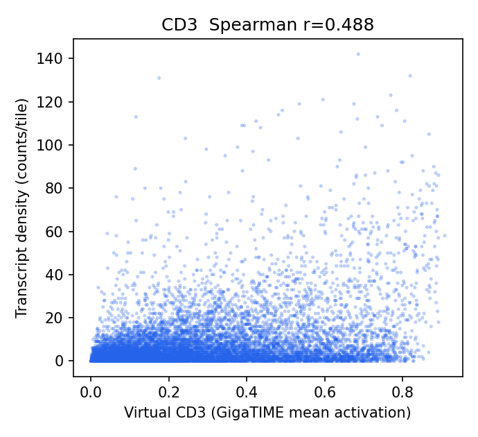
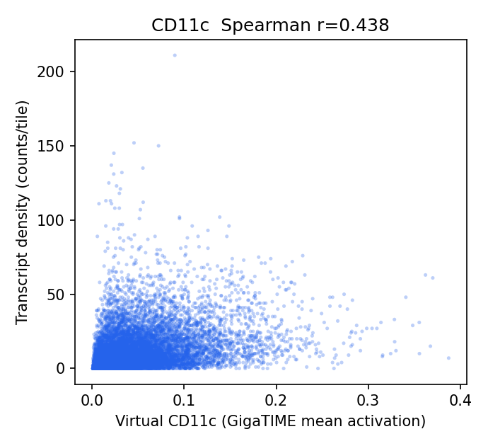
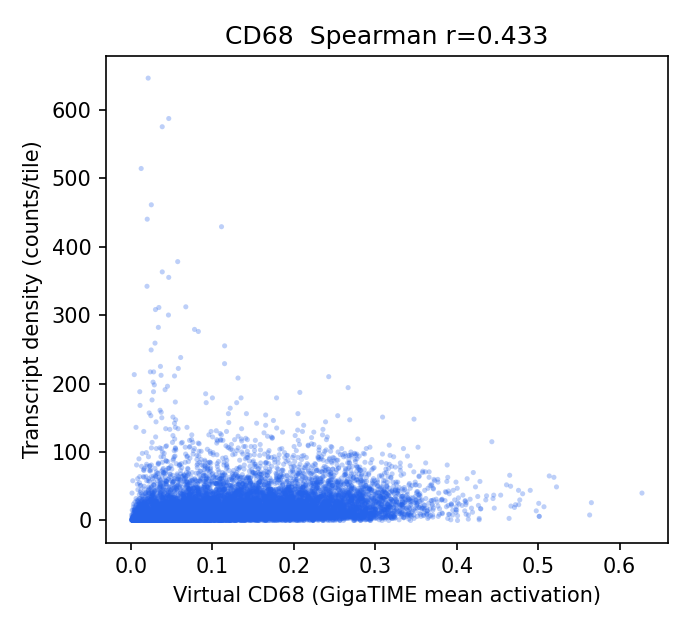
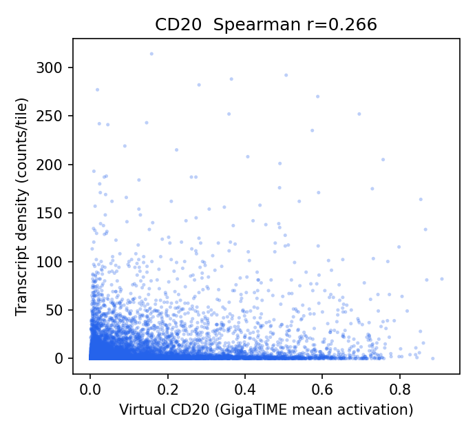
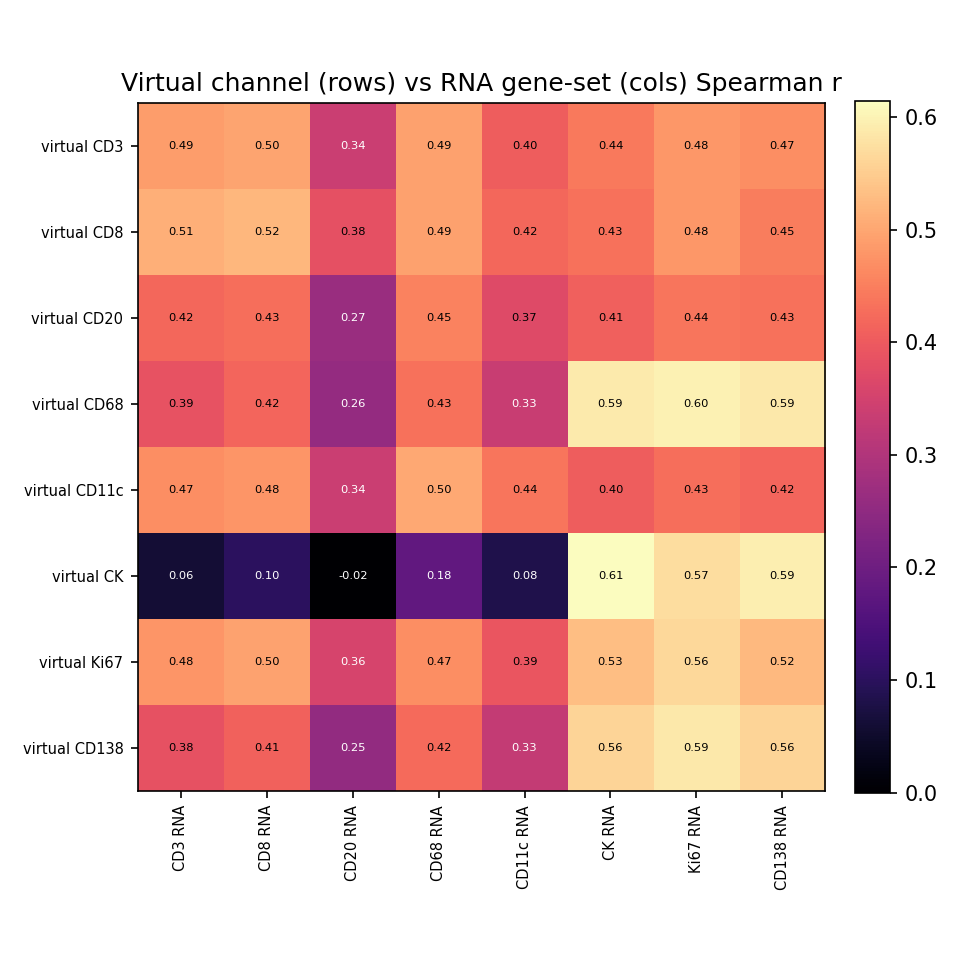

# HEST-1k Breast RNA-Validation Results — TENX195

Status: within-slide validation of GigaTIME virtual channels against HEST-1k spatial RNA. Independent replication of the Xenium Rep1/Rep2 audit on a different breast sample to test generalization.

- Sample: `TENX195` (Xenium, HEST-1k); Patient 2; `Section 2, middle`. Dataset: Xenium v1 Human Breast FFPE with Biomarkers & Housekeeping Genes Custom Panel.
- Clinical (from HEST metadata): IDC; DCIS, T1c N1 MX, G2, HER2-2+.

## Method

- H&E full resolution: 38540 x 27235 px (0.2740 um/px); 12494 tissue tiles at 256 px (stride 256).
- Transcripts: 74,131,254 gene transcripts (of 74,273,457 incl. controls), binned onto the tile grid directly via the HEST-provided H&E pixel coordinates (`he_x`/`he_y`) — no alignment affine.
- Channels with a panel gene (8/16): CD3, CD8, CD20, CD68, CD11c, CK, Ki67, CD138. Not in this panel: CD4, CD14, CD16, PD-1, PD-L1, CD34, T-bet, Tryptase.
- Statistics are computed by the same audited core as the Xenium Rep1/Rep2 run (`scripts/validate_gigatime_xenium_rna.py`, imported unchanged): within-slide Spearman, channel x gene-set specificity matrix, cellularity-controlled partial correlation, spatial block-bootstrap 95% CIs.

## Alignment Sanity (model-free)

Spearman(tile tissue fraction, total transcript density) = **-0.022** (p=1.3e-02, 95% CI [-0.070, 0.025]). A strongly positive value confirms the transcript-to-H&E mapping before interpreting channels.

## Channel Correlations (virtual channel vs RNA)

| Channel | Gene(s) | Spearman r | 95% CI | p | Transcripts on grid |
|---|---|---:|---|---:|---:|
| CK | KRT19, EPCAM | 0.614 | [0.579, 0.648] | 0.0e+00 | 1,072,709 |
| Ki67 | MKI67 | 0.565 | [0.541, 0.588] | 0.0e+00 | 137,001 |
| CD138 | SDC1 | 0.561 | [0.532, 0.588] | 0.0e+00 | 263,425 |
| CD8 | CD8A | 0.522 | [0.497, 0.546] | 0.0e+00 | 87,606 |
| CD3 | CD3E | 0.488 | [0.455, 0.519] | 0.0e+00 | 87,331 |
| CD11c | ITGAX | 0.438 | [0.413, 0.462] | 0.0e+00 | 142,302 |
| CD68 | CD68 | 0.433 | [0.401, 0.465] | 0.0e+00 | 253,318 |
| CD20 | MS4A1 | 0.266 | [0.230, 0.305] | 2.1e-201 | 97,189 |

### Scatter plots

## Channel Specificity (is the signal channel-specific, not just cellularity?)

(1) Row-max: own-gene is the most-correlated gene-set for **3/8** channels. (2) Partial correlation controlling for total per-tile transcript density stays positive (95% CI > 0) for **5/8** channels.

| Channel | Own-gene r | Partial r (control total tx) | Partial 95% CI | Own-gene row-max? | Closest other channel |
|---|---:|---:|---|:--:|---|
| CD8 | 0.522 | 0.342 | [0.308, 0.375] | yes | CD3 (0.511) |
| CD3 | 0.488 | 0.314 | [0.280, 0.347] | no | CD8 (0.497) |
| CD11c | 0.438 | 0.294 | [0.266, 0.322] | no | CD68 (0.504) |
| CK | 0.614 | 0.192 | [0.166, 0.217] | yes | CD138 (0.593) |
| CD20 | 0.266 | 0.143 | [0.108, 0.181] | no | CD68 (0.455) |
| CD68 | 0.433 | 0.011 | [-0.021, 0.043] | no | Ki67 (0.598) |
| Ki67 | 0.565 | -0.026 | [-0.049, 0.002] | yes | CK (0.532) |
| CD138 | 0.561 | -0.036 | [-0.075, 0.002] | no | Ki67 (0.587) |

## Interpretation

- Own-gene is the most-correlated gene-set for **3/8** channels; after partialling out total per-tile transcript density (cellularity), channel-specific signal stays positive (95% CI > 0) for **5/8** channels: CD8 0.34, CD3 0.31, CD11c 0.29, CK 0.19, CD20 0.14.
- Headline-channel check vs the Xenium Rep1/Rep2 finding: CK partial r = 0.19 (specific/positive); T-cell CD3 0.31, CD8 0.34; CD68 = 0.01 (NOT negative here).

## Output Files

- `results/gigatime_hest_rna_validation/TENX195/hest_rna_validation_report.json`
- `docs/assets/gigatime_hest_rna_validation_TENX195/`
