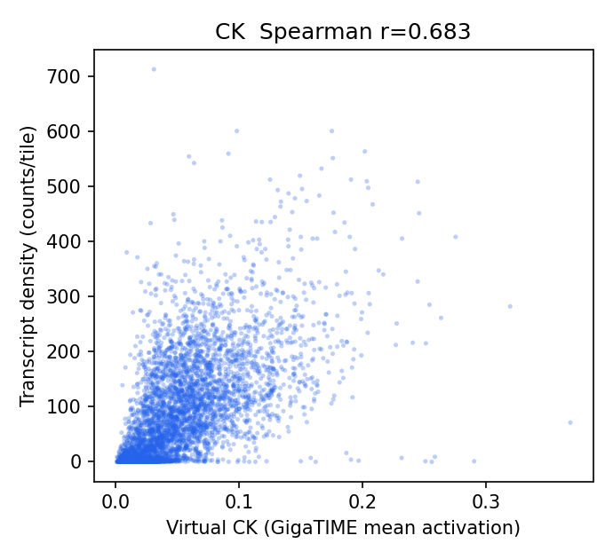
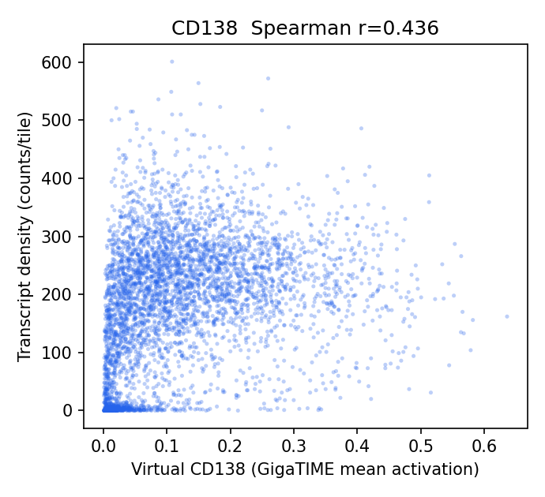
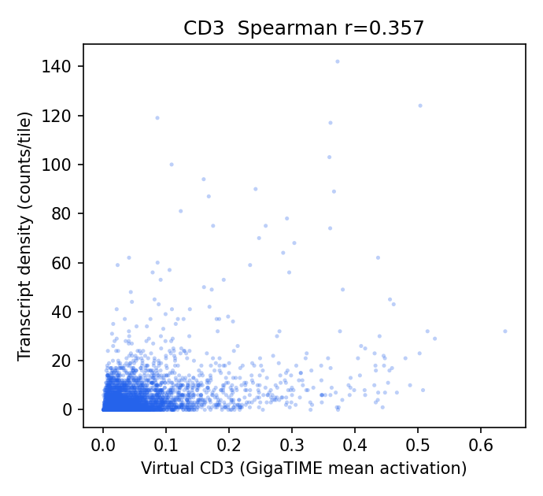
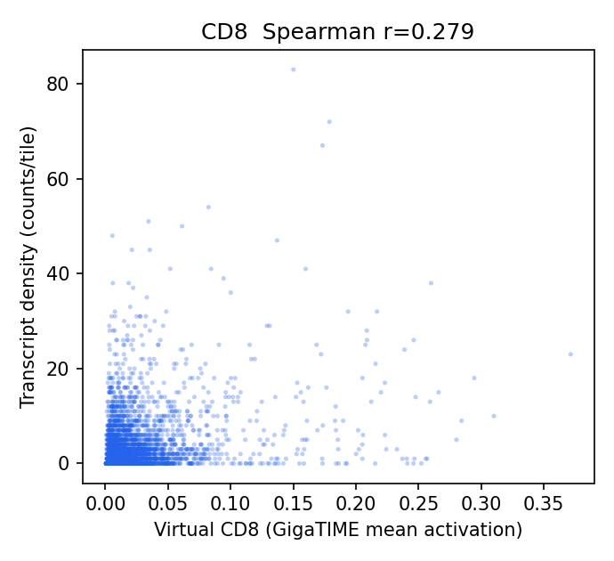
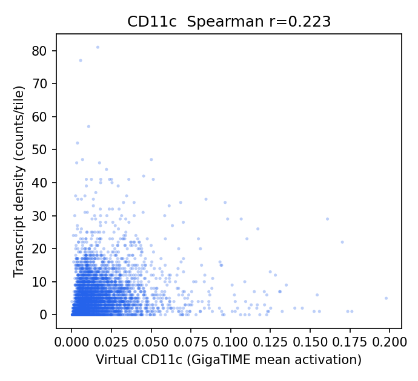
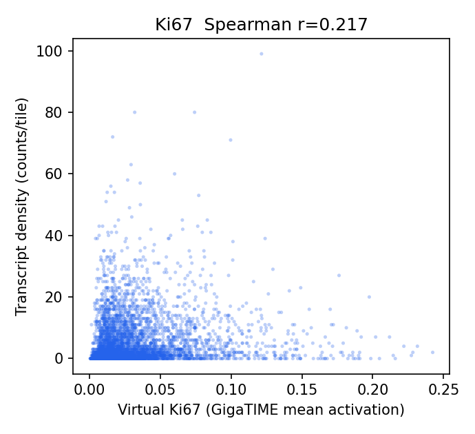
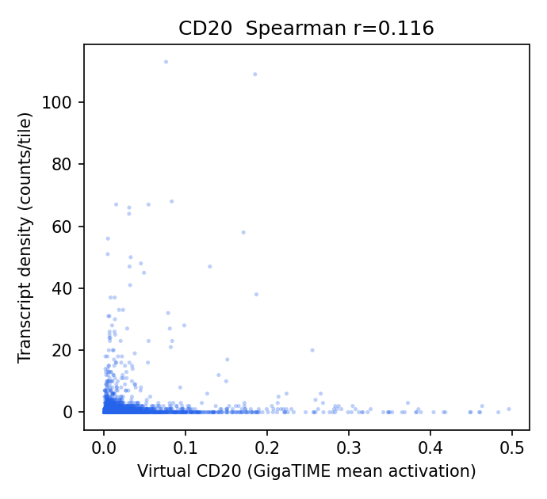
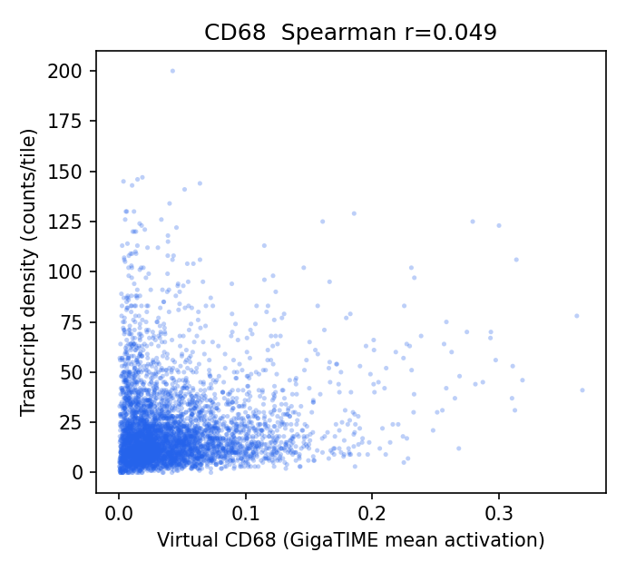
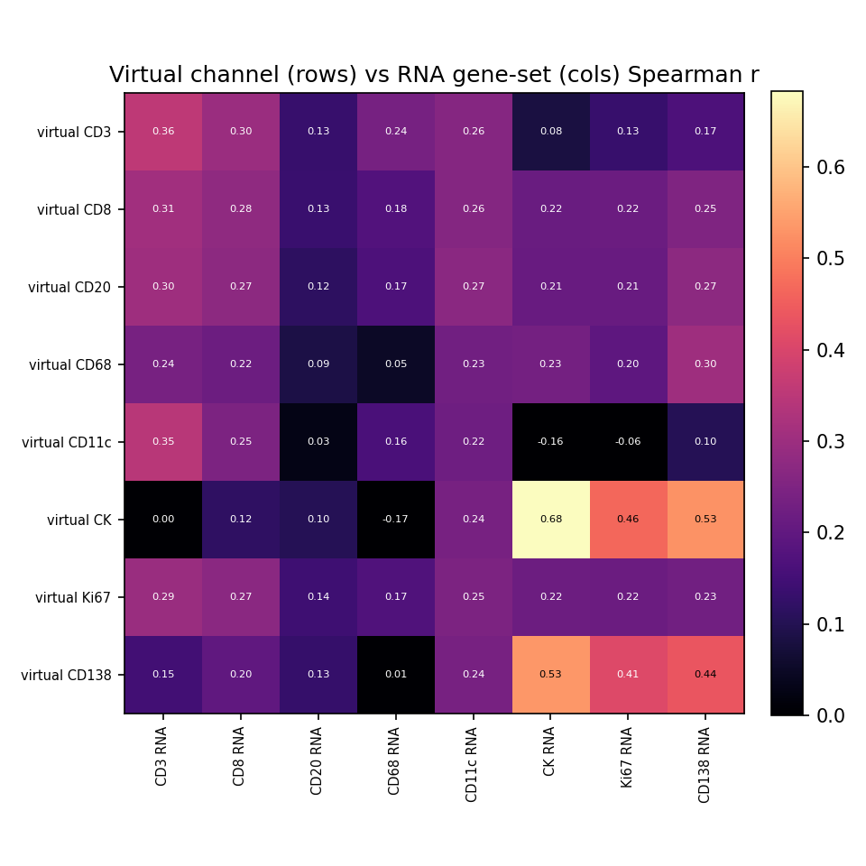

# HEST-1k Breast RNA-Validation Results — TENX199

Status: within-slide validation of GigaTIME virtual channels against HEST-1k spatial RNA. Independent replication of the Xenium Rep1/Rep2 audit on a different breast sample to test generalization.

- Sample: `TENX199` (Xenium, HEST-1k); Patient 3; `Section 3, bottom`. Dataset: Xenium v1 Human Breast FFPE with Biomarkers & Housekeeping Genes Custom Panel.
- Clinical (from HEST metadata): IDC; DCIS, TX NX M0, G2, ER-/PR-/HER2-2+.

## Method

- H&E full resolution: 31607 x 14853 px (0.2741 um/px); 4469 tissue tiles at 256 px (stride 256).
- Transcripts: 43,579,291 gene transcripts (of 43,717,142 incl. controls), binned onto the tile grid directly via the HEST-provided H&E pixel coordinates (`he_x`/`he_y`) — no alignment affine.
- Channels with a panel gene (8/16): CD3, CD8, CD20, CD68, CD11c, CK, Ki67, CD138. Not in this panel: CD4, CD14, CD16, PD-1, PD-L1, CD34, T-bet, Tryptase.
- Statistics are computed by the same audited core as the Xenium Rep1/Rep2 run (`scripts/validate_gigatime_xenium_rna.py`, imported unchanged): within-slide Spearman, channel x gene-set specificity matrix, cellularity-controlled partial correlation, spatial block-bootstrap 95% CIs.

## Alignment Sanity (model-free)

Spearman(tile tissue fraction, total transcript density) = **0.317** (p=3.9e-105, 95% CI [0.248, 0.378]). A strongly positive value confirms the transcript-to-H&E mapping before interpreting channels.

## Channel Correlations (virtual channel vs RNA)

| Channel | Gene(s) | Spearman r | 95% CI | p | Transcripts on grid |
|---|---|---:|---|---:|---:|
| CK | KRT19, EPCAM | 0.683 | [0.647, 0.716] | 0.0e+00 | 428,132 |
| CD138 | SDC1 | 0.436 | [0.366, 0.505] | 5.8e-207 | 818,669 |
| CD3 | CD3E | 0.357 | [0.299, 0.409] | 2.3e-134 | 20,663 |
| CD8 | CD8A | 0.279 | [0.227, 0.333] | 1.2e-80 | 14,918 |
| CD11c | ITGAX | 0.223 | [0.161, 0.282] | 1.2e-51 | 26,283 |
| Ki67 | MKI67 | 0.217 | [0.153, 0.274] | 9.3e-49 | 24,757 |
| CD20 | MS4A1 | 0.116 | [0.077, 0.155] | 7.6e-15 | 4,911 |
| CD68 | CD68 | 0.049 | [-0.013, 0.116] | 9.7e-04 | 100,065 |

### Scatter plots

## Channel Specificity (is the signal channel-specific, not just cellularity?)

(1) Row-max: own-gene is the most-correlated gene-set for **2/8** channels. (2) Partial correlation controlling for total per-tile transcript density stays positive (95% CI > 0) for **6/8** channels.

| Channel | Own-gene r | Partial r (control total tx) | Partial 95% CI | Own-gene row-max? | Closest other channel |
|---|---:|---:|---|:--:|---|
| CD3 | 0.357 | 0.346 | [0.291, 0.394] | yes | CD8 (0.296) |
| CD11c | 0.223 | 0.273 | [0.225, 0.318] | no | CD3 (0.346) |
| CK | 0.683 | 0.268 | [0.221, 0.318] | yes | CD138 (0.526) |
| CD8 | 0.279 | 0.215 | [0.154, 0.267] | no | CD3 (0.308) |
| CD138 | 0.436 | 0.143 | [0.082, 0.204] | no | CK (0.534) |
| CD68 | 0.049 | 0.060 | [-0.009, 0.122] | no | CD138 (0.304) |
| CD20 | 0.116 | 0.038 | [0.004, 0.074] | no | CD3 (0.303) |
| Ki67 | 0.217 | -0.010 | [-0.046, 0.032] | no | CD3 (0.295) |

## Interpretation

- Own-gene is the most-correlated gene-set for **2/8** channels; after partialling out total per-tile transcript density (cellularity), channel-specific signal stays positive (95% CI > 0) for **6/8** channels: CD3 0.35, CD11c 0.27, CK 0.27, CD8 0.21, CD138 0.14, CD20 0.04.
- Headline-channel check vs the Xenium Rep1/Rep2 finding: CK partial r = 0.27 (specific/positive); T-cell CD3 0.35, CD8 0.21; CD68 = 0.06 (NOT negative here).

## Output Files

- `results/gigatime_hest_rna_validation/TENX199/hest_rna_validation_report.json`
- `docs/assets/gigatime_hest_rna_validation_TENX199/`
