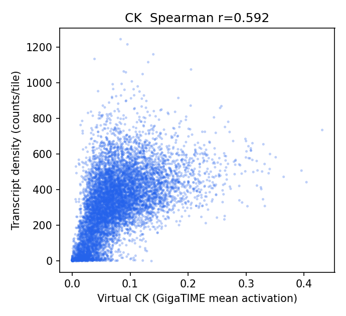
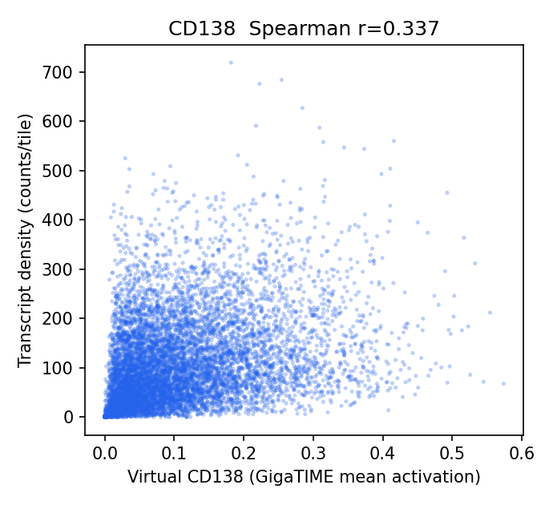
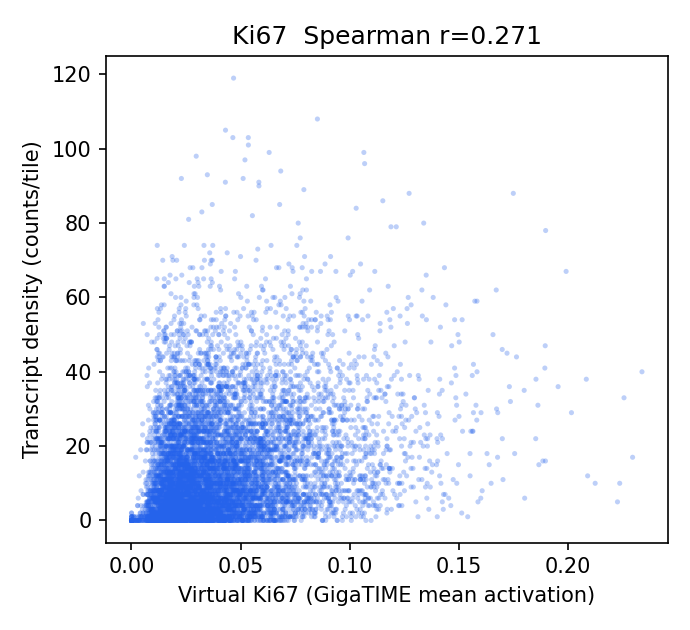
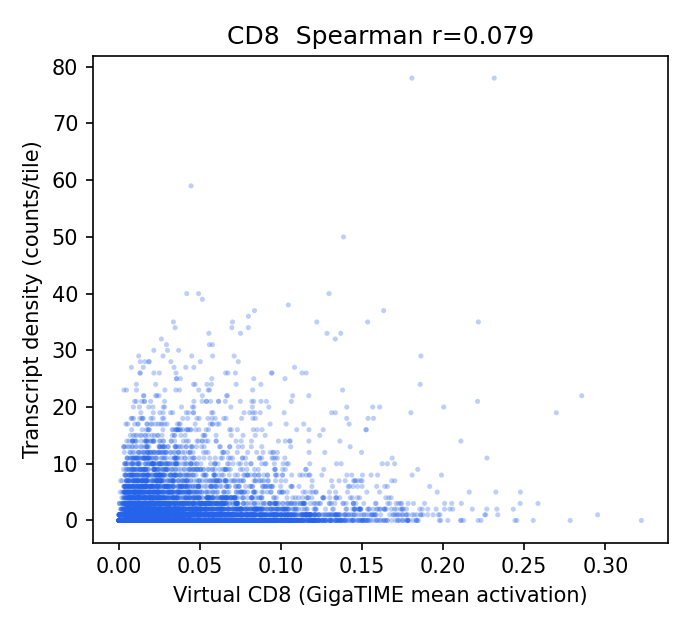
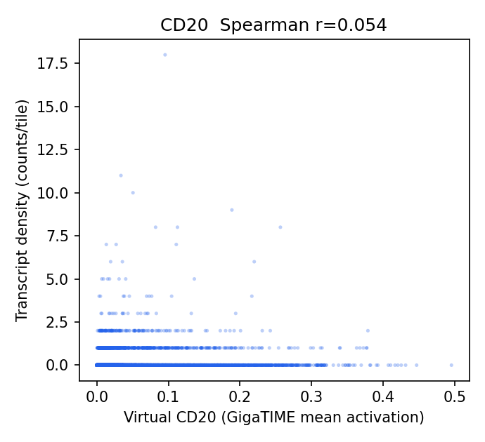
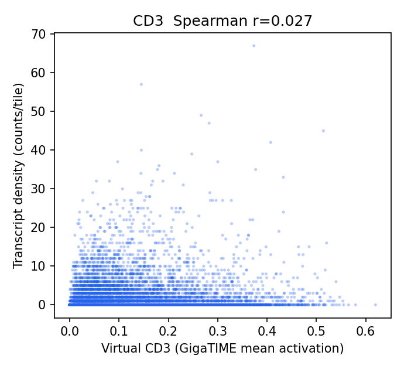
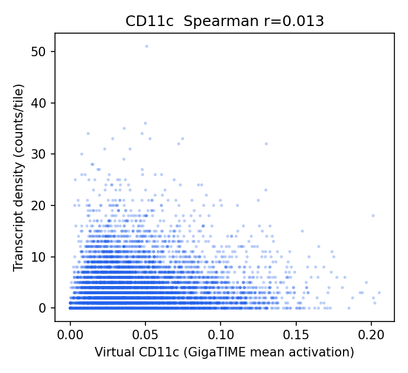
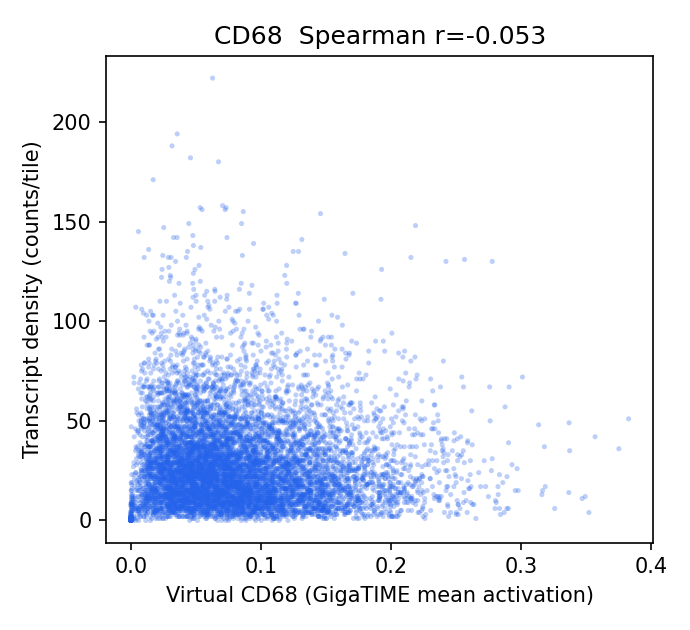
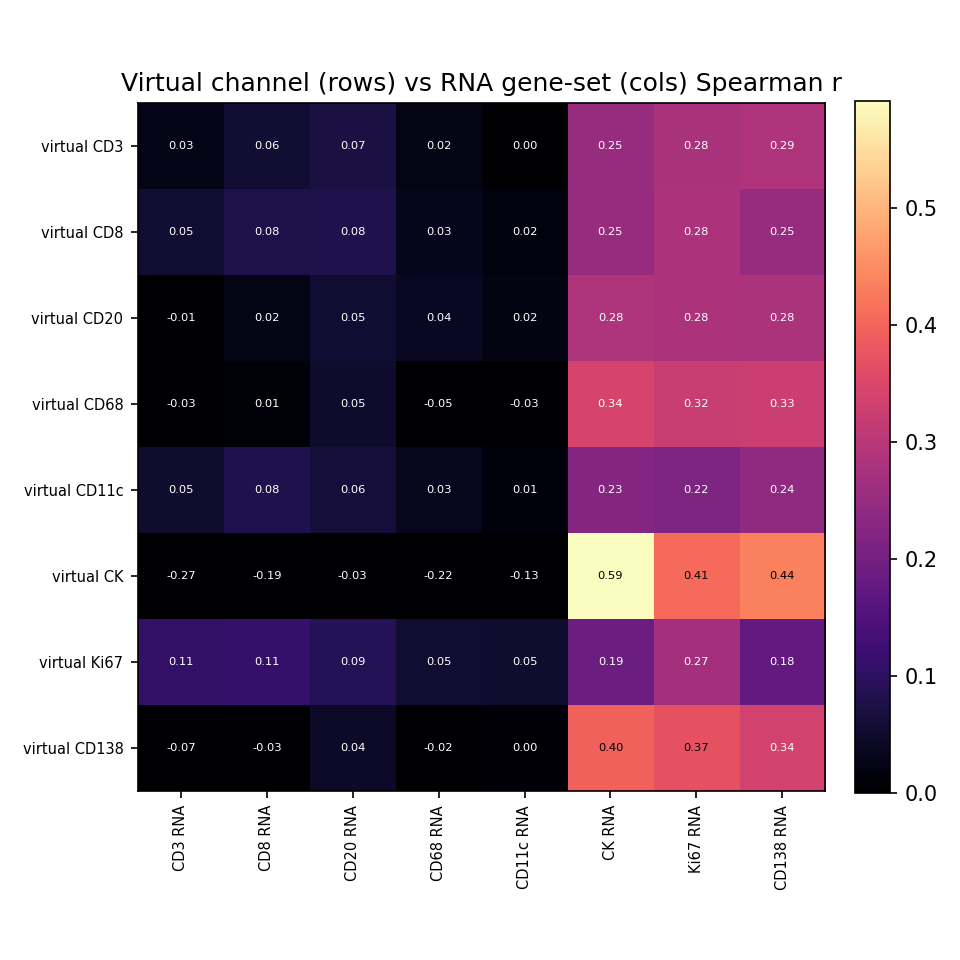

# HEST-1k Breast RNA-Validation Results — TENX202

Status: within-slide validation of GigaTIME virtual channels against HEST-1k spatial RNA. Independent replication of the Xenium Rep1/Rep2 audit on a different breast sample to test generalization.

- Sample: `TENX202` (Xenium, HEST-1k); Patient 4; `Section 4, bottom`. Dataset: Xenium v1 Human Breast FFPE with Biomarkers & Housekeeping Genes Custom Panel.
- Clinical (from HEST metadata): IDC; DCIS, T4a N2a, G3, HER2-1+.

## Method

- H&E full resolution: 30322 x 21607 px (0.2740 um/px); 8494 tissue tiles at 256 px (stride 256).
- Transcripts: 90,354,760 gene transcripts (of 90,495,390 incl. controls), binned onto the tile grid directly via the HEST-provided H&E pixel coordinates (`he_x`/`he_y`) — no alignment affine.
- Channels with a panel gene (8/16): CD3, CD8, CD20, CD68, CD11c, CK, Ki67, CD138. Not in this panel: CD4, CD14, CD16, PD-1, PD-L1, CD34, T-bet, Tryptase.
- Statistics are computed by the same audited core as the Xenium Rep1/Rep2 run (`scripts/validate_gigatime_xenium_rna.py`, imported unchanged): within-slide Spearman, channel x gene-set specificity matrix, cellularity-controlled partial correlation, spatial block-bootstrap 95% CIs.

## Alignment Sanity (model-free)

Spearman(tile tissue fraction, total transcript density) = **0.073** (p=1.5e-11, 95% CI [0.021, 0.120]). A strongly positive value confirms the transcript-to-H&E mapping before interpreting channels.

## Channel Correlations (virtual channel vs RNA)

| Channel | Gene(s) | Spearman r | 95% CI | p | Transcripts on grid |
|---|---|---:|---|---:|---:|
| CK | KRT19, EPCAM | 0.592 | [0.560, 0.620] | 0.0e+00 | 2,787,588 |
| CD138 | SDC1 | 0.337 | [0.297, 0.375] | 6.0e-225 | 956,540 |
| Ki67 | MKI67 | 0.271 | [0.234, 0.304] | 6.3e-143 | 132,786 |
| CD8 | CD8A | 0.079 | [0.044, 0.113] | 4.1e-13 | 22,728 |
| CD20 | MS4A1 | 0.054 | [0.029, 0.075] | 8.1e-07 | 1,258 |
| CD3 | CD3E | 0.027 | [-0.012, 0.067] | 1.4e-02 | 19,383 |
| CD11c | ITGAX | 0.013 | [-0.016, 0.043] | 2.3e-01 | 33,579 |
| CD68 | CD68 | -0.053 | [-0.094, -0.015] | 1.1e-06 | 250,082 |

### Scatter plots

## Channel Specificity (is the signal channel-specific, not just cellularity?)

(1) Row-max: own-gene is the most-correlated gene-set for **2/8** channels. (2) Partial correlation controlling for total per-tile transcript density stays positive (95% CI > 0) for **7/8** channels.

| Channel | Own-gene r | Partial r (control total tx) | Partial 95% CI | Own-gene row-max? | Closest other channel |
|---|---:|---:|---|:--:|---|
| CD8 | 0.079 | 0.174 | [0.141, 0.209] | no | Ki67 (0.284) |
| CD3 | 0.027 | 0.172 | [0.136, 0.208] | no | CD138 (0.288) |
| Ki67 | 0.271 | 0.151 | [0.119, 0.183] | yes | CK (0.190) |
| CD138 | 0.337 | 0.110 | [0.068, 0.152] | no | CK (0.396) |
| CD20 | 0.054 | 0.071 | [0.048, 0.094] | no | CK (0.285) |
| CD11c | 0.013 | 0.048 | [0.016, 0.077] | no | CD138 (0.242) |
| CK | 0.592 | 0.038 | [0.008, 0.068] | yes | CD138 (0.437) |
| CD68 | -0.053 | 0.018 | [-0.019, 0.059] | no | CK (0.343) |

## Interpretation

- Own-gene is the most-correlated gene-set for **2/8** channels; after partialling out total per-tile transcript density (cellularity), channel-specific signal stays positive (95% CI > 0) for **7/8** channels: CD8 0.17, CD3 0.17, Ki67 0.15, CD138 0.11, CD20 0.07, CD11c 0.05.
- Headline-channel check vs the Xenium Rep1/Rep2 finding: CK partial r = 0.04 (not positive); T-cell CD3 0.17, CD8 0.17; CD68 = 0.02 (NOT negative here).

## Output Files

- `results/gigatime_hest_rna_validation/TENX202/hest_rna_validation_report.json`
- `docs/assets/gigatime_hest_rna_validation_TENX202/`
