# HEST-1k Breast RNA-Validation Results — TENX24

Status: within-slide validation of GigaTIME virtual channels against HEST-1k spatial RNA (Visium). Independent replication of the Xenium Rep1/Rep2 audit on a different breast sample to test generalization.

- Sample: `TENX24` (Visium, HEST-1k); nan; `nan`. Dataset: Human Breast Cancer: Whole Transcriptome Analysis.
- Clinical (from HEST metadata): ILC; Invasive Lobular Carcinoma, AJCC/UICC Stage Group I, ER positive, PR positive, HER2 negative.

## Method

- H&E full resolution: 24240 x 24240 px (0.3662 um/px); 4026 tiles used at 256 px (stride 256).
- Visium: 4,325 spots (50,821,784 total UMI), binned onto the tile grid via `pxl_col/row_in_fullres`. Analysis restricted to the **4026** tiles containing >=1 spot (spots are ~100 um apart, sparser than 256 px tiles).
- Channels with a panel gene (16/16): CD3, CD8, CD4, CD20, CD68, CD14, CD11c, CD16, PD-1, PD-L1, CK, Ki67, CD138, CD34, T-bet, Tryptase. Not in this panel: none.
- Statistics are computed by the same audited core as the Xenium Rep1/Rep2 run (`scripts/validate_gigatime_xenium_rna.py`, imported unchanged): within-slide Spearman, channel x gene-set specificity matrix, cellularity-controlled partial correlation, spatial block-bootstrap 95% CIs.

## Alignment Sanity (model-free)

Spearman(tile tissue fraction, total transcript density) = **0.524** (p=2.8e-282, 95% CI [0.466, 0.575]). A strongly positive value confirms the transcript-to-H&E mapping before interpreting channels.

## Channel Correlations (virtual channel vs RNA)

| Channel | Gene(s) | Spearman r | 95% CI | p | Counts on grid |
|---|---|---:|---|---:|---:|
| CK | KRT8, KRT18, KRT19, KRT7, EPCAM | 0.268 | [0.188, 0.341] | 5.2e-67 | 262,787 |
| CD68 | CD68 | 0.094 | [0.042, 0.144] | 2.5e-09 | 2,687 |
| Ki67 | MKI67 | 0.092 | [0.059, 0.127] | 5.3e-09 | 606 |
| CD8 | CD8A, CD8B | -0.017 | [-0.055, 0.022] | 2.8e-01 | 82 |
| CD3 | CD3D, CD3E, CD3G | -0.018 | [-0.055, 0.020] | 2.6e-01 | 218 |
| CD16 | FCGR3A | -0.022 | [-0.072, 0.032] | 1.6e-01 | 2,033 |
| Tryptase | TPSAB1, TPSB2 | -0.027 | [-0.061, 0.011] | 9.0e-02 | 399 |
| CD11c | ITGAX | -0.036 | [-0.072, -0.000] | 2.3e-02 | 667 |
| CD14 | CD14 | -0.052 | [-0.095, -0.007] | 9.4e-04 | 2,155 |
| CD34 | CD34 | -0.071 | [-0.112, -0.029] | 7.2e-06 | 1,176 |
| CD4 | CD4 | -0.078 | [-0.114, -0.044] | 6.7e-07 | 465 |
| CD138 | SDC1 | -0.185 | [-0.247, -0.127] | 1.8e-32 | 12,209 |

### Scatter plots

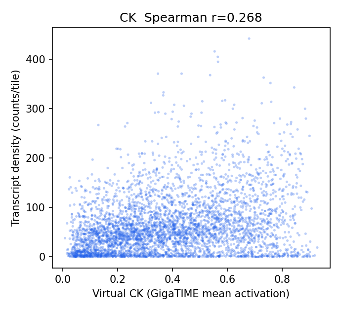
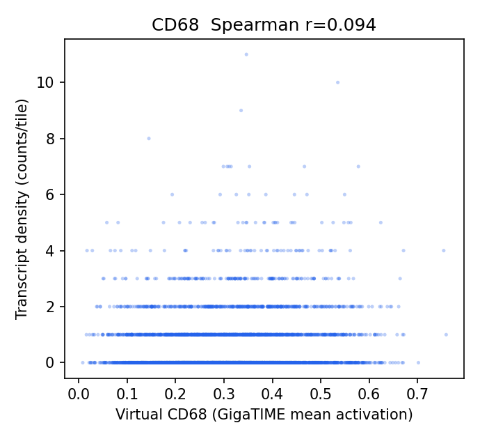
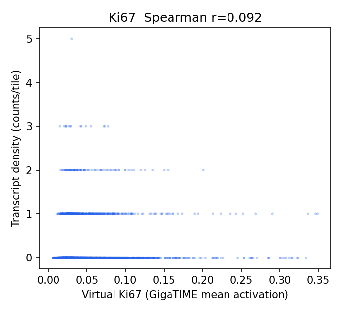
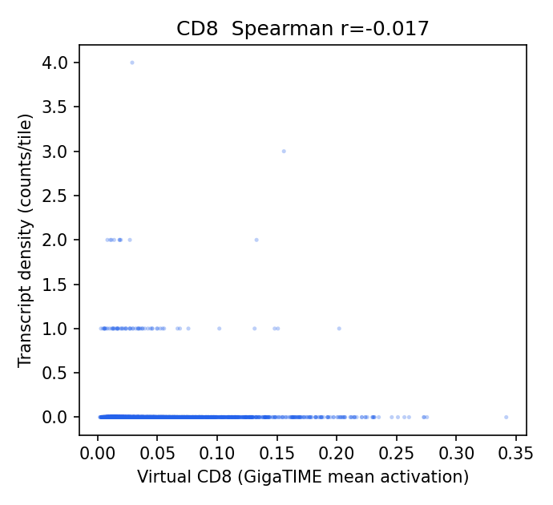
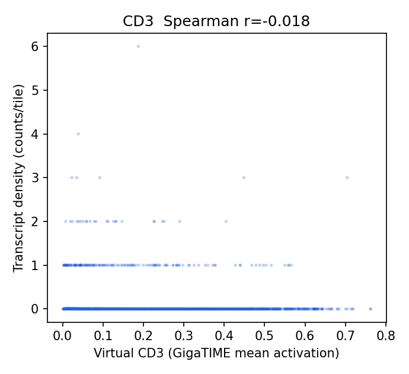
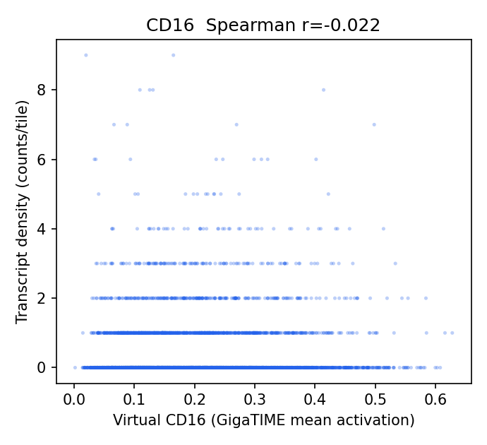
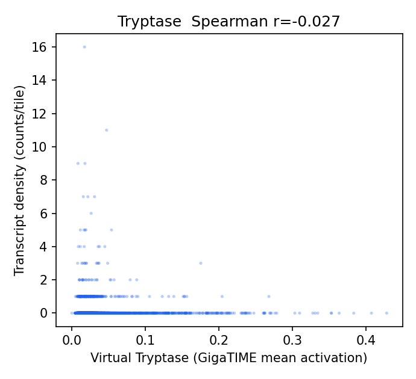
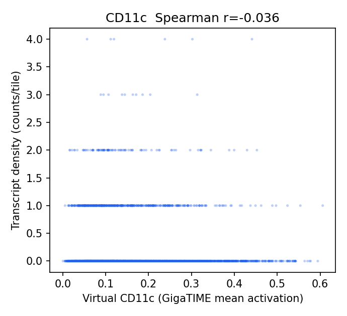
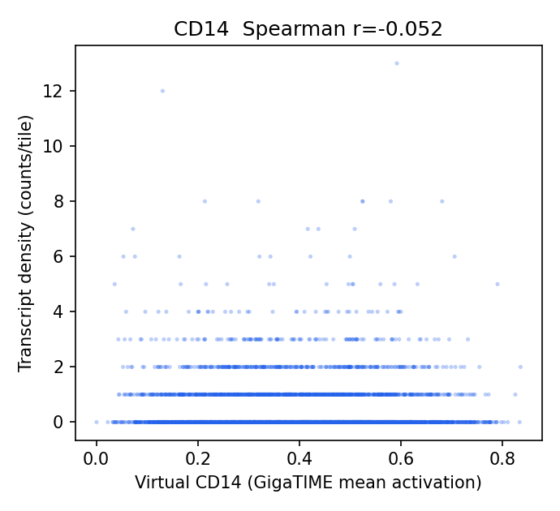
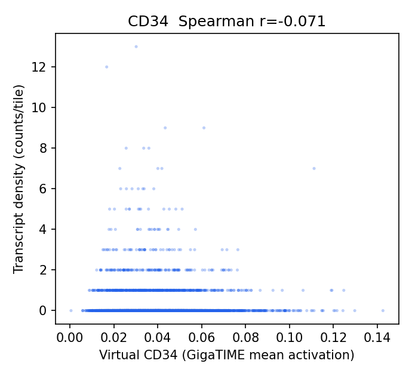
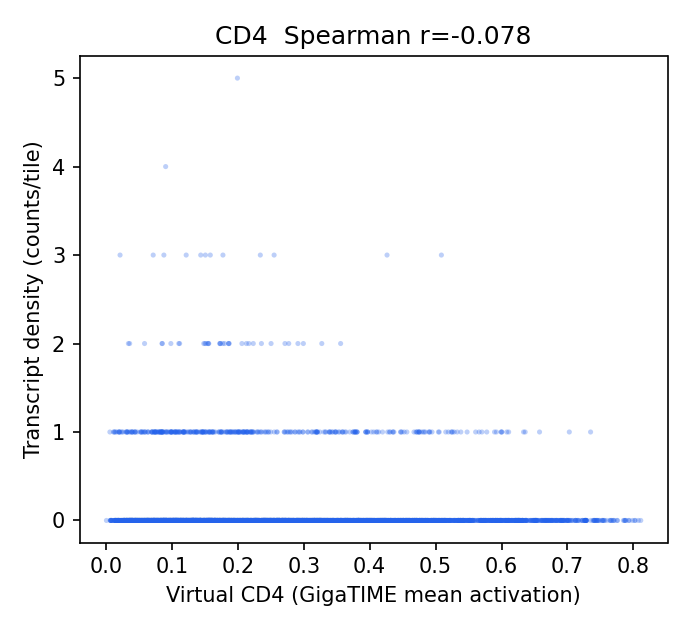
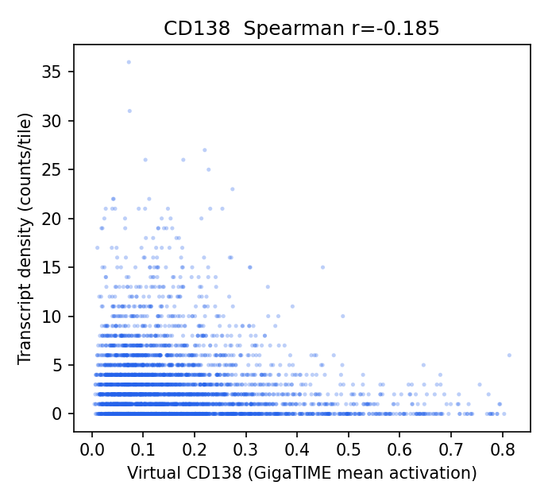

## Channel Specificity (is the signal channel-specific, not just cellularity?)

(1) Row-max: own-gene is the most-correlated gene-set for **1/12** channels. (2) Partial correlation controlling for total per-tile transcript density stays positive (95% CI > 0) for **1/12** channels.

| Channel | Own-gene r | Partial r (control total tx) | Partial 95% CI | Own-gene row-max? | Closest other channel |
|---|---:|---:|---|:--:|---|
| Ki67 | 0.092 | 0.044 | [0.013, 0.073] | no | CD138 (0.213) |
| CK | 0.268 | 0.034 | [-0.015, 0.083] | yes | CD16 (0.134) |
| CD11c | -0.036 | 0.020 | [-0.010, 0.050] | no | CD3 (0.001) |
| CD16 | -0.022 | 0.005 | [-0.032, 0.044] | no | CD34 (0.035) |
| CD3 | -0.018 | 0.004 | [-0.033, 0.043] | no | Tryptase (-0.009) |
| CD8 | -0.017 | -0.006 | [-0.042, 0.031] | no | Tryptase (0.004) |
| CD34 | -0.071 | -0.008 | [-0.043, 0.030] | no | CD3 (0.003) |
| CD68 | 0.094 | -0.009 | [-0.045, 0.032] | no | CK (0.199) |
| CD4 | -0.078 | -0.016 | [-0.047, 0.015] | no | Tryptase (-0.008) |
| Tryptase | -0.027 | -0.017 | [-0.052, 0.021] | no | CD3 (0.009) |
| CD14 | -0.052 | -0.020 | [-0.057, 0.013] | no | Tryptase (0.016) |
| CD138 | -0.185 | -0.083 | [-0.125, -0.038] | no | Tryptase (0.032) |

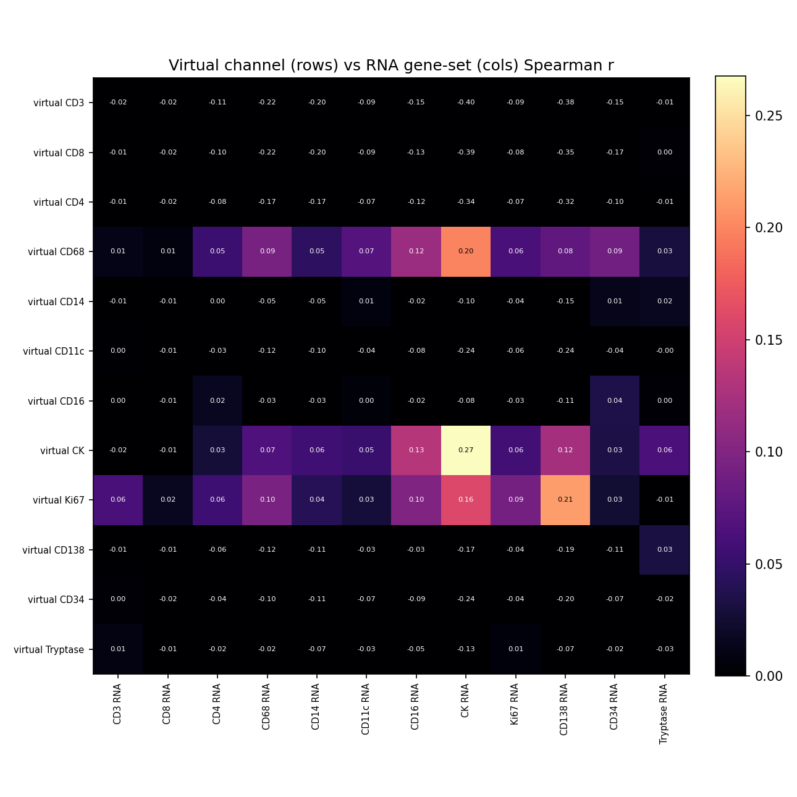

## Interpretation

- Own-gene is the most-correlated gene-set for **1/12** channels; after partialling out total per-tile transcript density (cellularity), channel-specific signal stays positive (95% CI > 0) for **1/12** channels: Ki67 0.04.
- Channels going negative after the cellularity control (track epithelium/cellularity, not their marker): CD138 -0.08.
- Headline-channel check vs the Xenium Rep1/Rep2 finding: CK partial r = 0.03 (not positive); T-cell CD3 0.00, CD8 -0.01, CD4 -0.02; CD68 = -0.01 (negative as in Rep1/Rep2).

## Output Files

- `results/gigatime_hest_rna_validation/TENX24/hest_rna_validation_report.json`
- `docs/assets/gigatime_hest_rna_validation_TENX24/`
