# HEST-1k Breast RNA-Validation Results — TENX39

Status: within-slide validation of GigaTIME virtual channels against HEST-1k spatial RNA (Visium). Independent replication of the Xenium Rep1/Rep2 audit on a different breast sample to test generalization.

- Sample: `TENX39` (Visium, HEST-1k); nan; `nan`. Dataset: Human Breast Cancer: Ductal Carcinoma In Situ, Invasive Carcinoma (FFPE).
- Clinical (from HEST metadata): IDC; Ductal Carcinoma In Situ, Invasive Carcinoma, grade II.

## Method

- H&E full resolution: 25233 x 27452 px (0.3448 um/px); 2442 tiles used at 256 px (stride 256).
- Visium: 2,518 spots (33,540,635 total UMI), binned onto the tile grid via `pxl_col/row_in_fullres`. Analysis restricted to the **2442** tiles containing >=1 spot (spots are ~100 um apart, sparser than 256 px tiles).
- Channels with a panel gene (16/16): CD3, CD8, CD4, CD20, CD68, CD14, CD11c, CD16, PD-1, PD-L1, CK, Ki67, CD138, CD34, T-bet, Tryptase. Not in this panel: none.
- Statistics are computed by the same audited core as the Xenium Rep1/Rep2 run (`scripts/validate_gigatime_xenium_rna.py`, imported unchanged): within-slide Spearman, channel x gene-set specificity matrix, cellularity-controlled partial correlation, spatial block-bootstrap 95% CIs.

## Alignment Sanity (model-free)

Spearman(tile tissue fraction, total transcript density) = **0.148** (p=1.9e-13, 95% CI [0.070, 0.224]). A strongly positive value confirms the transcript-to-H&E mapping before interpreting channels.

## Channel Correlations (virtual channel vs RNA)

| Channel | Gene(s) | Spearman r | 95% CI | p | Counts on grid |
|---|---|---:|---|---:|---:|
| CK | KRT8, KRT18, KRT7, EPCAM | 0.644 | [0.596, 0.686] | 4.7e-286 | 85,369 |
| CD138 | SDC1 | 0.531 | [0.485, 0.575] | 9.7e-178 | 8,018 |
| CD3 | CD3D, CD3E, CD3G | 0.260 | [0.188, 0.323] | 6.8e-39 | 4,301 |
| CD8 | CD8A, CD8B | 0.162 | [0.107, 0.213] | 7.7e-16 | 1,280 |
| PD-L1 | CD274 | 0.156 | [0.113, 0.205] | 7.5e-15 | 373 |
| CD34 | CD34 | 0.139 | [0.081, 0.190] | 4.6e-12 | 1,542 |
| CD11c | ITGAX | 0.131 | [0.071, 0.192] | 7.0e-11 | 3,705 |
| Ki67 | MKI67 | 0.130 | [0.082, 0.173] | 1.3e-10 | 495 |
| CD4 | CD4 | 0.124 | [0.071, 0.178] | 7.8e-10 | 2,609 |
| CD20 | MS4A1 | 0.117 | [0.054, 0.179] | 7.5e-09 | 536 |
| PD-1 | PDCD1 | 0.104 | [0.060, 0.150] | 2.6e-07 | 214 |
| CD14 | CD14 | 0.075 | [0.011, 0.139] | 2.1e-04 | 6,338 |
| T-bet | TBX21 | 0.070 | [0.026, 0.118] | 5.0e-04 | 230 |
| CD68 | CD68 | 0.064 | [-0.004, 0.136] | 1.7e-03 | 10,314 |
| CD16 | FCGR3A | 0.042 | [-0.016, 0.101] | 3.9e-02 | 6,495 |
| Tryptase | TPSB2 | 0.019 | [-0.039, 0.078] | 3.4e-01 | 1,615 |

### Scatter plots

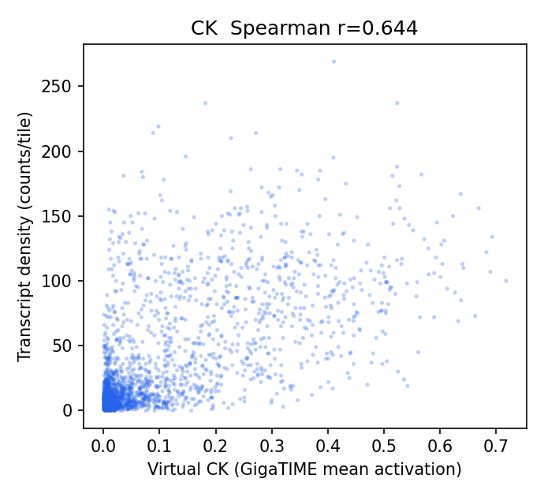
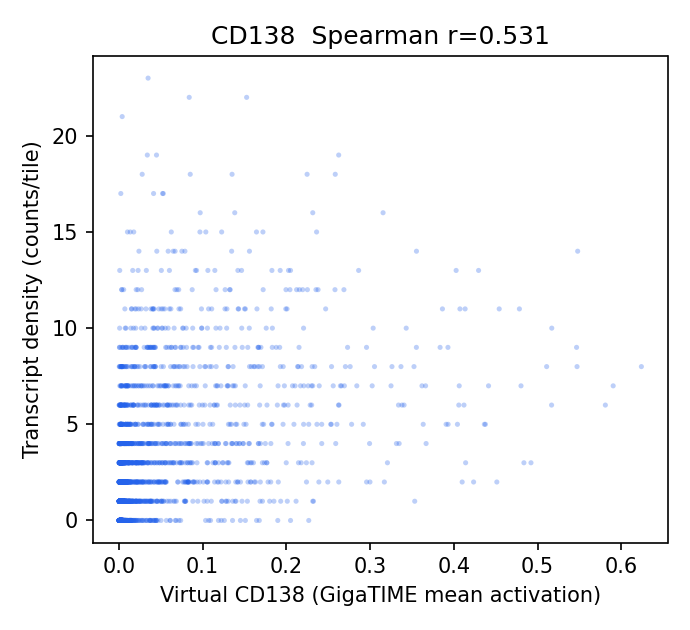
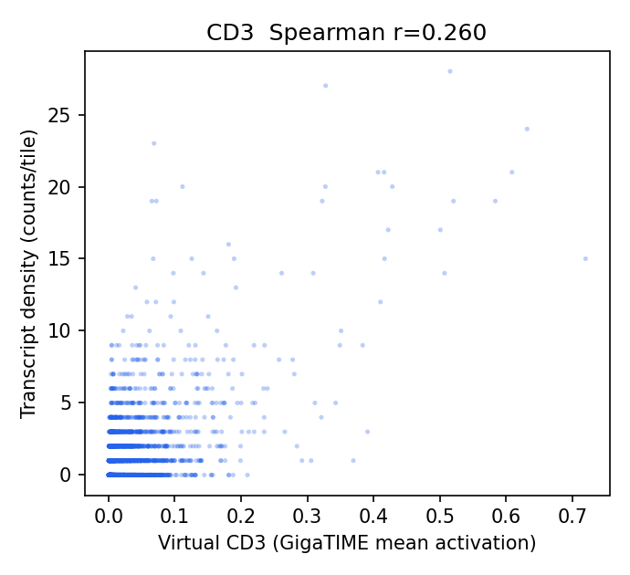
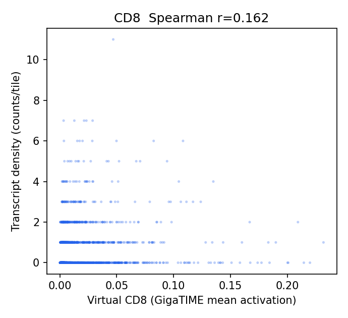
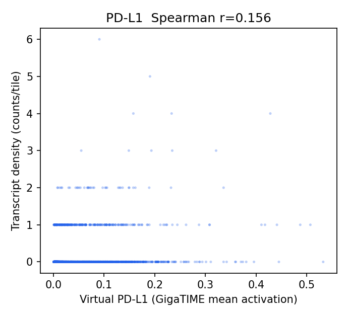
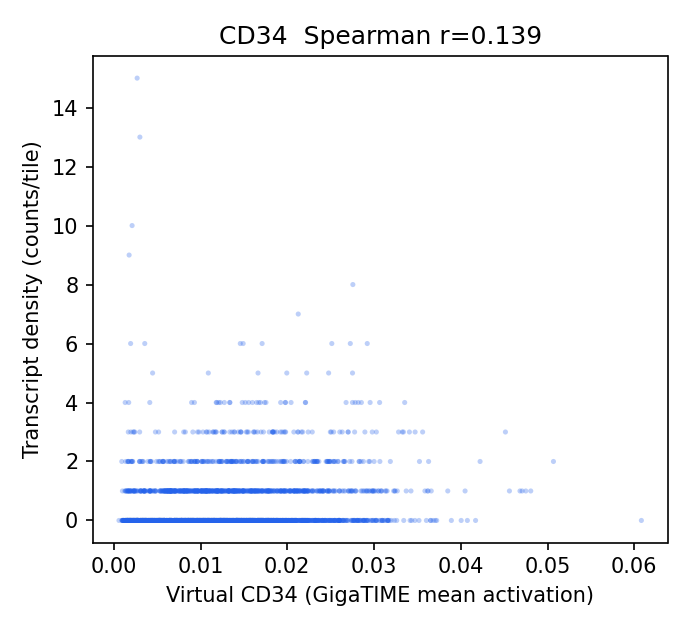
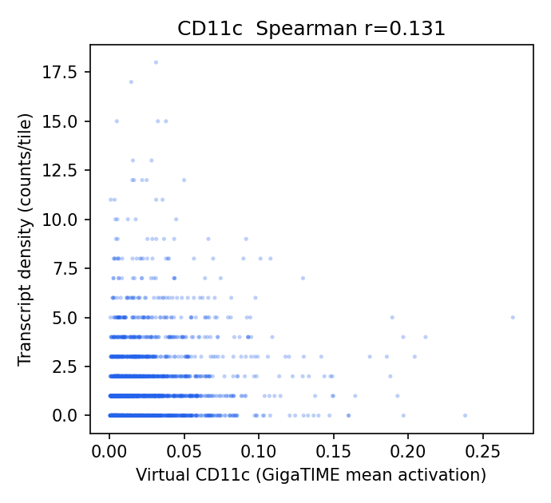
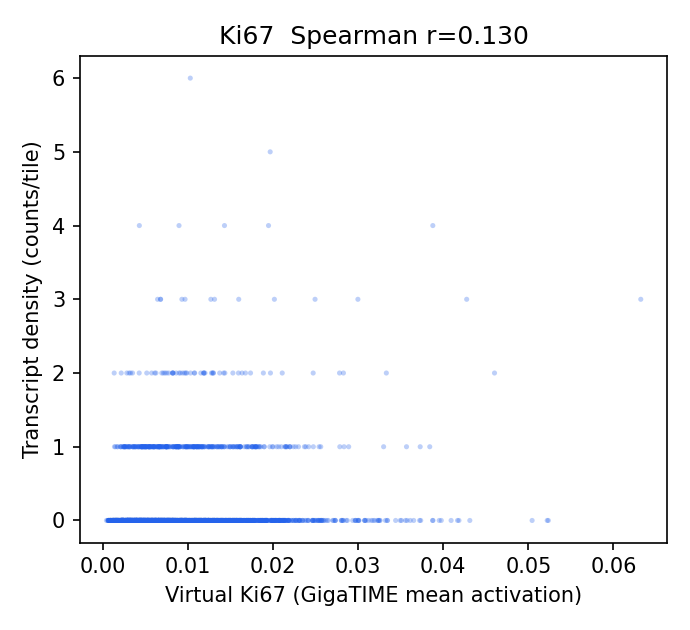
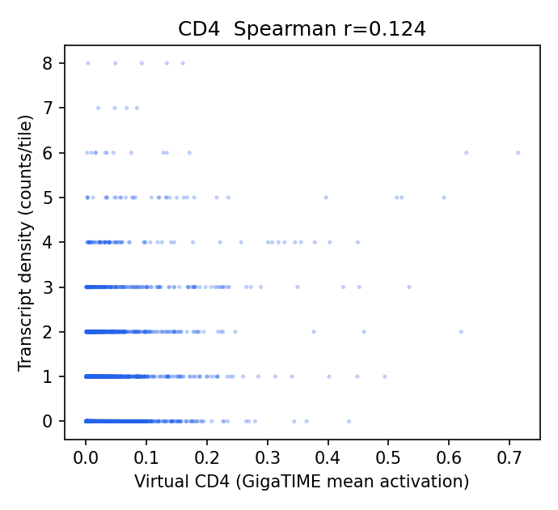
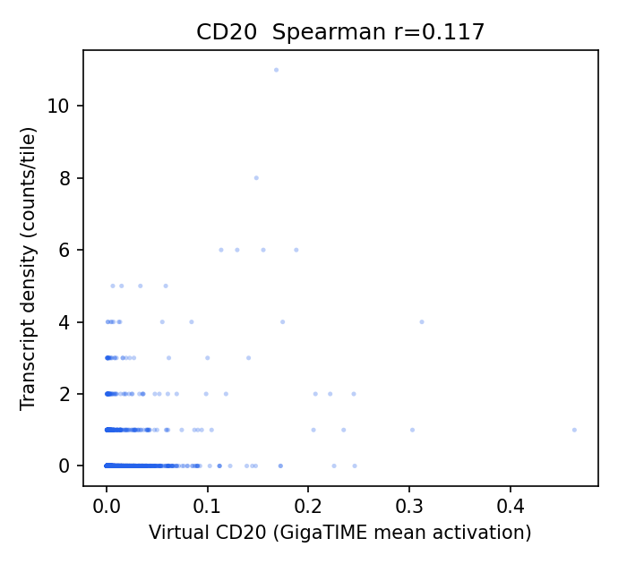
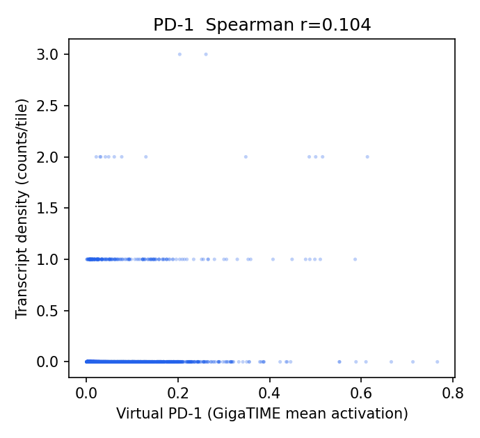
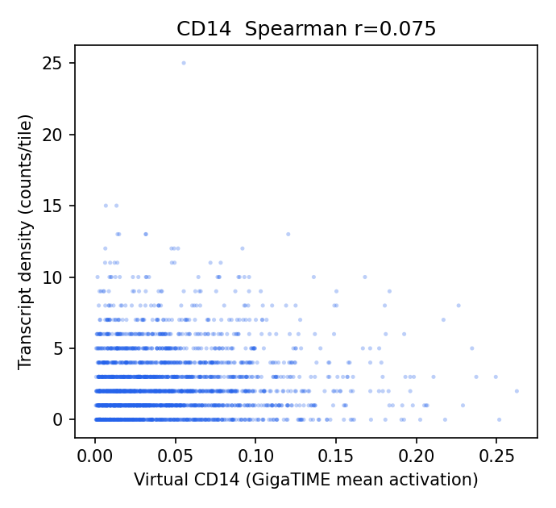
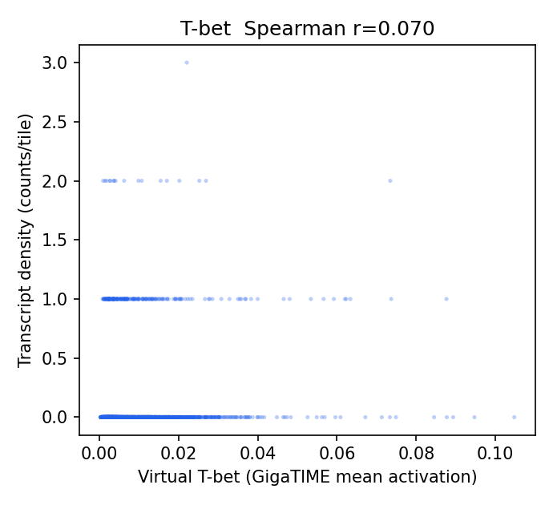
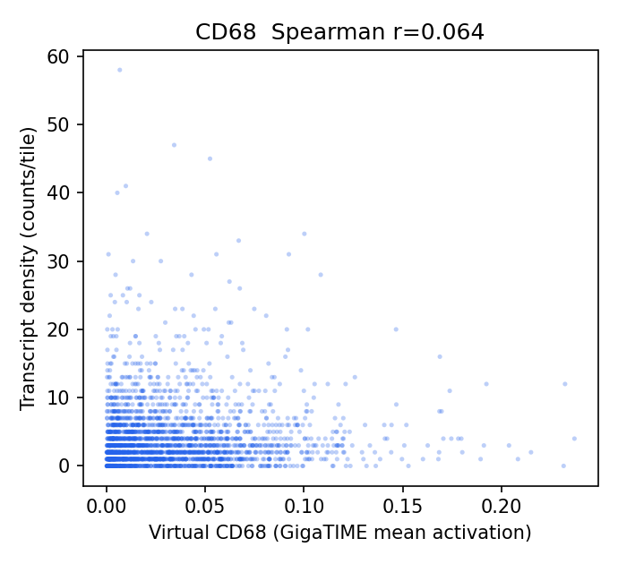
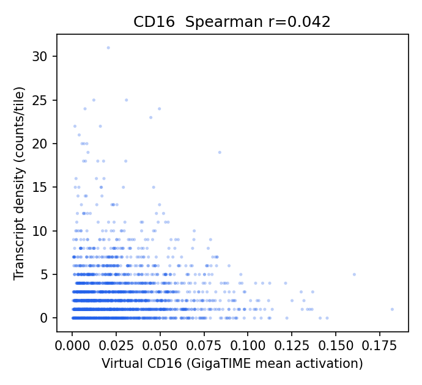
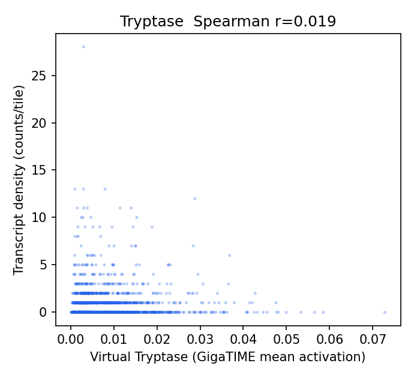

## Channel Specificity (is the signal channel-specific, not just cellularity?)

(1) Row-max: own-gene is the most-correlated gene-set for **1/16** channels. (2) Partial correlation controlling for total per-tile transcript density stays positive (95% CI > 0) for **9/16** channels.

| Channel | Own-gene r | Partial r (control total tx) | Partial 95% CI | Own-gene row-max? | Closest other channel |
|---|---:|---:|---|:--:|---|
| CD3 | 0.260 | 0.235 | [0.172, 0.304] | no | CK (0.299) |
| CD20 | 0.117 | 0.136 | [0.077, 0.191] | no | CK (0.472) |
| CD8 | 0.162 | 0.107 | [0.055, 0.164] | no | CK (0.552) |
| CK | 0.644 | 0.106 | [0.029, 0.171] | yes | CD138 (0.548) |
| CD4 | 0.124 | 0.090 | [0.033, 0.146] | no | CK (0.351) |
| CD11c | 0.131 | 0.088 | [0.026, 0.148] | no | CK (0.264) |
| PD-1 | 0.104 | 0.084 | [0.042, 0.124] | no | CK (0.473) |
| CD34 | 0.139 | 0.066 | [0.009, 0.118] | no | CK (0.275) |
| T-bet | 0.070 | 0.057 | [0.010, 0.106] | no | CK (0.407) |
| PD-L1 | 0.156 | 0.041 | [-0.001, 0.084] | no | CK (0.521) |
| CD138 | 0.531 | 0.037 | [-0.012, 0.085] | no | CK (0.623) |
| Tryptase | 0.019 | 0.035 | [-0.021, 0.093] | no | CK (0.335) |
| CD14 | 0.075 | 0.004 | [-0.061, 0.065] | no | CK (0.340) |
| CD68 | 0.064 | -0.002 | [-0.061, 0.058] | no | CK (0.465) |
| CD16 | 0.042 | -0.036 | [-0.098, 0.028] | no | CK (0.310) |
| Ki67 | 0.130 | -0.048 | [-0.096, 0.003] | no | CK (0.467) |

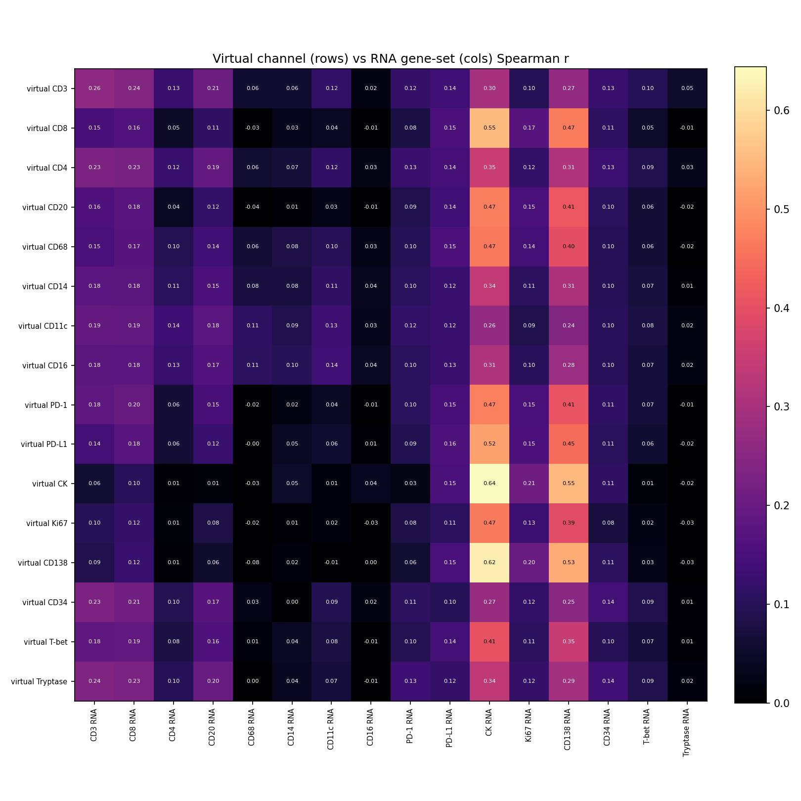

## Interpretation

- Own-gene is the most-correlated gene-set for **1/16** channels; after partialling out total per-tile transcript density (cellularity), channel-specific signal stays positive (95% CI > 0) for **9/16** channels: CD3 0.24, CD20 0.14, CD8 0.11, CK 0.11, CD4 0.09, CD11c 0.09, PD-1 0.08, CD34 0.07.
- Headline-channel check vs the Xenium Rep1/Rep2 finding: CK partial r = 0.11 (specific/positive); T-cell CD3 0.24, CD8 0.11, CD4 0.09; CD68 = -0.00 (negative as in Rep1/Rep2).

## Output Files

- `results/gigatime_hest_rna_validation/TENX39/hest_rna_validation_report.json`
- `docs/assets/gigatime_hest_rna_validation_TENX39/`
