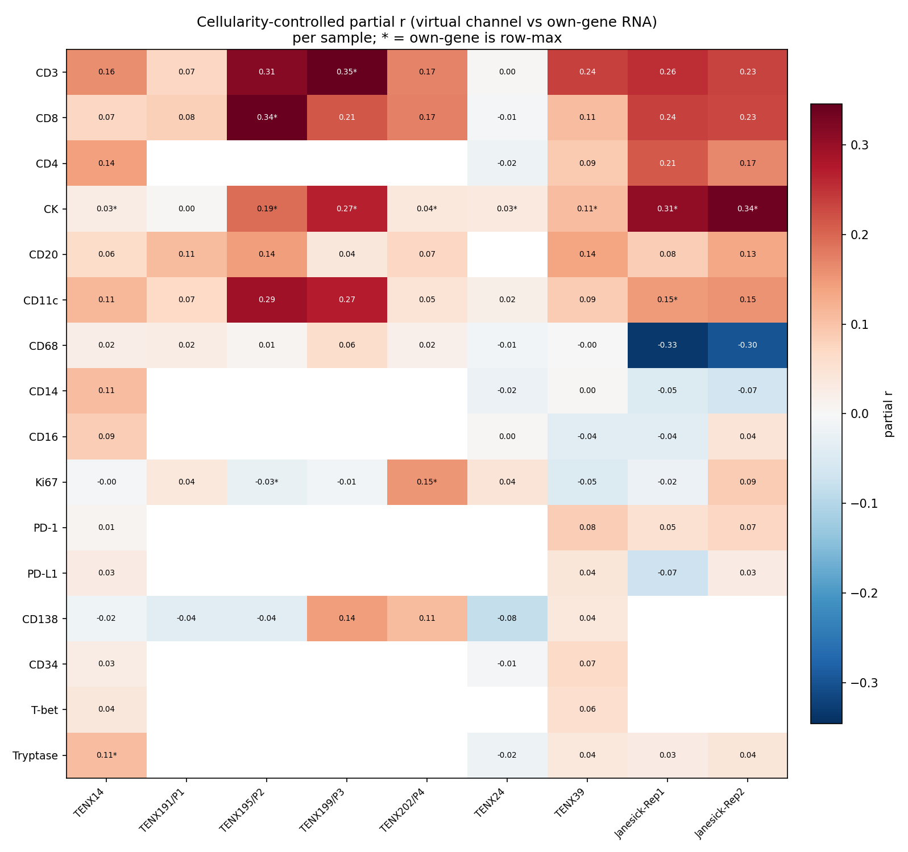

# GigaTIME RNA-Specificity: Cross-Sample Generalization Summary

Status: aggregate of every within-slide RNA-specificity audit run to date. Tests whether the Janesick single-section finding generalizes across independent breast tumors and spatial-transcriptomics platforms.

**Cohort:** 9 sections — Janesick Xenium (2), HEST-1k Xenium independent patients (4), HEST-1k Visium whole-transcriptome (3). Two platforms; IDC + ILC histology.

The load-bearing statistic is the **cellularity-controlled partial correlation** between each virtual channel and its own-gene RNA, per sample (positive = channel-specific signal beyond tissue density). All values are collated from the per-sample reports; the same audited core computed every one.

## Cross-sample partial r (virtual channel vs own-gene RNA, controlling for cellularity)

| Channel | TENX14 | TENX191/P1 | TENX195/P2 | TENX199/P3 | TENX202/P4 | TENX24 | TENX39 | Janesick-Rep1 | Janesick-Rep2 | verdict |
|---|---:|---:|---:|---:|---:|---:|---:|---:|---:|---|
| CD3 | **0.16** | **0.07** | **0.31** | **0.35** | **0.17** | 0.00 | **0.24** | **0.26** | **0.23** | consistently specific |
| CD8 | **0.07** | **0.08** | **0.34** | **0.21** | **0.17** | -0.01 | **0.11** | **0.24** | **0.23** | consistently specific |
| CD4 | **0.14** | — | — | — | — | -0.02 | **0.09** | **0.21** | **0.17** | consistently specific |
| CK | 0.03 | 0.00 | **0.19** | **0.27** | **0.04** | 0.03 | **0.11** | **0.31** | **0.34** | variable |
| CD20 | **0.06** | **0.11** | **0.14** | **0.04** | **0.07** | — | **0.14** | **0.08** | **0.13** | variable |
| CD11c | **0.11** | **0.07** | **0.29** | **0.27** | **0.05** | 0.02 | **0.09** | **0.15** | **0.15** | consistently specific |
| CD68 | 0.02 | 0.02 | 0.01 | 0.06 | 0.02 | -0.01 | -0.00 | -0.33 | -0.30 | never specific |
| CD14 | **0.11** | — | — | — | — | -0.02 | 0.00 | -0.05 | -0.07 | never specific |
| CD16 | **0.09** | — | — | — | — | 0.00 | -0.04 | -0.04 | **0.04** | never specific |
| Ki67 | -0.00 | **0.04** | -0.03 | -0.01 | **0.15** | **0.04** | -0.05 | -0.02 | **0.09** | variable |
| PD-1 | 0.01 | — | — | — | — | — | **0.08** | **0.05** | **0.07** | variable |
| PD-L1 | 0.03 | — | — | — | — | — | 0.04 | -0.07 | 0.03 | never specific |
| CD138 | -0.02 | -0.04 | -0.04 | **0.14** | **0.11** | -0.08 | 0.04 | — | — | never specific |
| CD34 | 0.03 | — | — | — | — | -0.01 | **0.07** | — | — | variable |
| T-bet | **0.04** | — | — | — | — | — | **0.06** | — | — | variable |
| Tryptase | **0.11** | — | — | — | — | -0.02 | 0.04 | 0.03 | **0.04** | variable |

Bold = cellularity-controlled partial r with 95% CI > 0 (channel-specific signal survives). Cells are blank where the sample's panel lacked that gene (the 541-gene Xenium panel omits CD4/CD14/CD16/PD-1/PD-L1/Tryptase/CD34/T-bet; Visium is whole-transcriptome).

## Per-channel verdict across samples

| Channel | Verdict | Mean partial r | Specific in N / tested |
|---|---|---:|---:|
| CD3 | consistently specific | 0.20 | 8/9 |
| CD8 | consistently specific | 0.16 | 8/9 |
| CD11c | consistently specific | 0.13 | 8/9 |
| CD4 | consistently specific | 0.12 | 4/5 |
| CK | variable | 0.15 | 6/9 |
| CD20 | variable | 0.10 | 8/8 |
| PD-1 | variable | 0.05 | 3/4 |
| T-bet | variable | 0.05 | 2/2 |
| Tryptase | variable | 0.04 | 2/5 |
| CD34 | variable | 0.03 | 1/3 |
| Ki67 | variable | 0.02 | 4/9 |
| CD138 | never specific | 0.02 | 2/7 |
| CD16 | never specific | 0.01 | 2/5 |
| PD-L1 | never specific | 0.01 | 0/4 |
| CD14 | never specific | -0.01 | 1/5 |
| CD68 | never specific | -0.06 | 0/9 |

## Conclusion

Across independent breast tumors and two ST platforms, GigaTIME virtual channels show only weak and **tissue-variable** marker specificity. The aggregate **T-cell channels (CD3/CD8/CD4)** are the most reproducible — positive in nearly every section — followed by **CK** (epithelium), which is specific in most but not all tumors. The **macrophage (CD68), myeloid (CD14/CD16), checkpoint (PD-L1) and proliferation (Ki67)** channels carry essentially no marker-specific signal after cellularity control on any platform (CD68 even inverts negative in the Janesick sections). Own-gene is rarely the top correlate. This generalizes and sharpens the single-section finding: the virtual channels reflect a broad T-cell-infiltrated-vs-epithelial contrast, not faithful per-marker stains, and they are not even consistent across patients — so they cannot serve as quantitative cell-type readouts or load-bearing biological evidence, only as interpretive context.

## Per-sample provenance

| Sample | Modality | Tiles | Alignment sanity r |
|---|---|---:|---:|
| TENX14 | visium | 3737 | 0.450 |
| TENX191/P1 | xenium | 9837 | 0.104 |
| TENX195/P2 | xenium | 12494 | -0.022 |
| TENX199/P3 | xenium | 4469 | 0.317 |
| TENX202/P4 | xenium | 8494 | 0.073 |
| TENX24 | visium | 4026 | 0.524 |
| TENX39 | visium | 2442 | 0.148 |
| Janesick-Rep1 | xenium (Janesick) | 6460 | 0.181 |
| Janesick-Rep2 | xenium (Janesick) | 6023 | 0.143 |

Generated by `scripts/aggregate_hest_rna_validation.py`.
